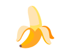
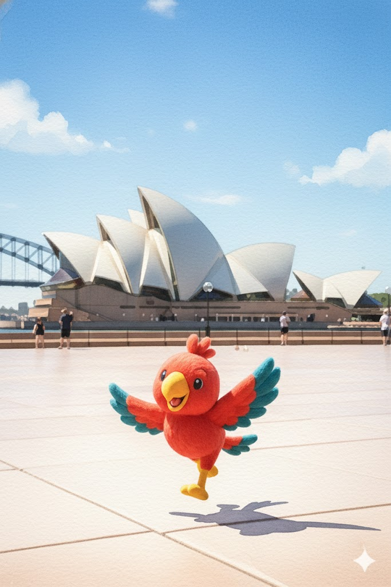

如果你最近依然高强度冲浪，那你大概率被这样一类图片刷屏过：

无论是质感逼真的手办效果图，还是连贯性极强的角色设定，这些让画师和设计师惊叹的图像背后，都绕不开一个近期统在生图领域“封神”的名字：**Nano Banana**。
这个听起来甚至有些滑稽的代号，不仅代表了谷歌（Google）在 AI 图像领域的强势反击，更为我们生动演绎了一出“隐世高手，龙王归来”的精彩戏码。
# 低调的开始
故事的时间轴拨回到2025 年 8 月。

一个叫做LMArena的众包模型测试平台——这是 AI 圈著名的众包竞技场，每天都有成千上万的用户在这里“盲测”各个大模型，试图通过残酷的 AB 测试分出高下。用户们正在和平常一样比较着各个模型的生成结果，试图找出目前各个模型之间的区别。这一天，没有预告，也没有发布会，用户们意外遇到了一个陌生的模型代号：“Nano banana”。这款模型并未出现在任何官方产品列表中也没有任何提前公告，像幽灵一样，它出现在了这个模型竞技场。

起初，人们并没有太在意这个略显随意的名字，直到测试结果开始在屏幕上显现。和当时的主流AI图像编辑工具相比，Nano banana展现出了惊人的角色和场景一致性：在编辑图像时，它能近乎完美的保留图像的面部、灯光和构图特征。展现了堪称恐怖的控制力。这个模型的出现让这个八月变得尤为特殊。

# 揭开面纱
从八月中旬开始，越来越多的用户见识了 Nano banana的能力后，每个人都意识到这个模型并不简单，人们的惊讶逐渐转换为了好奇，但没有人知道这个模型来自哪里，同时也没有官方文档。它的身份、能力都成为了谜团。

AI爱好者们立刻发起了集体侦探行动，分析Nano banana 的技术特征、性能指标和命名模式。尽管没有任何官方文档，但我们还是能从用户反馈一窥究竟，极客们开始分析它的 token 响应速度、图像生成的指纹特征，试图反向推导它的架构。在X平台上，#NanoBanana 标签在48小时内获得了超过五万次使用，每个科技博客和每个Youtube博主都在做关于这个模型的测试和对比内容。这些都昭示了这个模型的强大，外界对这个模型的猜测越来越多。

而直到8月19日，一个帖子暗示了该模型的来源，Google AI Studio 的负责人 Logan Kilpatrick 在社交媒体上发布了一条令人摸不着头脑的内容。没有文字，没有链接，只有一个简单的 Emoji：

整个社区立即意识到这可能是官方线索，这个表情符号成为了解开模型身份谜团的关键线索。

从这一天开始，仿佛是接到了某种信号，其他谷歌Deep Mind员工也开始在社交媒体上发布香蕉有关的内容，形成了一连串暗示。草蛇灰线，伏脉千里，所有的线索最终汇聚到了一处。在2025年8月29日，Nano banana 终于开始从神秘模型登堂入室，谷歌正式宣布了Gemini 2.5 Flash Image模型的存在，而它的开发代号，正是那个让全网魂牵梦绕了整整一个月的名字：Nano Banana。

Nano Banana 的故事，不仅仅是一次技术上的胜利，更是一场教科书级别的营销胜利。

谷歌的模型宣发策略开创了一个先河，一个通过社区驱动的、先体验的、病毒传播的模式。同时也为人工智能行业提供了重要见解，那就是一个高质量的，用户参与其中并通过社区推动的AI工具，要远远重要与华丽的发布活动。Nano Banana神秘的出现和最终确认不仅展示了谷歌在AI图像编辑领域的技术领先地位，更重要的是开创了全新的产品发布模式，八月份的产品发布过程完美展示了现代AI产品如何通过社区力量最大化产品影响力。

Nano Banana 的案例向所有 AI 开发者和企业证明了一个道理：

在信息透明的时代，优秀的技术产品本身就是最好的广告。

当你的地基足够深厚，只需一点点神秘感作为引信，用户参与的热情就能引爆意想不到的市场效应。Gemini 2.5 Flash Image 的成功，或许标志着 AI 产品发布正在进入一个新的纪元——一个去魅化、重体验的新标准时代。

# Topping：如何用好Nano banana

我们还没有拿到谷歌内部的技术文档或论文，无法确切知道 Nano Banana 背后的算法机制，但我们已经可以通过官方文档和公开社区经验，把它的能力最大化 — 让 Nano Banana 成为我们创作／产品／原型设计中的利器。

对于Nano banana来说，图片生成存在着一个基本原则：

描述场景，而不仅仅是列出关键字。 该模型的核心优势在于其深厚的语言理解能力。与一连串不相关的字词相比，叙述性描述段落几乎总是能生成更好、更连贯的图片。

以下策略可以帮助你组装出更有效的提示词，从而生成想要的图片。

## 图片生成提示词模板
越是详细的提示词，模型的生成效果相对来说会更好，对于Nano banana, 我们推荐的结构是：

主体（Subject） + 构图（Composition） + 行为（Action） + 场景（Location） + 风格（Style） + 技术控制（Technical Controls）

每个部分，都可以视作一个最小的提示词单元，用你的创意自由组合即可：

### 主体（Subject）
主体描述越是具体，结果越接近你心里想的画面，下面是个简单的例子：

- 错误：“a cat”（模型只知道你想要“一只猫”，但是什么品种？什么表情？是在阳光下伸懒腰，还是在厨房偷吃鱼？）
- 优秀：“a fluffy calico cat wearing a tiny wizard hat with star patterns”

### 构图（Composition）
就像真实的摄影一样， Nano banana对摄影构图的理解非常棒，请务必在提示词中用上它：
- “wide shot / extreme close-up / low-angle / portrait / symmetrical composition”
行为（Action）
- “brewing coffee / reading / casting a spell / running mid-stride”

    
    

### 场景（Location）
让模型更准确理解物理环境。
- “in a futuristic Mars café with red dust outside”
- “in a cluttered alchemist’s library”
### 风格（Style）
风格越明确越稳定。
- “1990s product photography”
- “photorealistic”
- “watercolor illustration”
- “film noir lighting”

### 技术控制（Technical Controls）
对于不同风格的图片，比如逼真风格、风格化插图或者商业摄影等，可以在相应场景下使用不同的提示词风格。基于模型对于摄影和技术术语的理解能力，它完全可以做到这一点，例如：
- 逼真场景：The scene is illuminated by [lighting description], creating a [mood] atmosphere. Captured with a [camera/lens details], emphasizing [key textures and details]. The image should be in a [aspect ratio] format.
- 风格化插画和贴纸：The design should have [line style] and [shading style]. The background must be transparent.

# AI 时代的社区驱动发布新范式
Nano Banana的故事还未落幕，其对于世界的影响也才刚刚开始。谷歌通过这场充满神秘色彩的“盲测”发布，向世界展示了Gemini Imaage模型在图像控制力和连贯性上的顶尖技术实力，更重要的是，它为整个科技行业开创了一个以社区驱动、用户体验为核心的产品发布新范式。

🍌这个代号的胜利证明了，在AI浪潮奔涌的今天，优秀的技术本身就是最强大的传播载体。用户不再满足于华丽的辞藻和盛大的发布会，他们渴望直接体验并参与到技术的进化中。而对开发者来说，Nano Banana 的案例则敲响了警钟：打磨你的技术，用产品本身说话。

