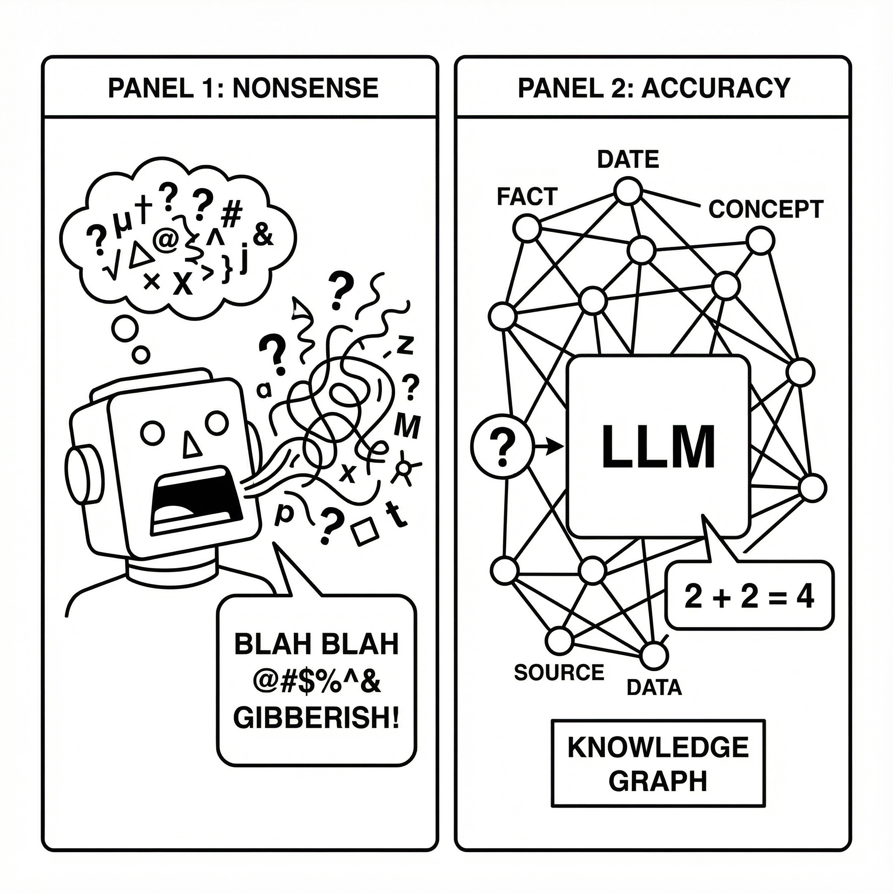
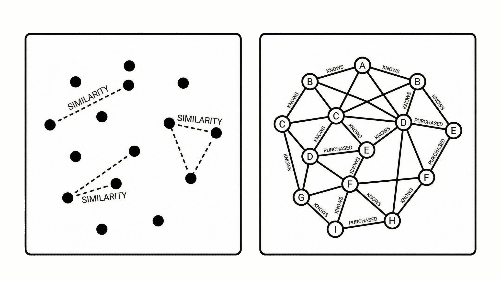
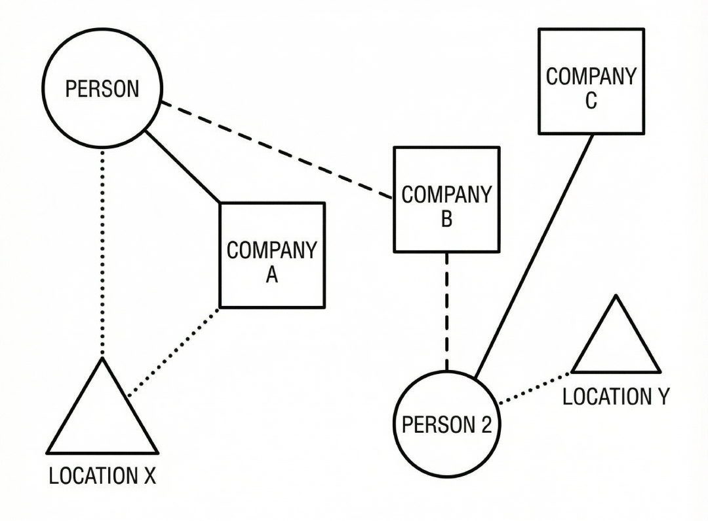
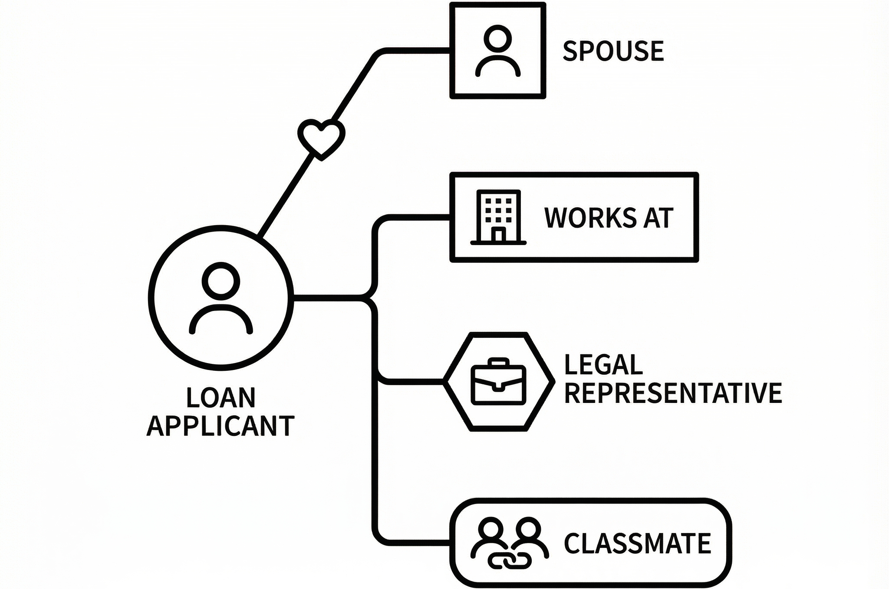
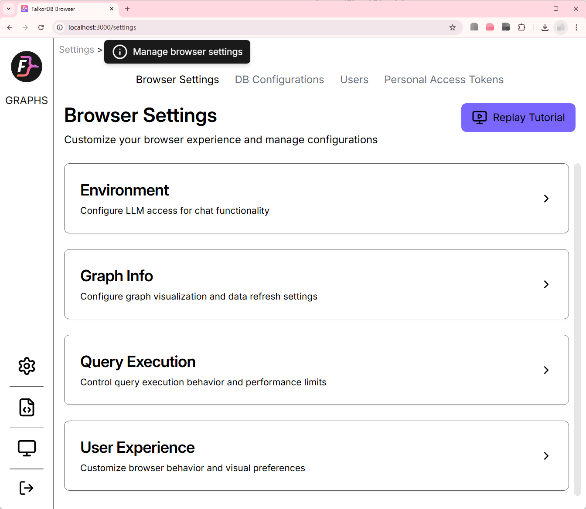

# FalkorDB: The Knowledge Graph Database That Stops AI from "Making Things Up"

---

## The Hallucination Problem with Large Language Models

Have you ever encountered this situation?

You ask an AI a professional question, and it answers confidently and eloquently—only for you to discover upon verification that the answer was completely fabricated.

This is the most frustrating problem with large language models: **Hallucination**. The model isn't unintelligent; it simply lacks a reliable "source of truth." Its knowledge comes entirely from what it "memorized" during training, and when it encounters something it hasn't seen before or can't quite remember, it starts "filling in the blanks."

To solve this problem, the industry has widely adopted **RAG (Retrieval-Augmented Generation)**: first retrieve relevant content from an external knowledge base, then have the model answer based on that content. This way, the model has references to consult and is less likely to fabricate information.

But here's the question: **What's the best way to organize and retrieve this knowledge?**

The current mainstream approach uses **vector databases**. However, more and more practitioners are finding that vector retrieval struggles when handling "relational knowledge."

This is exactly the problem that FalkorDB aims to solve—using **graph databases + knowledge graphs** to provide large language models with a more reliable, more logical knowledge foundation.



*(Image source: Generated by AI model Nano Banana)*

---

## Why Can't Vector RAG Handle "Relationships"?

Let's quickly review how vector RAG works:

1. Split documents into chunks
2. Use an embedding model to convert each chunk into a string of numbers (vectors)
3. Store them in a vector database
4. When a user asks a question, convert the question into a vector and find the "most similar" chunks
5. Feed these chunks to the large language model and let it answer

This approach works well in many scenarios. But there's one type of problem it inherently struggles with: **questions involving "relationships" and "reasoning chains."**

A few examples will make this clear:

**Example 1: Multi-hop Reasoning**

Question: "Who is John's manager's manager?"

Vector retrieval can only find chunks like "John's manager is Sarah" and "Sarah's manager is Michael," but it won't automatically connect these two pieces to derive "Michael" as the answer. It only knows how to "find similar things," not "how to reason."

**Example 2: Complex Associations**

Question: "Which venture capital firms have invested in both Uber and Airbnb?"

This question requires finding "firms that invested in Uber" and "firms that invested in Airbnb," then computing the intersection. Vector retrieval simply doesn't know how to perform this kind of "intersection" operation.

**Example 3: Path Tracing**

Question: "Where did this money ultimately flow from Account A? What intermediate accounts did it pass through?"

This is a classic "follow the money" question. A vector database can only tell you "which documents mention this transaction," but it can't help you trace the money flow step by step.

**The core problem is**: Vector databases excel at "finding similarities," not "understanding relationships." They treat each piece of content as an isolated point, with no connections between points.



*(Image source: Generated by AI model Nano Banana)*

---

## Graph Databases: Built for Storing "Relationships"

The core concept of graph databases is remarkably simple:

> Data isn't just a collection of isolated records—they have relationships. Store these relationships too, and queries become faster.

In a graph database, data is organized into two types of elements:

- **Nodes**: Represent entities, such as a person, a company, or an account
- **Edges**: Represent relationships between two entities, such as "knows," "invested in," or "transferred to"

This structure is particularly suitable for storing and querying questions like "who has what relationship with whom."

Going back to our earlier examples:

- "Who is John's manager's manager?" → Start from the John node, follow the "reports to" edge twice, and you're there
- "Which firms invested in both Uber and Airbnb?" → Find all incoming edges to Uber and Airbnb, see which nodes connect to both
- "Where did this money flow?" → Start from the source account, trace along the "transfer" edges

In traditional relational databases (like MySQL), these types of queries require extensive "table joins" (JOINs), which become painfully slow with large amounts of data. But in graph databases, this kind of "follow the relationships" query is what they do best—completed in milliseconds.

---

## FalkorDB: A Graph Database Built Specifically for AI

FalkorDB is an open-source graph database, formerly known as RedisGraph. After Redis Inc. announced they would no longer maintain RedisGraph in 2023, the community took over the project and renamed it FalkorDB to continue its development.

FalkorDB has several distinctive features:

### 1. Extremely Fast

FalkorDB uses a mathematical method called "sparse matrices" to store graph structures.

Think of it this way: suppose you have 1,000 users, and their friendship relationships can be represented by a 1,000×1,000 table—if the cell in row i, column j is 1, it means user i and user j are friends. But in reality, most cells are 0 (because not everyone knows each other), and only a small portion are 1.

"Sparse matrices" are a method of storing only the positions of those "1s," without wasting space storing the "0s." Plus, queries can use linear algebra operations, making them extremely fast.

### 2. Designed Specifically for GraphRAG

FalkorDB's positioning is clear: be the "knowledge backbone" for large language models.

It supports a technical approach called **GraphRAG**. Simply put:

- Organize knowledge into a knowledge graph (e.g., "Washington D.C. - is capital of - United States," "Elon Musk - founded - SpaceX")
- When users ask questions, first perform reasoning and retrieval on the graph
- Feed the retrieved structured knowledge to the large language model
- The model answers based on this "verifiable" knowledge

This way, the model's answers are no longer conjured from thin air but have clear knowledge sources.

### 3. Query with Cypher Language

FalkorDB supports the Cypher query language, one of the most popular query languages in the graph database field. Its syntax is very intuitive—basically describing the "graph pattern" you want to find.

For example, finding "John's friends" looks like this:

```cypher
MATCH (john:Person {name: "John"})-[:KNOWS]->(friend) RETURN friend
```

Finding "mutual friends of John and Emily":

```cypher
MATCH (john:Person {name: "John"})-[:KNOWS]->(mutualFriend)<-[:KNOWS]-(emily:Person {name: "Emily"}) 
RETURN mutualFriend
```

It looks like you're drawing a graph—very easy to understand.



*(Image source: Generated by AI model Nano Banana)*

---

## Vector RAG vs GraphRAG

| Comparison | Vector RAG | GraphRAG (FalkorDB) |
|------------|-----------|---------------------|
| Core Capability | Finding "semantically similar" content | Finding "relationally relevant" content |
| Multi-hop Reasoning | Not supported, requires manual chaining | Natively supported, just follow the edges |
| Relationship Queries | Weak, relies only on similarity | Strong, this is its primary function |
| Knowledge Explainability | Weak, hard to explain "why this was retrieved" | Strong, reasoning paths are clear and traceable |
| Suitable Scenarios | Document Q&A, semantic search | Knowledge reasoning, relationship analysis, fraud detection |
| Reducing Hallucinations | Helpful, but not thorough | More effective, knowledge has clear sources |

> Vector RAG looks for "similarity," GraphRAG looks for "whether there's a relationship and what kind."

---

## Real-World Scenarios: What Can GraphRAG Do?

### Scenario 1: Financial Risk Control

A bank needs to assess whether a loan application is risky. The applicant, John Smith, appears normal on paper. But what if you could discover: John's spouse is an executive at a company flagged for fraud, and that company's CEO was John's college roommate—this kind of "hidden association" is a major risk signal.

Vector retrieval would almost never discover this relationship because the information is scattered across different documents and semantically unrelated. But in a graph database, it's just two or three hops away.

### Scenario 2: Enterprise Knowledge Q&A

"Which of our company's projects use Python and have a project lead based in New York?"

This question involves multiple entities (projects, tech stack, personnel, locations) and multiple relationships. If knowledge is organized as a graph, answering it is just a single query.

### Scenario 3: Intelligent Customer Service / Technical Support

Customer asks: "Why hasn't my order shipped yet?"

The system can start from the order number and trace to the tracking number, shipping carrier, warehouse, inventory status... The entire chain is clear at a glance, allowing customer service or an AI assistant to give an accurate explanation.

### Scenario 4: Medical / Bioinformatics

"What drug interactions does this medication have?"
"What diseases are associated with this gene mutation?"

These are classic "relationship queries," and knowledge graphs paired with graph databases are the most natural solution.



*(Image source: Generated by AI model Nano Banana)*

---

## How to Get Started with FalkorDB

FalkorDB is open-source, and getting started is very simple.

The fastest way is to launch an instance using Docker:

```bash
docker run -p 6379:6379 -p 3000:3000 -it --rm -v ./data:/var/lib/falkordb/data falkordb/falkordb
```

After starting, open your browser and visit `http://localhost:3000`. You'll see a visual graph database interface where you can directly create nodes, add relationships, and execute queries.



For developers who want to integrate FalkorDB into AI applications, it provides client libraries for Python, Node.js, Go, and other languages, making it easy to connect with existing AI workflows.

---

## From "Stacking Vectors" to "Understanding Relationships": Giving AI a Knowledge Base That Can Reason

**The Vector RAG approach:**
"I chop up knowledge, turn it into vectors, store it, and you find similar things."

**The GraphRAG approach:**
"I clarify the relationships between pieces of knowledge, connect them, and you reason along those relationships."

In many scenarios, these two methods can complement each other: vector retrieval for rough filtering, graph reasoning for precise queries. But if your application scenario inherently involves lots of "entity relationships"—such as finance, healthcare, enterprise knowledge bases, or social networks—then graph databases are almost an essential choice.

FalkorDB, as a graph database optimized specifically for AI scenarios, provides an upgrade path from "letting the model guess" to "letting the model cite its sources."

If you're currently:

- Building an enterprise knowledge Q&A system but finding the model always gives irrelevant answers
- Working on risk management or fraud detection and need to discover complex hidden associations
- Constructing a knowledge graph and want AI to reason based on it
- Frustrated by vector RAG's "similar but not relevant" problem

Consider trying a different approach: **Instead of having the model search for a needle in a haystack of fragments, give it a clear relationship network and let it find answers by following the logic.**

---

**References:**

- https://www.falkordb.com/
- https://github.com/FalkorDB/FalkorDB
- https://docs.falkordb.com/
