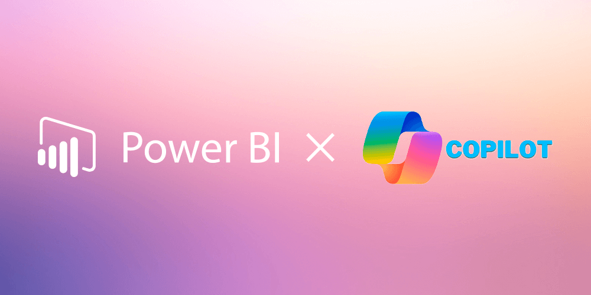

> 报表越来越多，洞察却越来越难。
> 
> 你是否也发现，企业积累了海量数据，却仍旧难以快速找到答案？
> 
> 在信息爆炸与决策加速的时代，传统 BI（Business Intelligence，商业智能）似乎已经力不从心。
> 
> 而 AI 的加入，正在让商业智能重新焕发生命力——它不再只是“显示数据”，而是“理解数据、生成洞察、辅助决策”。

# 商业智能有什么问题？

在 BI 出现的早期，其核心目标是让数据可见。企业通过数据仓库等技术，对内部历史数据进行统计聚合。管理层通过报表或仪表盘查看销售额、成本、库存等指标，从而理解过去的业务表现。  然而，这一阶段的 BI 更多是“回顾式分析”——数据的收集、处理和展示往往滞后于决策需求，缺乏对未来的预测能力，也难以应对实时变化的市场环境。

举个例子，一家传统零售连锁企业每月会通过 BI 系统汇总上月的销售数据，统计各门店的营收与库存水平。管理层依据这些报表来判断哪些产品畅销、哪些地区业绩下滑，再决定下一季度的采购计划。然而，当新的消费趋势在社交媒体上快速发酵时，这种以月为周期的决策模式显得过于迟缓：当他们意识到消费者偏好的变化、准备调整库存时，市场热度早已过去。

这样的滞后性正是传统 BI 的局限所在——它擅长“告诉你发生了什么”，却难以帮助企业“提前知道将会发生什么”。也正因如此，AI 驱动的智能分析才逐渐登上舞台，开始为 BI 注入实时感知与预测能力。

随着大数据和云计算的崛起，BI 进入了“现代化”的第二阶段。实时数据流（streaming data）和云平台的出现，使 BI 系统能实现近乎实时的监测与分析。与此同时，预测分析（Predictive Analytics）与机器学习（Machine Learning）技术开始融入 BI，让数据不仅解释过去，也能推演未来。

而现如今，我们可以看到人工智能正推动 BI 迈向第三阶段的智能化革命。AI 让 BI 从“被动查询”走向“主动调查”——系统开始主动识别趋势与风险，并能够以自然语言、可视化等方式提供洞见。而诸如客户评论、语音记录、图像识别结果等非结构化数据在 AI 的助力下帮助企业从更广泛的信息中挖掘价值。

AI 让 BI 从“数据分析工具”进化为“决策引擎”。企业逐渐具备了回答“为什么”以及“接下来会怎样”的能力。

# AI 能怎么应用在商业智能上？

在谈具体技术之前，我们得先回答一个关键问题：为什么商业智能需要 AI？

过去十多年，BI 工具已经能生成漂亮的报表、实时的看板和多维度分析，但问题在于——企业依然不知道接下来该怎么做。  数据在那里，但洞察很慢；图表很好看，但决策依然凭直觉。正是这种“信息过载 + 洞察不足”的矛盾，让 AI 登上了舞台。人工智能的加入，并不是锦上添花，而是让 BI 从“数据展示”真正升级为“智能决策系统”。它让分析不止停留在“过去发生了什么”，更能回答“为什么发生”“未来会怎样”“我该怎么办”。

人工智能并不是“附加在 BI 上的一层魔法”，而是正在重塑商业智能体系的底层能力。从数据处理、洞察生成到决策支持，AI 已成为驱动下一代 BI 的关键引擎。

我们能看到从以下几个方面，AI 正在重新定义商业智能的底层逻辑。

## 自然语言处理（NLP）与对话式分析：让每个人都能和数据对话

在过去，BI 系统像是一个“只听懂代码的机器”—— 业务人员如果想知道“上个月哪个产品线利润最高”，就得求助分析师写 SQL。

现在，这道门槛被 AI 打破了。得益于自然语言处理（NLP）技术，现代 BI 工具能“听懂人话”。

你只需输入一句话：“帮我看一下上季度华南区的销售趋势”，系统就会自动调用数据库，生成趋势图，还能附上总结：“该地区环比增长 12.3%，主要由新产品 X 拉动”。

更先进的工具（如 Microsoft Copilot for Power BI 或 Tableau GPT）甚至能与你​**对话式分析**​——当你追问“那利润率呢？”或“如果我加大广告预算会怎样？” 它会自动追加分析、生成预测模型。这让数据分析第一次真正“对话化”，人人都能成为分析师。

## 实时数据与流分析：让决策从“滞后”变为“即时”

传统 BI 的最大痛点是“慢”—— 数据汇总、清洗、加载完毕，报告往往已经过时。

AI 的加入让 BI 变得​**实时响应**​。它不再等到报表出炉，而是在数据变化的瞬间自动分析、自动决策。

比方说：一家全国连锁的物流企业，将 AI 引入路线调度系统。过去遇到天气突变或交通拥堵，往往要人工协调，耽误几个小时；现在系统能自动识别异常，几秒内就推荐替代路线，确保车辆照常送达。再比方说：大型电商平台每天都要处理成千上万笔订单。AI-BI 系统在分析实时订单流时，发现某地区的退货率突然上升，便立刻触发客服团队介入调查，防止问题蔓延。

还有证券机构这样对速度要求极高的场景。AI 模型实时监控市场行情，当波动幅度超过预设阈值时，会自动生成预警、推送给交易员，甚至触发算法风控。

AI 让 BI 从“事后报告”变成“即时指挥系统”。在商业竞争加速的今天，谁能更快反应，谁就更有机会赢。

## 智能治理：让智能建立在信任之上

BI 最早的使命就是“让企业基于数据做决策”，它承担了从数据采集、存储、清洗、建模到分析可视化的全过程。因此，BI 并不只是“展示结果”的工具，而是企业数据体系的中枢——所有数据的流向、标准、权限、口径都由它定义。

比方说，一个集团公司要比较全国销售业绩，不同地区的销售额、毛利、成本、库存数据都需要在 BI 平台中汇总。如果 BI 底层的数据口径不统一（例如东区用“出库量”，西区用“发货量”），上层的所有分析都会南辕北辙。

传统 BI 系统往往被抱怨“算得快、但算得不对”。销售额对不上财报、库存表和采购表口径不同、一个指标要对三天。很多企业到最后甚至陷入了“用 BI，但不信 BI”的尴尬境地。

AI 的到来正在重写这一切。它不只是让报表变聪明，更重要的是让数据变干净、变可信。AI 能自动识别重复记录、填补缺失值、发现异常输入，还能用算法检测逻辑冲突，比如“利润比营收还高”这类人工容易忽略的矛盾。更妙的是，它可以追踪每一个字段的来龙去脉，让所有分析都有迹可循——每个数字都能回答一句“我从哪来”。

# 未来的 BI 会是什么样子？

当我们谈论AI 在 BI 中应用时，我们其实是在讨论一个“数据会自己思考”的时代。想象一下，如果你登录 BI 平台，它已经提前生成一份今日经营简报——指出库存预警、建议调价区间、预测利润走势，并在底部给出一句总结：“如果维持当前策略，本季度净利润可能下降 3.8%。” 那不是科幻，而是 AI 驱动 BI 的必然方向。

随着生成式 AI 和大语言模型的深入融合，商业智能将从“分析型系统”进化为“行动型系统”：不仅告诉你“发生了什么”，更能回答“接下来该怎么做”。决策将不再依赖层层汇报，而是实时在数据层面闭环执行。未来的 BI，将不再是一个工具，而是一种企业的思维方式。
