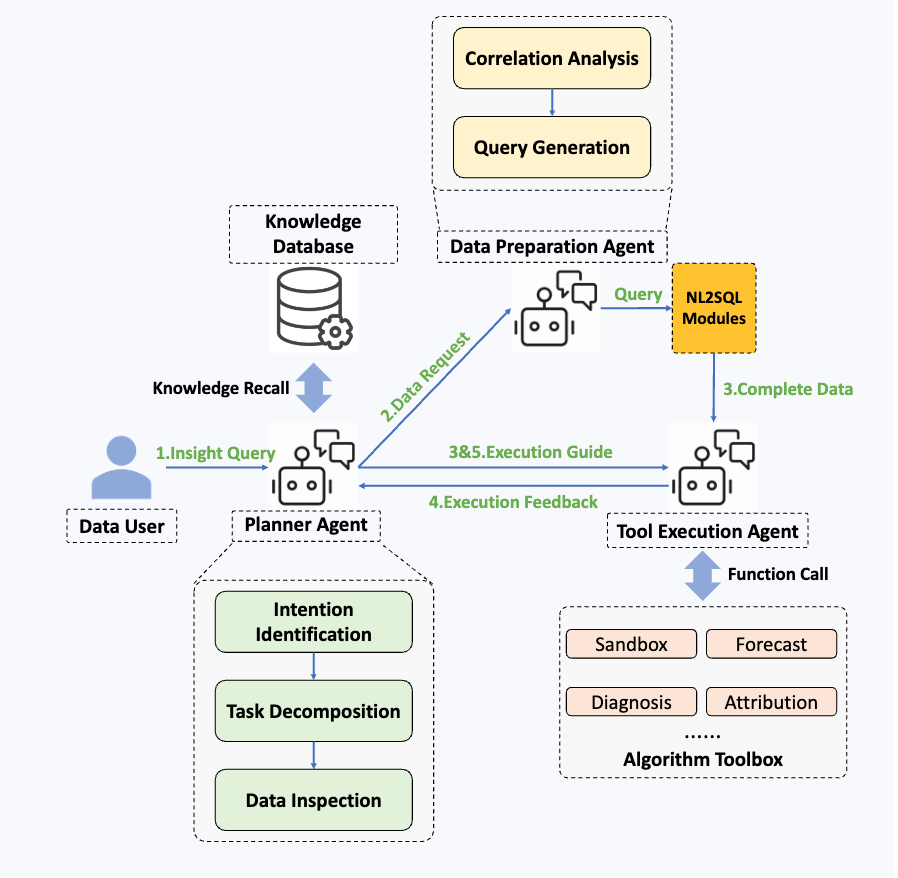
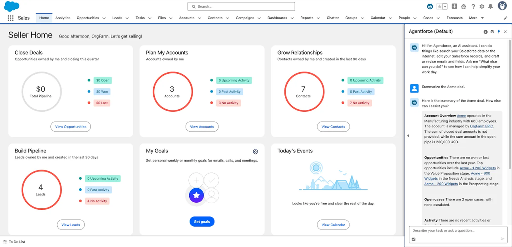
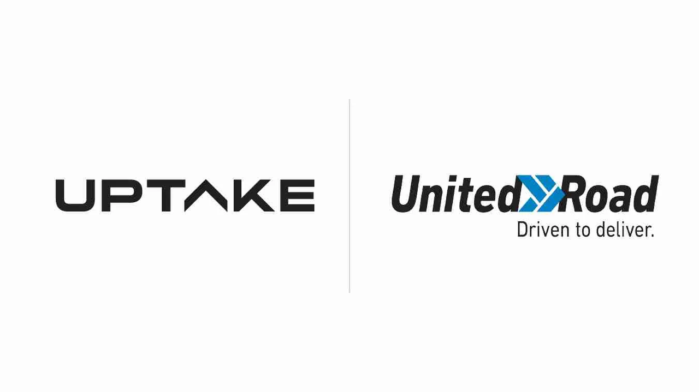

> 报表越来越多，洞察却越来越难。
> 
> 你是否也发现，企业积累了海量数据，却仍旧难以快速找到答案？
> 
> 在信息爆炸与决策加速的时代，传统 BI（Business Intelligence，商业智能）似乎已经力不从心。
> 
> 而 AI 的加入，正在让商业智能重新焕发生命力——它不再只是“显示数据”，而是“理解数据、生成洞察、辅助决策”。

# BI是什么？

Business Intelligence，商业智能这个术语最早出现在 1865 年，不过在现在意义上 BI 的概念则诞生于 1989 年，我们一般认为商业智能是与数据分析，决策支持系统关联，帮助企业做出明智的业务经营决策的工具，通过来自于业务系统订单、库存、交易账目等的数据，辅助业务经营决策，这个决策既可以是作业层的，也可以是管理策略层的。比起一项技术，将商业智能看做一种解决方案更为恰当，这个方案的关键在于从来自企业运作中的资料中，提取有用的部分并进行清理，在此基础上运用合适的查询和分析工具整理为辅助决策的知识，最终呈现给管理者。

# BI 有什么问题？

> BI 的故事看起来十分美好，也确实帮助企业决策者解决了业务运行过程中的诸多挑战，但这里出了什么问题？

在 BI 的早期发展阶段，它的核心使命是**理解过去**：通过报表与数据仓库，帮助管理者复盘企业经营的成败。这类 BI 系统擅长“描述性分析”，即告诉你——过去发生了什么、趋势如何、绩效好坏。但这种能力也构成了它的最大局限：**滞后、静态、缺乏灵活性**。

举个例子，一家连锁零售企业利用 BI 系统每月统计销售与库存，依据这些结果制定下季度采购计划。然而，当某款商品在社交媒体上突然爆火、消费者偏好迅速转移时，企业往往难以及时反应——等到下一轮报表出炉、决策层准备调整时，市场热度已过。这种滞后正是传统 BI 的常见痛点。

这样的滞后性正是传统 BI 的局限所在——它擅长“告诉你发生了什么”，却难以帮助企业“提前知道将会发生什么”。也正因如此，AI 驱动的智能分析才逐渐登上舞台，开始为 BI 注入实时感知与预测能力。

更深层的问题在于，传统 BI 多停留在描述层面：它告诉你“发生了什么”，但无法解释“为什么会这样”，更无法回答“接下来应该怎么办”。在复杂、多变的商业环境中，仅凭历史数据驱动的回顾式分析，已经难以支撑企业的实时决策与持续创新。

# AI 能怎么应用在商业智能上？

在谈具体技术之前，我们得先回答一个关键问题：为什么商业智能需要 AI？

过去十多年，BI 工具已经能生成漂亮的报表、实时的看板，但问题在于——企业依然不知道接下来该怎么做。 数据在那里，但洞察很慢；图表很好看，但决策依然凭直觉。正是这种“信息过载 + 洞察不足”的矛盾，让 AI 登上了舞台。人工智能的加入，并不是锦上添花，而是让 BI 从“数据展示”真正升级为“智能决策系统”。它让分析不止停留在“过去发生了什么”，更能回答“为什么发生”“未来会怎样”“我该怎么办”。

人工智能并不是“附加在 BI 上的一层魔法”，而是正在重塑商业智能体系的底层能力。从数据处理、洞察生成到决策支持，AI 已成为驱动下一代 BI 的关键引擎。

我们能看到从以下几个方面，AI 正在重新定义商业智能的底层逻辑。

## CASE 1：自然语言处理（NLP）与对话式分析：让每个人都能和数据对话

传统的 BI 系统像是一个“只听得懂数据库语言的黑箱”。每当管理层想了解一个不同维度的市场情况，都必须依赖分析师重新编写 SQL 查询，再制作新的可视化面板。比如从“上季度销售额”到“按地区分的销售趋势”，再到“利润率和库存的联动分析”，每一个问题都意味着一份新的报表。随着时间推移，面板越堆越多，维护成本飙升，版本混乱，最后没人知道哪个面板是最新的、哪个口径才准确。

现在，这道门槛被 AI 打破了。得益于自然语言处理技术，许多现代化 BI 平台支持 SQL 生成，用户只需要问出在不同维度的问题，而系统本身会管理上下文和模型，随时准备好你想要的信息。

你只需输入一句话：“帮我看一下上季度华南区的销售趋势”，系统会理解你的意图，生成查询语句并调用数据库，绘制出趋势。帮助你看到现在的业务具体是什么样子。

更强大的是，这些系统还能进行多轮对话式分析。诸如微软的 Power BI + Copilot、腾讯的 SiriusBI、Salesforce Einstein Analytics 等现代化平台。管理者可以连续提问，在现有数据报表的基础上询问更加细节的信息，系统会自动保持上下文，补充数据维度和过滤条件。

在 NLP 技术的加持下，这种对话分析正帮助 BI 从查询工具变成业务伙伴，这意味着业务人员无需 SQL，不用懂数据建模，也能直接向系统提问并获取数据洞见。

## CASE 2：智能治理：抽象数据驱动的实际价值

BI 最早的使命就是“让企业基于数据做决策”，它承担了从数据采集、存储、清洗、建模到分析可视化的全过程。在实际应用中，尤其是工业领域，散落在系统中的数据往往让数据驱动成为了一句口号。来自不同厂牌，不同接口，不同精度的传感器，记录着温度、震动、电流等上百个指标，孤立的存放在各个子系统中。往往只有在设备故障后，才会被调取分析。

工业智能公司 Uptake 提供了一个令人信服的范例。 为了实现真正的“数据驱动维护”，Uptake 将历史工况数据与设备的实时传感器数据相结合，通过网络与卫星通信，将遍布各地的车队、风力发电机组、矿山机械的运行数据汇聚到一个集中的分析平台。 在这一平台中，AI 模型会自动识别异常模式并生成预测性见解。例如：

-   当某台发动机的振动频谱出现微弱异常时，系统会预测“可能发生轴承磨损”；
    
-   当风机的温度曲线偏离正常波动区间，系统会生成“冷却系统效率下降”的预警；
    
-   这些异常被即时推送至维护团队，同时同步更新到 BI 仪表盘，管理层能看到设备健康指数、风险等级与维护优先级。
    

这种以 **智能治理** 为核心的架构，让企业真正实现了“数据的闭环流动”——数据从采集到建模、从分析到执行，始终在标准化、可信任的框架下运行。结果是：设备故障率下降、非计划停机减少、资产寿命延长、维护决策更加科学。

BI 在这里不再只是“展示结果”的界面，而成为企业运营中枢的一部分。智能治理让数据不再是散乱的记录，而是一种可以被理解、被信任、被执行的语言。

# 未来的 BI 会是什么样子？

当我们谈论AI 在 BI 中应用时，我们其实是在讨论一个“数据会自己思考”的时代。想象一下，如果你登录 BI 平台，它已经提前生成一份今日经营简报——指出库存预警、建议调价区间、预测利润走势，并在底部给出一句总结：“如果维持当前策略，本季度净利润可能下降 3.8%。” 那不是科幻，而是 AI 驱动 BI 的必然方向。

随着生成式 AI 和大语言模型的深入融合，商业智能将从“分析型系统”进化为“行动型系统”：不仅告诉你“发生了什么”，更能回答“接下来该怎么做”。决策将不再依赖层层汇报，而是实时在数据层面闭环执行。未来的 BI，将不再是一个工具，而是一种企业的思维方式。
