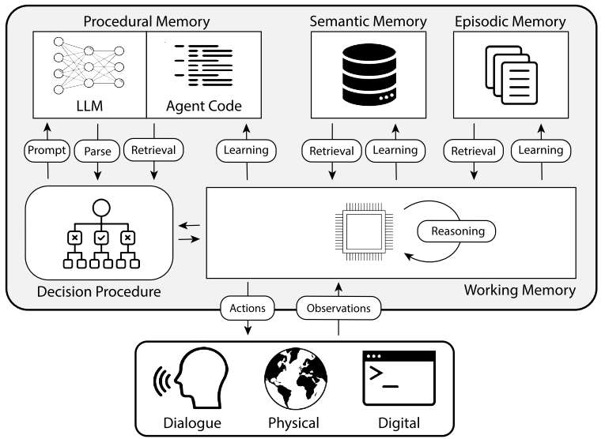

# AI Memory Design

## 1. Why AI Needs “Memory”

Modern large language models possess powerful generative and pattern induction capabilities, but from an engineering perspective, they typically provide only a limited-length conversational context as short-term memory. Once content exceeds this window, the model forgets. This makes it difficult for the model to maintain coherence in long or cross-session conversations. A truly practical intelligent agent must maintain temporal continuity: remembering past preferences and agreements, understanding the current task state, and optimizing behavior based on accumulated experience. Therefore, memory systems are key for an agent to evolve from a mere “answering tool” into a “long-term partner.”

Cognitively, AI memory can be divided into short-term and long-term. Short-term memory is reflected in the model’s context window—similar to human working memory—holding the most relevant information within a task or conversation to maintain semantic coherence. As context windows expand, capacity has grown from thousands to hundreds of thousands of tokens, allowing AI to recall longer histories within one session.

Long-term memory, on the other hand, is achieved through external storage, retaining information across sessions. It is usually implemented using databases, vector retrieval, or knowledge graphs that record historical user behavior, preferences, and semantic summaries. When the user interacts again, the system can proactively retrieve relevant content, achieving cognitive continuity and personalization. Short-term memory enables immediate understanding, while long-term memory provides cross-temporal accumulation; together, they allow AI to learn and grow through continuous interaction.

------

## 2. Hierarchical Memory and Cognitive Analogy

Short-term and long-term memory determine whether AI can “remember,” while the hierarchical structure of memory determines whether it can “understand deeply.” Human memory operates hierarchically, including impressions of specific events, abstract understanding of patterns, and behavior patterns formed through experience. Similarly, AI’s memory system can be divided into three layers: **episodic memory**, **semantic memory**, and **procedural memory**.

**Episodic Memory** records concrete events such as a conversation, a task execution, or a user input. It serves as the raw material for knowledge formation, preserving contextual details like time and location.
**Semantic Memory** is the stable structure distilled from multiple episodes—it extracts patterns, preferences, and factual knowledge to support reasoning and decision-making.
**Procedural Memory** represents deeper, non-linguistic learning results, existing as strategies, workflows, or decision templates that allow the agent to “know how to act.”

In engineering implementation, these three layers operate in a dynamic loop. Raw dialog logs, interaction data, and system events form the foundation of episodic memory. The semantic layer extracts topics and relationships using embedding models, clustering, or knowledge graphs, forming a retrievable long-term knowledge structure. The procedural layer then transforms semantic insights into behavioral strategies—via rule engines or policy models—to guide the agent’s next steps. A robust AI memory system is not a static stack, but a closed loop where “event → understanding → action” continuously circulates.

------

## 3. The Deep Logic of RAG: More Than Retrieval — The “Operating System” of Memory

Many implementations oversimplify RAG (Retrieval-Augmented Generation) as “look up the vector database when you don’t know something.” However, a mature memory system must build full-stack capabilities around RAG: how knowledge enters the store, how it is indexed for multi-dimensional retrieval, when and how it is compressed or consolidated, and how it is routed and fused during responses.
RAG functions as the **operating system of memory**, responsible for managing and orchestrating the entire lifecycle of memory data.

### 3.1 Building the Knowledge Base: Sources, Organization, and Indexing

1. **Ingestion**: Collect multi-source data (dialogs, documents, logs, etc.), then clean, deduplicate, segment, and annotate it. Segmentation should adapt to content type—shorter windows for conversations to preserve flow; larger semantic chunks for documents to retain context and reasoning. Each segment should include metadata (timestamps, source, etc.) for multimodal and multidimensional retrieval.
2. **Representation**: Represent text segments as embeddings using multi-granular models (sentence-, paragraph-, and document-level). Incorporate symbolic elements such as keywords, entities, and relations to build knowledge graphs. For structured data, extract layout cues (like headings or table coordinates) to enable structure-aware retrieval.
3. **Storage & Indexing**: Use vector indices for semantic nearest-neighbor retrieval; inverted or keyword indices for exact matches; and metadata indices (time, author, etc.) for temporal or responsibility tracing. Graph indices connect entities and relations for path reasoning. A hybrid retrieval setup (semantic + keyword + time + graph) greatly enhances both relevance and interpretability.
4. **Refresh**: The knowledge base should not be static but evolve dynamically with business changes. Regularly recompute embeddings, perform incremental updates, manage versions and permissions, and deprecate or archive outdated content while maintaining referential consistency. For personalized memory, provide an auditable user-facing interface where users can review, edit, or delete stored memories.

### 3.2 Memory Compression and Consolidation: Triggers, Execution, and Validation

The goal of compression is not merely to save storage, but to improve retrieval and reasoning signal-to-noise ratio. Compression is typically triggered when accumulated data exceeds a threshold, a topic remains inactive for a long time, or certain events occur (like document updates or task completions).

The process has two layers:
First, locally summarize within a time window or topic to extract key insights and supporting evidence.
Then, hierarchically aggregate these summaries into topic-level semantic nodes. High-value topics should retain drill-down access to original evidence. Compression quality must be verified through replay evaluation and concept drift monitoring—comparing response accuracy and interpretability before and after compression. When semantic drift occurs, automatic re-compression or alignment is required.

### 3.3 Importance Scoring: From Heuristics to Learning-based Evaluation

Without a learning model, heuristic scoring can rank memory fragments by factors like occurrence frequency, recency, task similarity, emotional intensity, and citation count. User feedback (e.g., pinning or ignoring) provides additional signals.
With sufficient data, train predictive models to estimate which fragments are likely to be reused—capturing cross-topic and cross-temporal patterns better than heuristics.

Regardless of method, importance scores must dynamically adjust: fragments frequently used in successful responses gain weight, while outdated or replaced ones lose weight. Continuous calibration keeps the memory base alive and adaptive.

------

## 4. Conversational vs. Document Memory: Differences and Synergy

**Conversational Memory** stores personalized contextual information such as user preferences, tone, constraints, agreements, and task states. It changes rapidly, is fine-grained, and emphasizes temporal order and context.

**Document Memory** stores relatively stable domain knowledge and reference materials, emphasizing source reliability, version control, and traceability.

Their ingestion, segmentation, embedding, and indexing strategies differ: conversational memory favors short windows and time-based indices, while document memory favors structured views and version indices.

At runtime, they must cooperate. The system first uses conversational context for reference resolution (“last report,” “previous suggestion,” etc.) and then retrieves matching documents accordingly. Conversational memory answers “what are we talking about, who are you, and what’s your stance,” while document memory answers “what are the facts, evidence, and standards.” Only when both work together can the agent truly “understand you” and “understand the world.”

------

## 5. From RAG to MemoRAG and A-MEM: Toward Active and Structured Memory

**MemoRAG** introduces a lightweight *memory scheduler* that continuously reads and organizes the memory base, generating prompts for the main model—such as relevant topics, priority sources, or pending reminders. The main model then performs small-step retrieval and validation instead of scanning the entire knowledge base each time. This dual-system design reduces latency and cost while improving relevance through pre-filtering. More importantly, it elevates memory management from passive data access to an active cognitive process.

**A-MEM (Agentic Memory)** emphasizes connectivity and traversability. The system transforms memory fragments into interconnected nodes that explicitly represent semantic or causal relationships. When answering, the model expands or constrains retrieval along these relationships, forming an interpretable trace. Such “memory graphs” facilitate knowledge reuse across documents and sessions, supporting review, alignment, and planning. Compared with traditional RAG, A-MEM treats “memory structure itself” as a first-class reasoning entity.

------

## 6. Real-world Cases: ChatGPT, Gemini, and Grok Memory Designs

- **ChatGPT (OpenAI)**: OpenAI introduced cross-session memory for ChatGPT, allowing it to retain key historical user preferences. The system periodically summarizes conversation records semantically to extract essential context, which is then reloaded in new sessions. Memory is layered: short-term within the context window, long-term via external databases and vector stores. Users can view, delete, or disable stored memories.
- **Gemini (Google)**: Gemini supports personalized memory with strong emphasis on privacy and instant switching. The dialog system automatically references previous chats for coherence, but users can enable “temporary session” mode, excluding current interactions from long-term memory. Gemini stores only small embedding sets for key preferences rather than indexing all dialogs, balancing performance and privacy.
- **Grok (xAI)**: Grok supports million-token contexts for complex short-term tasks and offers persistent user memory modules for tracking user interests and task states across sessions. It also implements “regional availability and compliance control,” allowing users in privacy-sensitive regions to disable or limit memory. This demonstrates that modern memory design balances technical innovation with privacy, regulation, and user experience.

These cases show that AI memory design now involves much more than extending the context window—it performs complex background operations such as summarization, filtering, indexing, and permission control. They each implement varying degrees of active scheduling, compression, importance scoring, and explainable governance, pushing AI from static retrieval toward adaptive cognition.

------

## 7. Conclusion: Memory as the Compound Interest of Intelligence

A memory system is not an optional add-on—it is the compound engine of intelligence. It determines whether an agent can accumulate advantage over time, grow alongside the user, and ultimately evolve from a “language model” into a “long-term partner.”
When RAG is viewed as the *operating system of memory*, MemoRAG as *active scheduler*, and A-MEM as *structural consolidation*, a self-organizing, interpretable, and continuously evolving **second brain** emerges.