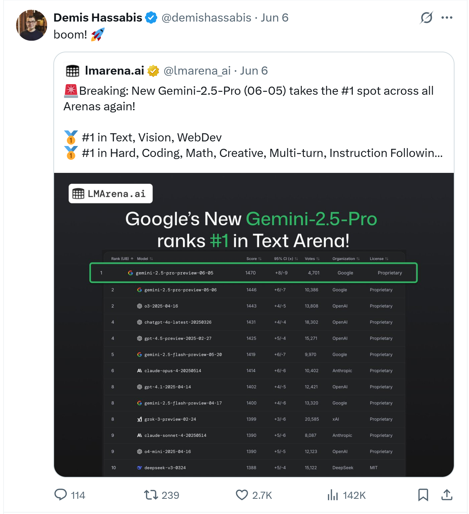
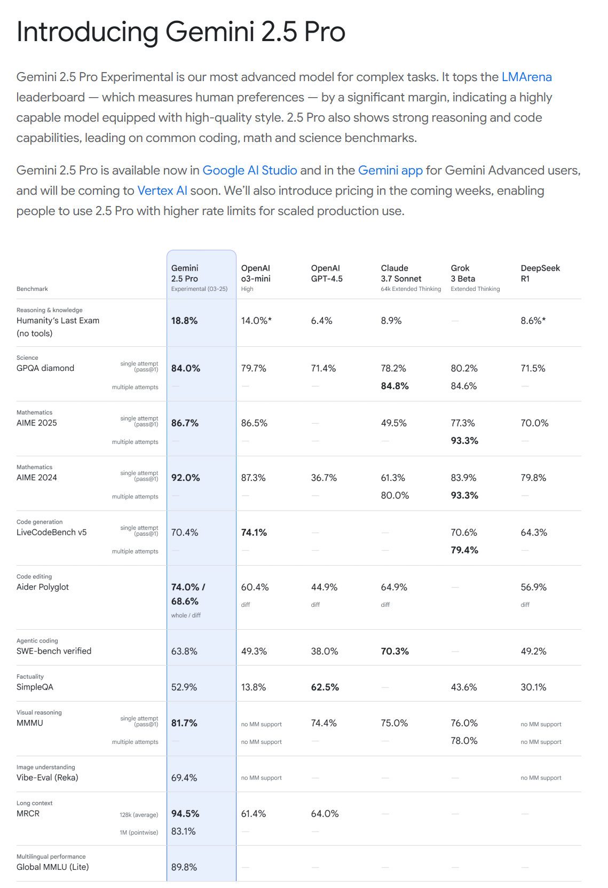
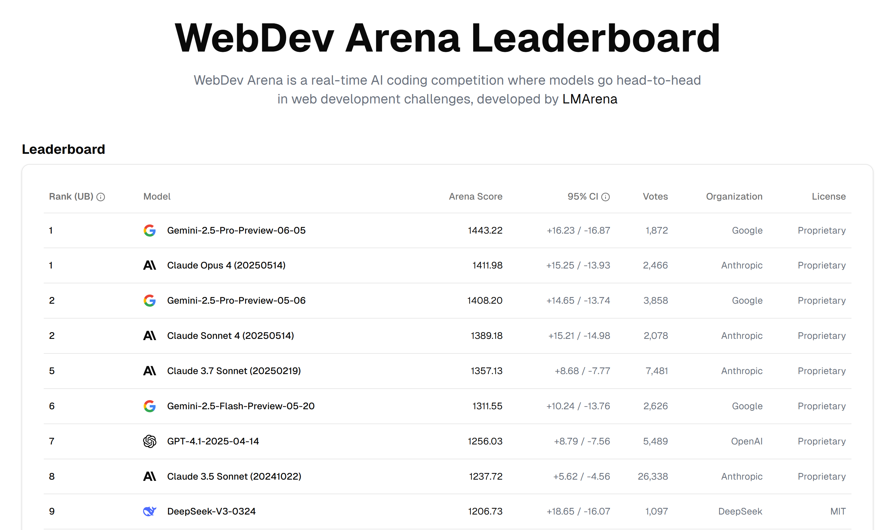
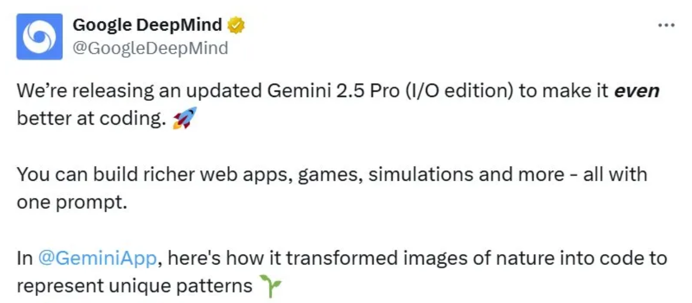
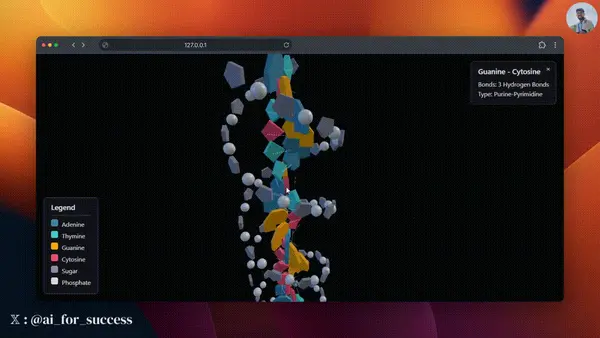
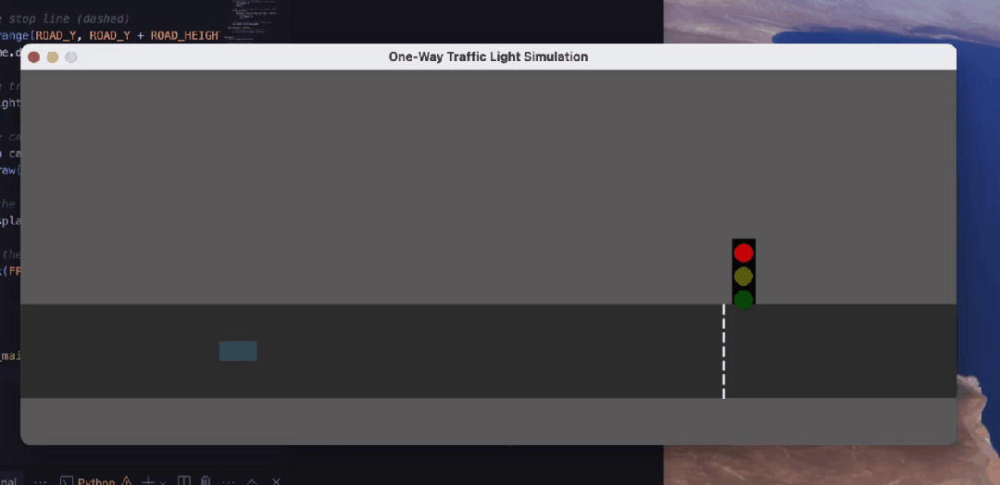
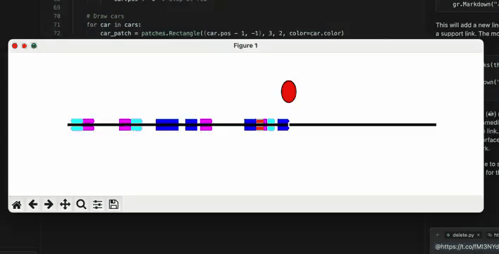
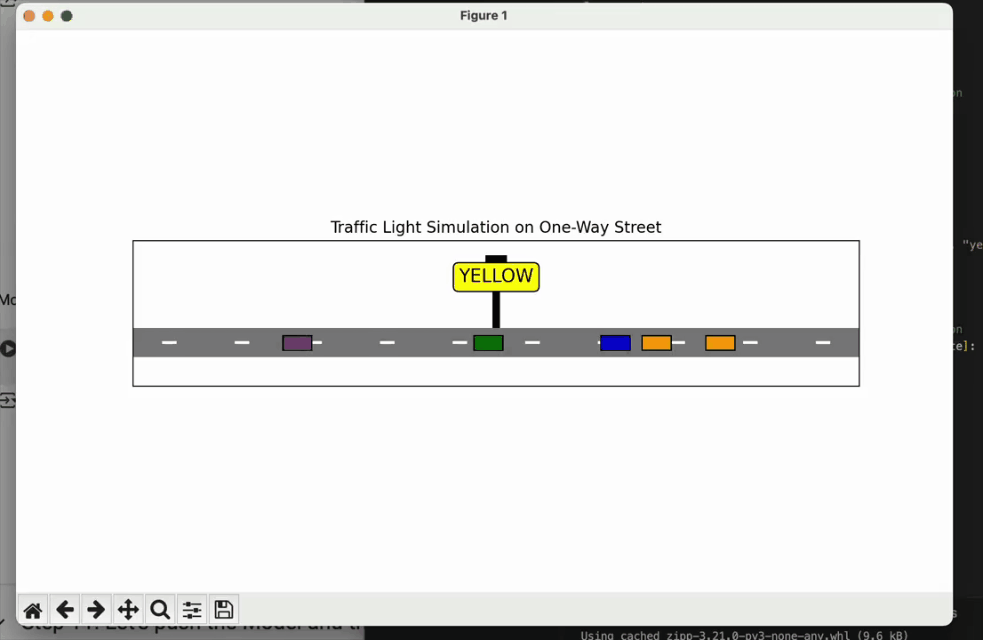
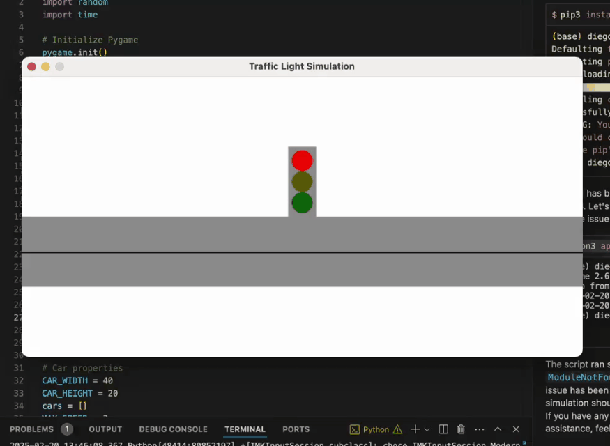
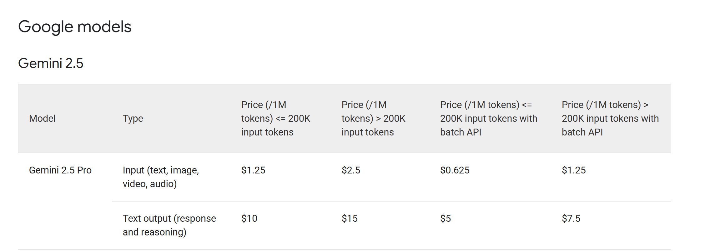

# Gemini 2.5 Pro Comprehensive Analysis: Setting New Benchmarks for AI Reasoning Models with the 0605 Release

**On June 5, 2025, Google released Gemini 2.5 Pro Preview 0605, achieving a commanding lead on LMArena with an ELO score of 1470 points, further widening the gap with competitors. When every AI company claims their new model "changes everything," how do we objectively assess the true value of an AI model? Let's dive deep into this latest release to see what it actually brings to the table.**

## Latest Release: Breakthrough Updates in the 0605 Version

### Major Performance Data Improvements

The newly released Gemini 2.5 Pro Preview 0605 has achieved significant breakthroughs across multiple key metrics:

- **LMArena Leaderboard**: Dominates with an ELO score of 1470, establishing a significant lead over competitors

*Search Description: LMArena leaderboard screenshot showing Gemini 2.5 Pro 0605 ranking first with ELO score of 1470*
*Search Keywords: LMArena leaderboard Gemini 2.5 Pro 0605 ranking first place*

- **WebDev Arena Programming Rankings**: Score surge of 35 points compared to previous version, achieving "seismic" breakthrough
- **GPQA, AIME 2025 and other academic benchmarks**: Leading the pack in mathematics and science domains

*Search Description: Gemini 2.5 Pro SOTA performance comparison chart across various academic benchmarks*
*Search Keywords: Gemini 2.5 Pro benchmark scores GPQA AIME MMMU academic performance*

- **Humanity's Last Exam**: Achieved 18.8% SOTA performance, challenging the limits of human intelligence

### Targeted Key Improvements

The 0605 version updates are highly targeted, primarily including:

1. **Performance Regression Fixes**: Official confirmation of fixes to performance issues in the 0506 version when handling non-coding tasks, making model performance more comprehensive and stable

2. **1 Million Token Context Length**: Brings overwhelming ultra-long context capabilities, easily understanding entire codebases

3. **Thinking Budget Feature**: Introduces the "thinking budgets" concept, allowing developers to fine-tune the balance between cost and response latency

### Intense AI Model Competition Landscape

The past two months in AI have shown white-hot competition:

| Date | Company | Release | Significance |
|------|---------|---------|--------------|
| March 26 | OpenAI | GPT-4o Native Image Generation Full Release | Precision strike against Google Gemini 2.5, new heights in AI image generation |
| April 15 | OpenAI | GPT-4.1 and o3/o4-mini Series | Consecutive model releases demonstrating technical prowess |
| May 6 | Google | Gemini 2.5 Pro Preview 0506 | First to break Claude's lead in programming domain |
| May 21 | Google | Gemini 2.5 Pro Deep Thinking Capabilities | Added thinking budget functionality, Flash version release |
| May 23 | Anthropic | Claude Sonnet 4 and Opus 4 | New generation Claude model release |
| May 28 | DeepSeek | DeepSeek R1 Major Update | Domestic model leadership, approaching international top-tier levels |
| June 5 | Google | Gemini 2.5 Pro Preview 0605 | Comprehensive SOTA refresh, achieving breakthrough leadership |

## Understanding "Thinking Models": More Than Just Faster Computing

To understand the value of Gemini 2.5 Pro, we first need to grasp what a "thinking model" means. Imagine two different exam strategies: one is to write answers immediately upon seeing questions, the other is to first analyze and reason on scratch paper before giving final answers.

Traditional AI models are more like the first strategy—they generate outputs almost immediately after receiving inputs. Gemini 2.5 Pro represents the second strategy—it conducts an internal "thinking" process, considering multiple possibilities before providing more thoughtful responses.

This difference becomes crucial when handling complex problems. For instance, in system design problems, traditional AI might immediately give a standard answer, while Gemini 2.5 Pro would first analyze the complexity of requirements, consider trade-offs between different solutions, and even question whether the requirements themselves are reasonable.

## In-Depth Analysis of Five Core Capabilities

### 1. Ultra-Long Memory: The Real Meaning of 1 Million Tokens

The latest 0605 version further strengthens this advantage. Let's use a concrete example to understand what this number means. A typical technical document might contain 50,000 to 100,000 tokens. This means Gemini 2.5 Pro can simultaneously process 10-20 such documents without needing to split or batch process them.

More importantly, this capability brings qualitative changes. Software engineer Simon Willison found in actual use that when he asked the model to add new features to his website, the model could "process the entire codebase and identify all 18 files that needed changes." This is no longer simple code generation, but project-level architectural understanding.

Google also plans to expand this window to 2 million tokens, which will further expand possible application scenarios. However, we need to think rationally: do all tasks require such large context? The answer is no. For simple Q&A or short writing, this capability might be overkill.

### 2. Deep Think Mode: The "Thinker" of AI

The "thinking budget" feature in the 0605 version represents an important evolution of this capability. This mode allows the model to spend more time thinking before answering, similar to how human experts approach complex problems.

In benchmark tests, this capability brought significant improvements. In the 2025 USAMO mathematics competition, Deep Think mode demonstrated impressive performance. In MMMU multimodal reasoning tests, it scored 84.0%, indicating the model can not only "see" content but truly "understand" its logical relationships.

The new "thinking budget" feature allows developers to more precisely control this process, finding the optimal balance between cost and performance.

### 3. Programming Capabilities: From Code Generation to Project Understanding

The 0605 version achieved historic breakthroughs in programming capabilities, particularly evident in practical applications.

Compared to the previous generation, Gemini 2.5 Pro's overall ELO improved by 24 points, especially on Web Arena with a substantial 35-point ELO increase.

More importantly, the practical application effects:

**Complex Requirements with One Sentence**:
- Program Design: Generate complete application interfaces and interaction logic with just one description

- SVG Structure Diagrams: Automatically generate complex visualization charts
- Sequence Diagrams: Understand business processes and convert them to standard sequence diagrams
- 3D Model Creation: Create realistic 3D DNA models through Three.js

In SWE-Bench Verified testing, Gemini 2.5 Pro achieved 63.8% accuracy, which simulates real software development tasks including bug fixes and feature additions.

**Programming Capability Comparison with Competitors**:
Data scientist Diego's tests show that in creating traffic light visualization tasks:

- **Gemini 2.5 Pro 0605**: Beautiful animation, clear logic, physics-compliant

- **GPT 4.5**: Rough graphics, vehicle behavior not physics-compliant

- **Claude Sonnet 3.7**: Moderate performance

- **Grok 3**: Basic functionality implemented but average results

Replit President Michele Catasta's assessment is quite valuable: "We found Gemini 2.5 Pro to be the best frontier model in terms of 'capability-to-latency ratio'."

### 4. Multimodal Understanding: More Than Just "Describing Pictures"

Modern AI applications often need to handle multiple types of input—text, images, audio, video. How does Gemini 2.5 Pro's native multimodal capability perform in this regard?

In VideoMME benchmark testing, Gemini 2.5 Pro scored 84.8%. What does this score mean? Simply put, it can truly "understand" the logical structure of video content, not just identify objects in frames.

Google demonstrated a "video-to-learning app" example: given a YouTube tutorial video, it can automatically generate a complete interactive learning application, including knowledge summaries, practice questions, and even simulated experiments. This capability transforms video from passive content consumption to active learning tools.

### 5. Cost Considerations: Understanding Real Economic Value

Let's look at the cost issues of today's large models. Gemini 2.5 Pro's pricing structure is:
- Within 200K tokens: $1.25/million input tokens, $10/million output tokens
- Over 200K tokens: $2.50/million input tokens, $15/million output tokens

Comparing this price with competitors:

| Model | Input Price (per million tokens) | Output Price (per million tokens) |
|-------|----------------------------------|-----------------------------------|
| **Gemini 2.5 Pro** | **$1.25 (≤200K) / $2.50 (>200K)** | **$10 (≤200K) / $15 (>200K)** |
| OpenAI o3-mini | $1.10 | $4.40 |
| DeepSeek R1 | $0.55 | $2.19 |
| Claude 4.0 Sonnet | $3.00 | $15.00 |

This shows that Gemini 2.5 Pro has certain price advantages for input tokens, but is relatively expensive for output tokens. This means that for applications requiring large amounts of output (like code generation, long-form writing), costs could accumulate quickly.

## Real Positioning in the Competitive Landscape

### Latest Competitive Situation Analysis

The release of the 0605 version has redefined the AI model competitive landscape:

**Clear Leading Advantage**:
- LMArena score of 1470 creates significant gap with second place
- Comprehensive leadership in programming, mathematics, scientific reasoning and other key areas
- Multiple top development platforms (Replit, Cognition, Cursor) choose integration

### Head-to-Head Comparison with Claude 4

While the latest Claude Sonnet 4 still has advantages in some creative tasks, it has been clearly surpassed by Gemini 2.5 Pro 0605 in programming and technical reasoning. In Diego's comparison tests, Claude 4's code generation quality was noticeably inferior to Gemini 2.5 Pro.

### Comparison with OpenAI Models

OpenAI's o4 series still has competitiveness in certain specific tasks, but Gemini 2.5 Pro's overall performance is superior, particularly in handling large projects and complex programming tasks.

## Understanding Google's Strategic Intent

### Success of Technology Leadership Strategy

The successful release of the 0605 version proves Google's strategic vision in the AI field:
- Focus on deep optimization of reasoning capabilities
- Investment in ultra-long context technology pays off
- Advantages of native multimodal integration become increasingly apparent

### Accelerated Ecosystem Integration

With established performance advantages, more enterprises and development platforms choose to integrate Gemini 2.5 Pro, creating a positive cycle that further consolidates its market position.

## How to Develop Usage Strategies

### Evaluation Framework Based on Latest Version

Considering the outstanding performance of the 0605 version, the evaluation framework needs updating:

**Performance-Priority Assessment**:
- For tasks involving complex programming, mathematical reasoning, or scientific computing, Gemini 2.5 Pro 0605 should be the first choice
- For tasks requiring ultra-long context, its advantages are even more apparent
- Multimodal task processing capabilities lead other models

**Cost-Benefit Recalculation**:
- While single-call costs are higher, high-quality output may reduce iteration count
- Consider convenience and cost savings of domestic platforms
- Evaluate time cost savings (faster completion of complex tasks)

## The Bigger Picture of Technology Trends

### New Stage in AI Reasoning Capability Evolution

The 0605 version represents not just performance improvements, but a new stage in AI reasoning capability evolution:

**From Point Breakthroughs to Comprehensive Leadership**: Early AI models typically excelled in specific domains, while Gemini 2.5 Pro 0605 achieves leadership across multiple key areas.

**From Tool Assistance to Capability Enhancement**: Models are no longer just tools for completing specified tasks, but intelligent assistants capable of understanding complex needs and providing innovative solutions.

### Important Significance of the Thinking Budget Concept

The "thinking budget" feature represents an important shift in AI model design philosophy:
- From pursuing speed to balancing quality and efficiency
- From fixed reasoning modes to adjustable intelligent processing
- From cost black boxes to transparent, controllable resource allocation

This design philosophy may be adopted by other models, becoming an industry standard.

### Application Prospects for Ultra-Long Context

The 1 million token context length has already begun changing practical application patterns:
- Entire codebase-level understanding and modification
- Deep analysis of lengthy academic papers
- Comprehensive optimization of complex business processes

With the planned implementation of 2 million tokens, this trend will further accelerate.

## Reality Expectation Management and Best Practices

### Leveraging Model Strengths Appropriately

**Playing to Strengths**:
- Prioritize Gemini 2.5 Pro 0605 for complex programming tasks
- Fully utilize thinking budget functionality for problems requiring deep reasoning
- Leverage native integration advantages for multimodal tasks

**Avoiding Over-Dependence**:
- Use more cost-effective models for simple tasks
- Other models might be more suitable for creative writing tasks
- Always maintain human review and verification

### Cost Control Strategies

**Smart Usage Scenario Selection**:
- Use top-tier models for high-value tasks
- Use economical models for routine tasks
- Fully utilize thinking budget functionality to optimize costs

**Batch Processing Optimization**:
- Combine related tasks for processing, fully utilizing long context
- Design reasonable prompts to reduce ineffective token consumption

## Conclusion: Establishing New Benchmarks and Future Outlook

After comprehensive analysis of Gemini 2.5 Pro Preview 0605, we can draw the following important conclusions:

### Technical Breakthroughs Are Indeed Significant

The 0605 version's breakthroughs across multiple key metrics are not incremental improvements, but leapfrog developments:
- LMArena score of 1470 establishes clear leading advantage
- 147-point ELO improvement in programming capabilities represents qualitative leap
- Comprehensive leadership in academic benchmarks proves technical strength

### Application Value Verified

Positive feedback from top development platforms and real application cases prove its commercial value:
- Choices by Replit, Cognition, Cursor and other platforms prove its practicality
- One-sentence complex application generation capability demonstrates efficiency improvement potential
- Shows clear advantages in direct comparisons with competitors

### Insights for AI Development Trends

The success of the 0605 version provides important insights for AI industry development:
- Deep reasoning capabilities become new competitive focus
- Commercial value of ultra-long context processing capabilities confirmed
- Native multimodal integration superior to post-integration solutions
- Controllable reasoning resource allocation (thinking budget) represents future direction

### Practical Recommendations

For users considering Gemini 2.5 Pro 0605:

1. **Thorough Testing**: Utilize convenience of domestic platforms for comprehensive testing, especially in your specific application scenarios
2. **Proper Positioning**: Position it as a professional tool for handling complex, high-value tasks
3. **Cost Awareness**: Optimize costs through intelligent task allocation and batch processing
4. **Continuous Attention**: AI technology develops rapidly, maintain attention and learning about new developments

### Future Outlook

From Gemini 2.5 Pro 0605's performance, AI models are moving toward more intelligent, more practical directions. We may be witnessing an important juncture in the transformation from AI assistants to AI partners.

However, technology's value is ultimately determined by its ability to solve real problems. No matter how impressive benchmark scores are, the real test lies in whether it can consistently create value in daily work. From current feedback, Gemini 2.5 Pro 0605 is passing this test.

In this rapidly developing AI era, maintaining an open and learning mindset is more important than sticking to any specific tool. The success of Gemini 2.5 Pro 0605 reminds us that AI technology development speed may exceed our expectations, and we need to be prepared to embrace change.

*This analysis is based on the latest information from June 2025, including release data for Gemini 2.5 Pro Preview 0605. AI technology develops rapidly; please follow official updates for the latest information.* 