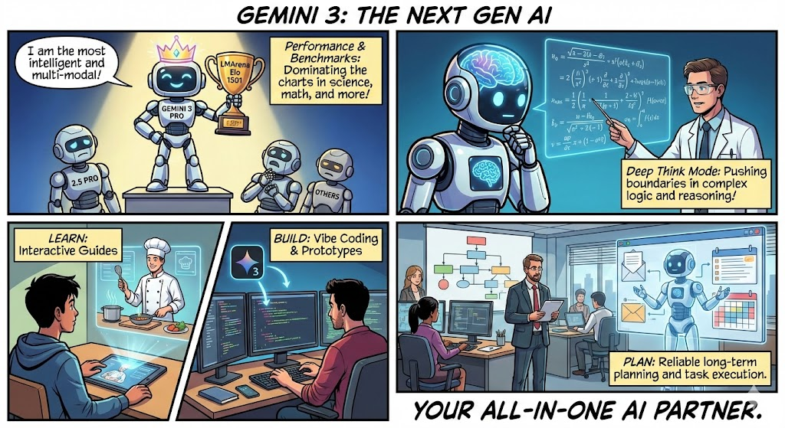
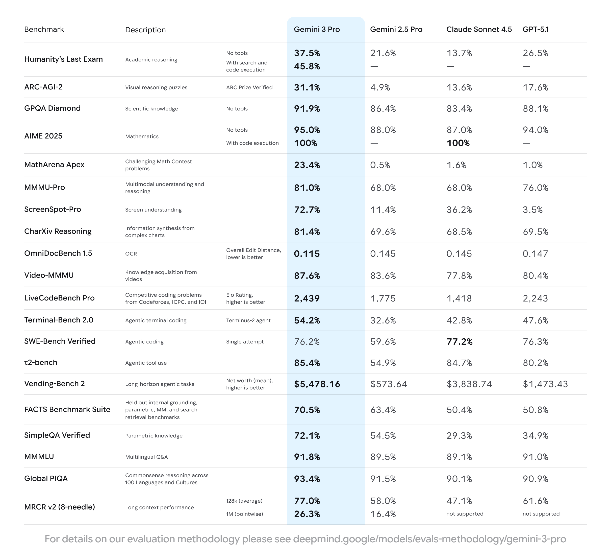
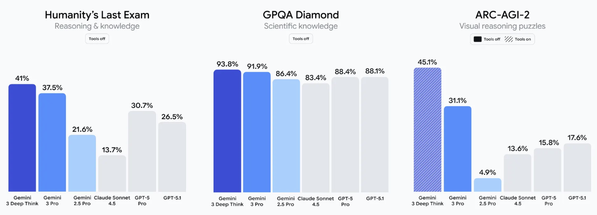
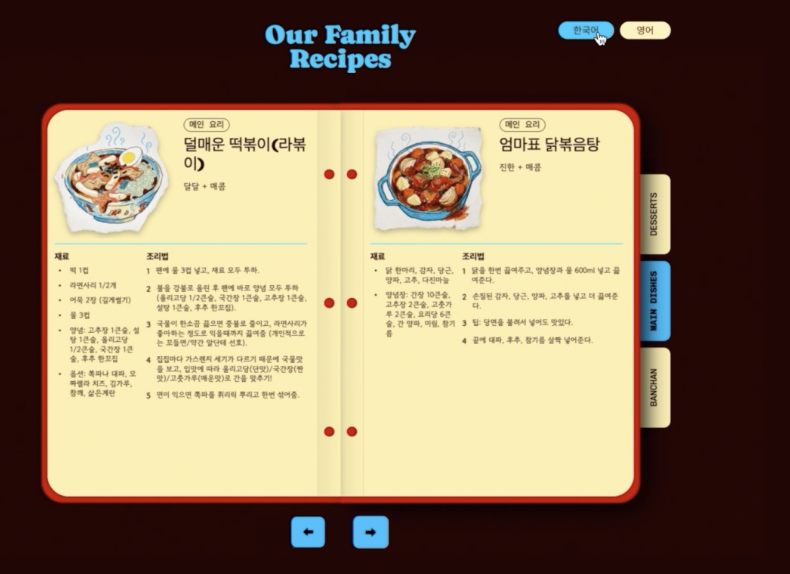
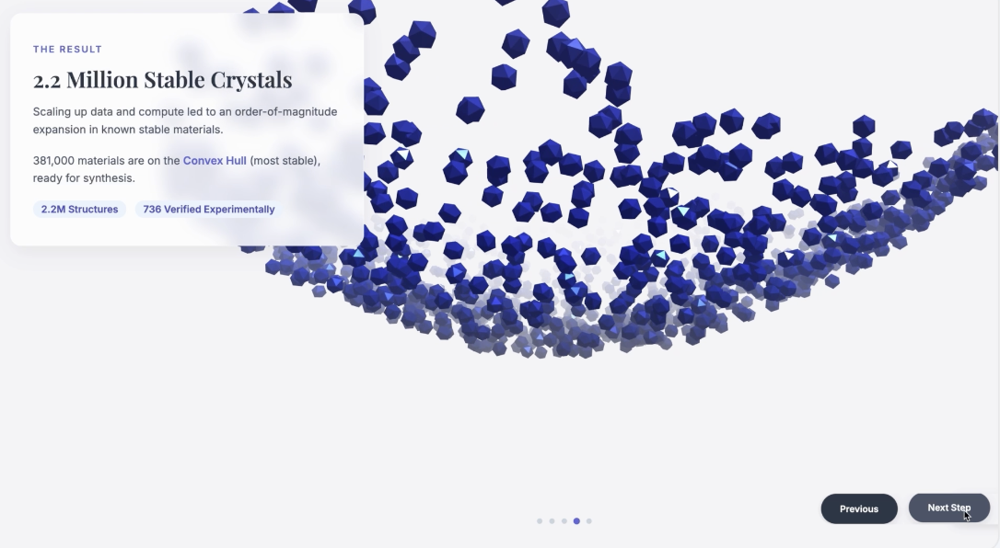
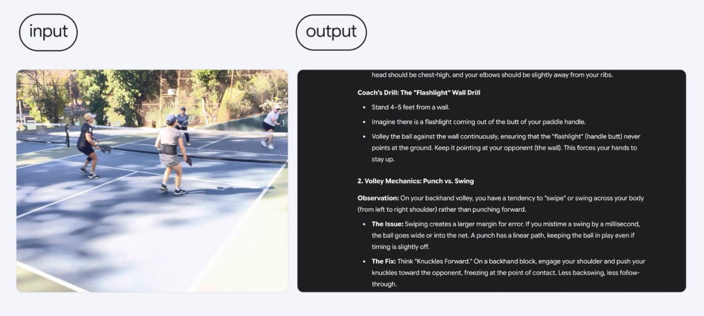
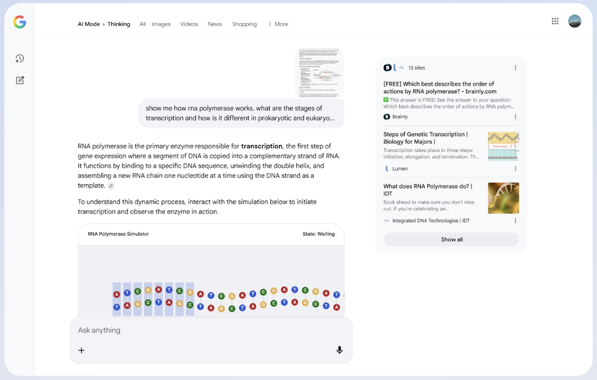

# Gemini 3：智能新时代开启最，强推理、多模态与智能体平台全解读

11 月 18 日，Alphabet 旗下的谷歌正式推出 Gemini 3 系列模型。Alphabet 兼谷歌 CEO Sundar Pichai 表示：Gemini 时代开启近两年，用户与开发者采用度空前。AI Overviews 月活用户达 20 亿，Gemini App 月活 6.5 亿+，超过 70% 的 Cloud 客户在用 AI，1300 万开发者基于生成式模型构建应用。而 Gemini 3 将会把各代能力融为一体，从读取文本图像，到能读懂场景氛围，并在搜索 AI 模式、Gemini App、AI Studio、Vertex AI 与 Google Antigravity 同步落地。

## Gemini 3 性能与评测

Gemini 3 是 Google 的新一代旗舰模型，定位为“最智能”与“最强多模态与智能体”的统一体。在几乎所有主流的 AI 基准测试中，新发布的 Gemini 3 Pro 都显著优于之前的 2.5 Pro：

- **LMArena**：Elo **1501**，登顶榜单。
- **Humanity’s Last Exam**（无工具）：**37.5%**。
- **GPQA Diamond**：**91.9%**。
- **MathArena Apex**：**23.4%**（数学前沿 SOTA）。
- **MMMU-Pro**：**81%**（多模态理解）。
- **Video-MMMU**：**87.6%**（视频多模态）。
- **SimpleQA Verified**：**72.1%**（事实性提升）。

这些成绩意味着 Gemini 3 Pro 在科学、数学等复杂问题上具备更高可靠性，在跨模态任务中理解更精准。

## Deep Think 模式：把“难题”再往前推一程

Gemini 3 Deep Think 是 Gemini 3 的增强推理模式，在复杂逻辑、多模态理解等方面取得了进一步突破：

- **Humanity’s Last Exam（无工具）**：**41.0%**
- **GPQA Diamond**：**93.8%**
- **ARC-AGI-2（含代码执行，ARC Prize 验证）**：**45.1%**

## 场景能力：学习、构建、规划，一站式搞定

### 1）Learn：学会任何东西

Gemini 3 结合了其先进的推理、视觉和空间理解能力、领先的多语言性能以及百万级上下文窗口，进一步拓展了多模态推理的边界，可帮助用户以最适合自己的方式学习。例如：

- **家庭菜谱数字化**：识别/翻译手写菜谱，生成可分享的家庭食谱。
    
    
    
- **深度学习新领域**：输入论文、长视频课程，自动生成交互式记忆卡与可视化代码。
    
    
    
- **运动分析**：解析用户的 Pickleball 比赛视频，定位动作问题并输出训练方案。
    
    
    
- **搜索新体验**：搜索 AI 模式引入生成式 UI，按需生成沉浸式可视化、交互工具/模拟。
    
    
    

### 2）Build：构建任何项目

在 2.5 Pro 成功的基础上，Gemini 3 兑现了将开发者的任何想法变为现实的承诺。它在零样本生成方面表现出色，能够处理复杂的提示和指令，从而渲染出更丰富、更具交互性的 Web 用户界面。

同时，Gemini 3 也是谷歌迄今为止构建的最佳 Vibe Coding 模型，它在 WebDev Arena 排行榜上名列榜首，获得了令人瞩目的 1487 Elo 分数。此外，它在 Terminal-Bench 2.0 测试（该测试旨在评估模型通过终端操作计算机的工具使用能力）中也取得了 54.2% 的成绩，在 SWE-bench Verified 测试（该测试用于衡量编码智能体的性能）中也大幅超越了 2.5 Pro 版本（得分为 76.2%），。

目前，Gemini 3 可在 Google AI Studio、Vertex AI、Gemini CLI、Google Antigravity（谷歌新发布的 Agent AI IDE）中使用，并已进入 Cursor、GitHub、JetBrains、Manus、Replit 等第三方生态。

### 3）Plan：规划任何事务

除了编码能力，Gemini 3 在规划方面的可靠性也得到了增强，包括：

- **长程规划稳定性**：在 Vending-Bench 2（一年期模拟经营）排名第一，稳定用工具与决策，不跑偏，回报更高。
- **现实任务执行**：能够在用户的授权与把控下，完成如预订本地服务、整理邮箱等多步骤工作流。

## 安全与责任

在性能提升的同时，Gemini 3 也是至今最安全的一代，它实现了：

- 更少盲从、更强抗提示注入、更佳网络安全防护；
- 符合 Google Frontier Safety Framework 的关键域自检；
- 与全球专家协作评估，并获 UK AISI 等机构提前审查；
- 接受 Apollo、Vaultis、Dreadnode 等第三方独立评估。

## 给不同用户的上手路线

Gemini 3 不只是更强大的“问答模型”，而是迈向“可感知、可推理、可行动”的新阶段。它把学习-构建-规划三件事串成闭环，也让“AI 合作伙伴”真正落地。对于不同用户，Gemini 3 可在不同场景下提供帮助，例如

- **学生/自学者**：可以把论文/网课丢给 Gemini 3，自动生成学习卡片与可视化；用搜索 AI 模式的生成式 UI 学复杂机理（如 RNA 聚合酶）。
- **创作者/设计师**：可以用多模态与长上下文做风格化可视化、脚本/分镜与交互原型。
- **开发者**：可以在 AI Studio/Antigravity 里 vibe coding，用智能体完成端到端原型；在 Vertex AI 做生产级部署。
- **职场/业务运营**：可以交给智能体处理多步骤流程（如邮箱整理、服务预订、资料归档），用户只需设定目标与审阅结果。