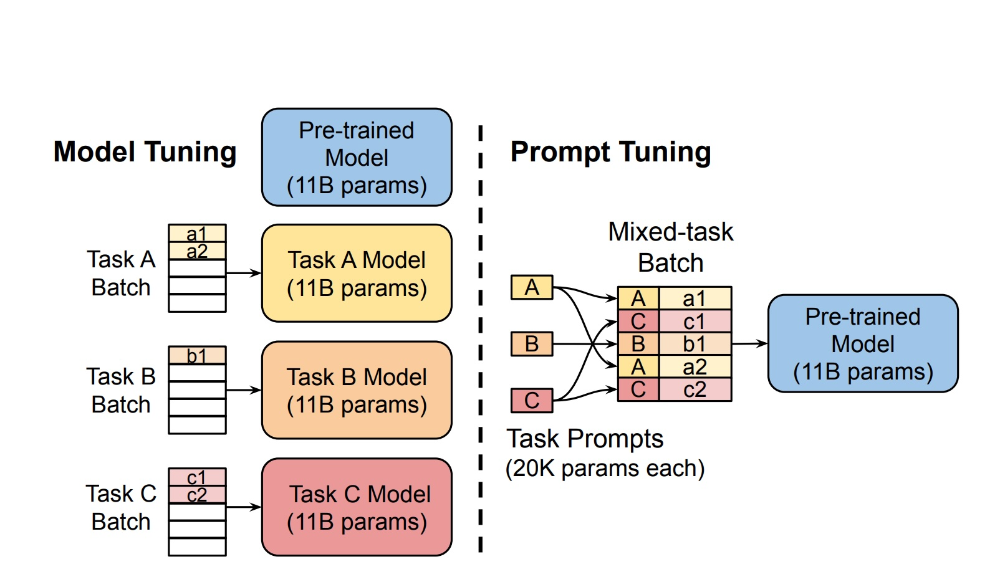
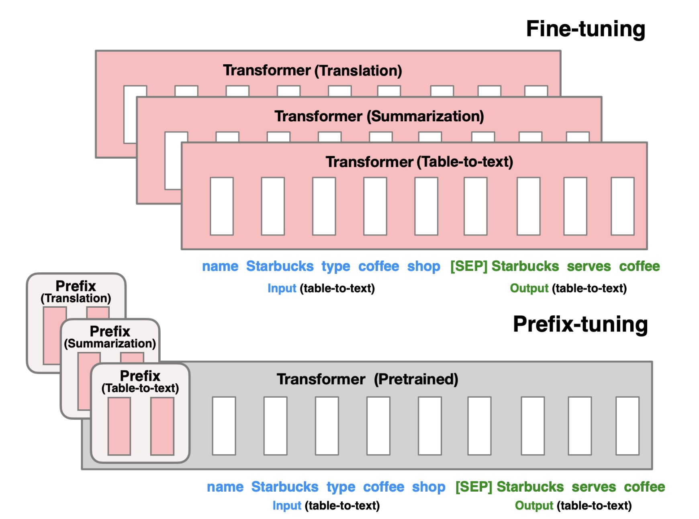
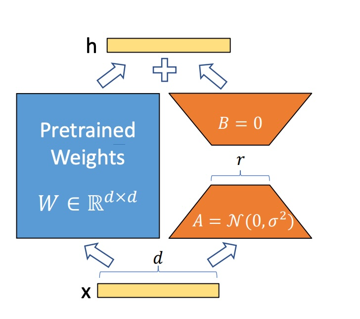
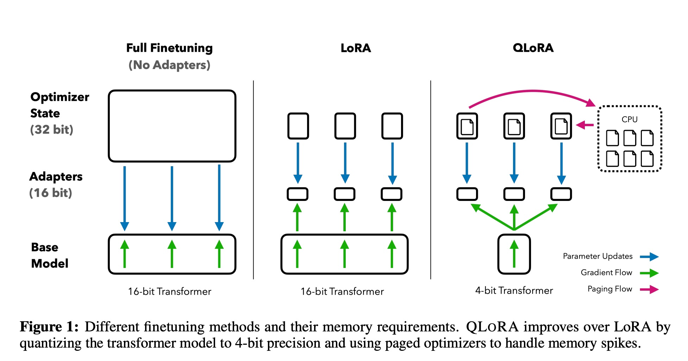
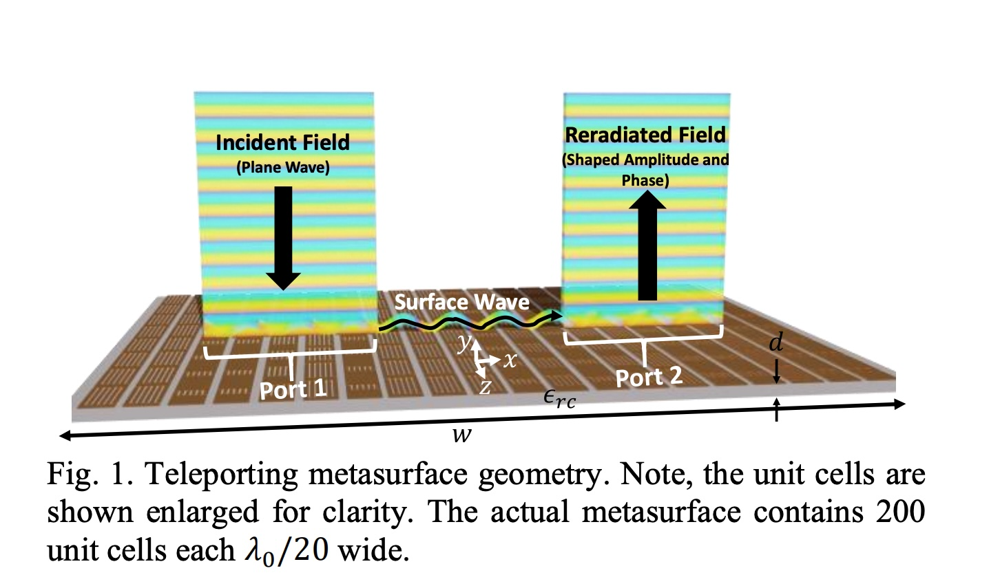

## 揭开大模型微调的神秘面纱：让 AI 更懂你

我们常说：“理解技术，比掌握技术本身更重要。” 在 AI 时代，大模型将成为像水、电一样的基础设施——不是每个人都需要从头建造，而是要学会**如何用好它**。

对于普通用户来说，掌握大模型的使用，有两个层次：

1. **提示词工程 (Prompt Engineering)**：像在和 AI 聊天时，给它更清晰、更精准的指令。
2. **大模型微调 (Fine Tuning)**：让大模型更“贴合你的需求”，今天的主角就是它。

我们来用最直观的方式理解大模型微调，首先我们把大模型想象成一个超级翻译机：

它负责把输入的“序列 X”翻译成输出的“序列 Y”：

```
输入序列 X = [x1, x2, ..., xm]
```

```
输出序列 Y = [y1, y2, ..., yn]
```

它们的关系可以简化理解为 Y = W \* X

这里的 `W` 就是模型的大脑——所有的知识都藏在这些参数里。 “大模型”就是参数特别多的大脑，有的甚至达到**千亿、万亿级别**！

> 当然，实际模型远比这个复杂，但这个比喻足够帮助理解微调。

## 为什么要微调大模型？

1. **成本太高**：训练一个大模型，从零开始造轮子，几乎只有大公司才玩得起。
2. **提示词也有局限**：Prompt 太长，推理成本高，还可能被截断影响效果。
3. **专属数据**：企业有自己的行业数据，通过微调让模型更懂专业内容。
4. **个性化服务**：为每个用户量身定制小型微调模型。
5. **数据安全**：敏感数据不能传给第三方大模型服务，只能自己微调。

通俗来说：Prompt 就像告诉 AI“怎么做”，而微调就是让 AI“适应你的习惯”。

## 微调的两条路线

从参数规模角度，大模型微调主要有两种：

1. **全量微调 (Full Fine Tuning, FFT)**

   - 就是把整个大脑重新训练一次。
   - 优点：特定领域效果最好。
   - 缺点：成本高、容易忘掉原本知识（灾难性遗忘）。

2. **参数高效微调 (PEFT)**
   - 只训练部分参数，就像给大脑加“外挂”。
   - 优点：成本低、保留原有能力。

## 微调的方法有哪些？

从训练数据和方法来看，大模型微调主要有三类：

1. **监督式微调 (SFT)**
   - 用人工标注的数据训练模型，让 AI 学会“正确答案”。
2. **基于人类反馈的强化学习 (RLHF)**
   - 用人的评价来调整 AI，让它的输出更符合人类期望。
3. **基于 AI 反馈的强化学习 (RLAIF)**
   - 用 AI 自身生成反馈，提高效率，减少收集人工数据的成本。

> 无论哪种方法，目标都是**用最低成本，让模型在特定场景更智能**。

## PEFT 的几种流行方案

随着大语言模型（LLM, Large Language Model）在各领域的广泛应用，**微调（Fine-tuning）**技术成为让模型更“懂你”的关键手段。
然而，全量微调（Full Fine-tuning）往往需要巨大的计算资源与数据成本。于是，一系列**参数高效微调（PEFT, Parameter-Efficient Fine-Tuning）**方法应运而生。

本文将带你深入了解几种目前最流行的 PEFT 技术路线：
**Prompt Tuning**、**Prefix Tuning**、**LoRA** 和 **QLoRA**。

### 1. Prompt Tuning：在输入上动“手脚”

#### 基本思想

Prompt Tuning 的核心思路是：

> 不改变大模型的参数，只在输入端前面加上一小段可训练的“提示向量”（Prompt Embedding）。

换句话说，它训练的是一小部分“虚拟词”，这些词并不存在于词表中，而是模型专门学出来的参数。

在推理时，这些虚拟 Token 会被拼接到输入序列前面，用来**引导模型生成期望的输出**。

_图 1 来源[The Power of Scale for Parameter-Efficient Prompt Tuning](https://arxiv.org/abs/2104.08691)_

#### 原理公式

给定原始输入序列：

```
X = [x₁, x₂, ..., xₘ]
```

Prompt Tuning 会构造一个新的输入：

```
X' = [p₁, p₂, ..., pₖ; x₁, x₂, ..., xₘ]
```

其中，`p₁...pₖ` 是可训练的 **Prompt Embeddings**。

模型输出则为：

```
Y = W * X'
```

这种方法相当于在不改变模型主干的前提下，通过输入端的“提示”来影响输出结果。

#### 实现特点

- 仅在 **Embedding 层** 进行调整；
- 模型参数完全冻结；
- 训练效率高、成本极低；
- 适用于分类、生成、问答等任务。

推荐论文：[The Power of Scale for Parameter-Efficient Prompt Tuning (2021)](https://arxiv.org/abs/2104.08691)

### 2. Prefix Tuning：在网络结构中加“前缀”

#### 基本思想

Prefix Tuning 的灵感来源于 Prompt Engineering：

> 给模型加合适的上下文条件，可以显著提升生成质量。

与 Prompt Tuning 不同，Prefix Tuning **不仅改输入层**，而是**在 Transformer 的每一层**中注入额外的可训练前缀向量。



_图 2 来源[Prefix-Tuning: Optimizing Continuous Prompts for Generation (2021)](https://arxiv.org/abs/2101.00190)_

#### 原理公式

在标准 Transformer 中，输出通常为：

```
Y = W * X
```

而 Prefix Tuning 会在 `W` 前拼接一组可训练参数：

```
W' = [Wₚ; W]
```

从而得到新的输出：

```
Y = W' * X
```

也就是说，它在每层的注意力机制中引入了额外的“前缀键值对”，让模型在推理时参考这些额外信息。

#### 实现特点

- 模型主干（Backbone）完全冻结；
- 在 Encoder 和 Decoder 的多头注意力中引入前缀；
- 通常需要比 Prompt Tuning 多一些显存；
- 在生成类任务（如文本续写、摘要）中表现更好。

推荐论文：[Prefix-Tuning: Optimizing Continuous Prompts for Generation (2021)](https://arxiv.org/abs/2101.00190)

### 3. LoRA：低秩分解，轻量又高效

#### 基本思想

LoRA（Low-Rank Adaptation）走的是另一条路线。
它假设大语言模型是**过度参数化的**，即模型中只有一小部分参数对输出真正重要。



_图 3 来源[LoRA: Low-Rank Adaptation of Large Language Models (2021)](https://arxiv.org/abs/2106.09685)_

因此，LoRA 不去直接修改完整权重矩阵 `W`，而是在其中注入一个**低秩更新矩阵 ΔW**：

```
Y = (W + ΔW) * X
```

#### 数学原理

LoRA 假设 ΔW 是一个低秩矩阵，可以分解为：

```
ΔW = A * B
```

其中：

- `A` 为 m×r 矩阵
- `B` 为 r×n 矩阵
- `r` ≪ min(m, n)（即低秩约束）

在训练时，只需要学习 `A` 和 `B` 这两个小矩阵，而原始参数 `W` 保持冻结。

推理时，只需在计算中加上 ΔW 即可。

#### 优势

- 显著减少可训练参数数量（通常仅占 0.1%～ 1%）；

- 训练速度快，推理时几乎无额外开销；

- 易于任务切换：

  ```
  (W + ΔW₁) → (W + ΔW₂)
  ```

  只需简单矩阵替换即可。

推荐论文：[LoRA: Low-Rank Adaptation of Large Language Models (2021)](https://arxiv.org/abs/2106.09685)

### 4. QLoRA：更省显存的量化微调

#### 基本思想

LoRA 已经非常高效，但在数十亿参数的大模型上仍可能显存不足。
于是，**QLoRA（Quantized LoRA）** 进一步在 LoRA 基础上加入了 **量化（Quantization）** 技术。



_图 4 来源[QLoRA: Efficient Finetuning of Quantized LLMs (2023)](https://arxiv.org/abs/2305.14314)_

量化的核心思想是：

> 在不显著损失精度的前提下，用更低位数来表示参数。

#### 工作原理

QLoRA 将原本的 16-bit 浮点参数量化为 4-bit，从而大幅减少显存占用。

例如，论文中指出：
在 LLaMA-65B 模型上，
传统微调需要 **780GB GPU 显存**，
而使用 QLoRA 只需 **48GB** —— 性能几乎不降，成本却下降了十几倍。

#### 优势

- 显著降低 GPU 显存需求；
- 可在单卡消费级显卡上微调大型模型；
- 保持 LoRA 的模块化与灵活性；
- 在多任务场景下可快速切换不同领域微调结果。

推荐论文：[QLoRA: Efficient Finetuning of Quantized LLMs (2023)](https://arxiv.org/abs/2305.14314)

### 延伸阅读：PEFT 技术谱系

除了以上四种方法，Parameter-Efficient Fine-Tuning 还有许多变体：

- **Adapter Tuning**：在每层插入小型可训练模块；
- **BitFit**：仅微调偏置项（bias parameters）；
- **Prompt-based Mixture of Experts**：按任务自动选择微调组件。


_图 5 来源 [Scaling Down to Scale Up: A Guide to Parameter-Efficient Fine-Tuning (2023)](https://arxiv.org/abs/2306.08019)_

### 总结

| 方法          | 是否修改主干参数 | 可训练参数量 | 显存消耗 | 适用场景       |
| ------------- | ---------------- | ------------ | -------- | -------------- |
| Prompt Tuning | 否               | 极少         | 极低     | 分类、指令微调 |
| Prefix Tuning | 否               | 较少         | 较低     | 文本生成、对话 |
| LoRA          | 局部注入低秩矩阵 | 少量         | 中等     | 通用任务       |
| QLoRA         | LoRA + 量化      | 少量         | 极低     | 大模型场景     |

> 如果说“全量微调”是重新教育模型，那么“PEFT 微调”就是**在不改模型大脑的前提下，教它新技能**。

未来，随着 LoRA、QLoRA 等方法的成熟，普通研究者也能在消费级设备上训练出属于自己的专业大模型。

1. [The Power of Scale for Parameter-Efficient Prompt Tuning](https://arxiv.org/abs/2104.08691)
2. [Prefix-Tuning: Optimizing Continuous Prompts for Generation](https://arxiv.org/abs/2101.00190)
3. [LoRA: Low-Rank Adaptation of Large Language Models](https://arxiv.org/abs/2106.09685)
4. [QLoRA: Efficient Finetuning of Quantized LLMs](https://arxiv.org/abs/2305.14314)
5. [Scaling Down to Scale Up: A Guide to Parameter-Efficient Fine-Tuning](https://arxiv.org/abs/2302.00072)
