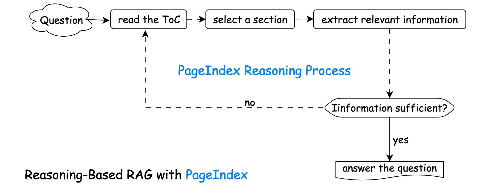

# **PageIndex：新一代无向量、基于推理的 RAG，让模型“先想清楚再去找”**

## 一、从“大上下文”到“聪明检索”：RAG 的瓶颈来了

大模型已经成为文档问答、知识检索的通用引擎，但它有一个绕不开的物理限制：**上下文窗口**——一次最多只能读这么多 token。

即便今天的模型已经支持几十万 token，上下文变长后，模型真的“看懂了全部内容”吗？像 Chroma 的 Context Rot 研究就发现：上下文越长，召回的准确率反而在下降。也就是说，把一整本厚书都塞给模型，它可能“看着很努力，其实没记住多少”。

于是，**检索增强生成（RAG）** 成了主流方案：先从文档中“捞出最相关的一小撮内容”，再丢给模型，让有限的上下文真正花在刀刃上。

主流的 RAG 方案，几乎都在用向量 + 向量库，而这套方案本身，正在暴露越来越多的结构性问题。为此，Vectify AI 团队提出了一个新的方向：**PageIndex——一种不依赖向量库、基于“推理导航”的新一代 RAG 框架**，让模型像人一样“看目录、找章节、顺着引用一路追下去”。

## 二、为什么传统向量 RAG 越用越别扭？

经典向量 RAG 的流程大致是这样：

1. 预处理：把文档切块（例如每 512 / 1000 tokens 一块）
2. 嵌入：用 embedding 模型把每个块变成向量
3. 入库：存进向量数据库（如 Chroma、Pinecone）
4. 查询：用户问题 → 向量 → 在库里找“最相似的 K 个块”
5. 把这些块和问题拼起来，送给 LLM 回答问题

这套系统在短文本、粗粒度检索上很实用，但在长文档、专业文档场景中，会遇到一系列痛点：

1. 查询和知识空间天然“不对齐”
    
    向量检索默认：语义最相似 = 最相关。但用户提问往往表达的是 “意图”，而不是文档中出现过的原文片段。比如：“这份报告是怎么控制风险敞口的？”文档中可能没有这句话，但答案散落在多个风险管理章节里。
    
2. 语义相似 ≠ 真正相关
    
    在技术/法律/金融等专业文档中，非常常见：两段文字用词高度相似，但说的是完全不同的结论；或者关键结论所在段落，措辞平平无奇，语义看起来“不够相似”，却最重要。向量检索擅长捕捉“语言表面相似”，但很难直接理解“这种场景下到底哪一段才关键”。
    
3. “硬切块”打断语义与逻辑
    
    为了嵌入，文档必须被按固定长度切块。在这种设置下，可能出现一个段落、一个公式、一个小节可能被拆在两个块里，某个块看上去很相关，但上一页和下一页才是完整推导。模型看到的是“碎片化语境”，容易理解错、补错、甚至“编故事”。
    
4. 无法自然利用聊天历史
    
    大多数向量 RAG 把每个查询当成独立的一次检索，检索器不知道你前面已经问过啥、看过啥、当前话题延续自哪一段。这导致多轮问答体验割裂：用户是连贯在追问，检索器却每次都当“新问题”。
    
5. 文内引用几乎处理不了
    
    文档里充满了这种句子：“见附录 G”、“参见表 5.3”、“如图 7 所示……”。这些指向关系在语义向量空间里几乎捕捉不到：“附录 G” 和 真正的附录内容 完全不像一个东西。除非你在预处理阶段手工搭建知识图谱，否则向量 RAG 往往就“断链”了。
    

也因此，包括 Claude Code 在内的一些先进系统，已经在代码场景里放弃了传统向量 RAG，改用更加结构化、无需向量库的检索方式，以换取精准度和速度。把这套思路推广到文档世界，就是今天要讲的 PageIndex。

## 三、PageIndex：让模型先读目录，再去找答案

**PageIndex 的核心思想很简单一句话：**

> 不要先把文档打碎成向量，再模糊匹配；而是先把文档变成一个“可推理的目录树”，让模型在树上走、在原文里查。
> 

它模拟的是 **“人类读长文档”的自然过程：**遇到一个问题时，你不会从第一页开始生啃，而是

1. 先 **扫一眼目录**，看有哪些章节可能有关
2. 再 **锁定一两章** 重点翻
3. 不够再去看 **相邻小节 / 附录 / 表格**
4. 在这个过程中不断修正自己的判断，直到信息足够回答问题

PageIndex 就是把这个过程机械化，让 LLM 按照一个迭代循环来工作：



1. **阅读目录（ToC / PageIndex Tree）：** 了解文档整体结构，找出可能相关的章节/子节。
2. **选择一个章节：** 基于当前问题，挑选最有可能包含信息的节点。
3. **提取该节点的内容：** 通过 `node_id` 精确拉取原文文本/表格/图片等。
4. **判断信息是否足够？**
    - 如果“够了”，就进入回答阶段；
    - 如果“不够”，退回目录，挑下一批节点继续看。
5. **在已收集内容的基础上生成回答**

这个过程中，**目录（ToC / index tree）就是模型的“内部索引”**。模型不是在向量库里找“相似向量”，而是在一棵目录树上做“推理导航”。

## 四、把文档变成一棵 JSON 目录树：PageIndex Tree

为了让 LLM 能“看懂目录”，PageIndex 把文档结构统一表示成一个 JSON 树，也就是所谓的 **PageIndex Tree**。每个节点代表文档中的一个逻辑部分：章节、小节、段落、页面……结构大致如下：

```json
Node {
  node_id: string,      // 节点唯一 ID
  name: string,         // 标题或标签（例如：3.2 Bayesian Linear Regression）
  description: string,  // 这部分大致讲了什么（可选）
  metadata: object,     // 任意上下文信息（来源、页码范围、主题、标签等）
  sub_nodes: [Node]     // 子节点（递归结构）
}

```

其中：

- **`node_id` 就是“索引键”**
    
    通过它可以准确取回对应的原始内容（文本、图像、表格等）。
    
- **`sub_nodes` 支持多层嵌套**
    
    这棵树可以细到“章节 → 小节 → 段落 → 页码范围”。
    
- **`metadata` 用来放各种辅助信息**
    
    比如页码区间、文档类型、标签、时间、相关性打分……
    
    这些元数据也可以成为“推理导航”的信号。
    

不同于向量数据库那种“外部静态索引”，在 PageIndex 中：

- 模型可以在这棵树上 **递归遍历、比较、筛选**
- 可以通过 `node_id` 反查原文内容
- 可以一边看 ToC，一边根据问题动态决定“下一步去哪儿查”

PageIndex 把这种方式称为：**“上下文内索引（in-context index）”**。

## 五、PageIndex 如何逐项解决 RAG 的五大痛点？

我们按照前面的 5 个问题，看看 PageIndex 是怎么一一化解的。

1. 查询与知识空间不匹配
    
    传统向量 RAG：
    
    > “谁跟这个问题语义最像，我就把谁丢给模型。”
    > 
    
    PageIndex：
    
    > “我思考一下，这个问题按常理应该藏在哪一章。”
    > 
    
    例如：“递延资产的总值在哪里？”模型可以在目录里推理：
    
    > “资产总值通常在财务报表或统计附录里，那就先看看附录和统计表部分。”
    > 
    
    换句话说，**从“比句子像不像”变成“推理这类信息通常放哪儿”**。
    
2. 语义相似 ≠ 真正相关
    
    在 PageIndex 中，模型会先阅读和分析 ToC 节点的 **标题 + 摘要 + 元数据**。例如对于问题“如何避免过拟合？”，PageIndex 会先考虑问题本身的意图，再对比每个节点在整本书中的 **角色和上下文**，找出哪个部分真正讲“正则化机制”、“模型复杂度控制”，而不是只字面提到 “overfitting”。因此，它检索到的是 **“语境中最相关”** 的内容，而不只是“看上去用词相似”的句子。
    
3. “硬切块”破坏语义整合
    
    PageIndex 不再按固定 token 长度粗暴切块，而是以 **章节/小节/页区间** 为单位：
    
    - 一个节点 = 一个语义完整的逻辑块
    - 如果当前节点不够，模型可以 **显式请求相邻节点**（例如：下一小节、同一章节的其它部分）
    
    这更接近人类读文档的方式：
    
    > “这一节没看明白，再往前翻一页/往后翻一页看看。”
    > 
4. 无法利用聊天历史
    
    由于 PageIndex 的检索过程本身就是 **推理驱动 + 多轮迭代**，所以它天然能和对话上下文结合：
    
    - 模型记得你之前问过什么、看过哪些节点
    - 新问题可以被理解为 **上一轮问题的延伸**
        - 例如：先问 “金融资产怎么定义”，后问 “那负债呢？”
        - 模型会自动聚焦在同一报告中“负债”相关章节，而不是重新在全局乱搜
5. 跨文档引用终于能“走得通”
    
    PageIndex 的目录树保留了 **章节之间的层次与关联**，当原文里出现：
    
    > “参见附录 G 的统计表”
    > 
    
    模型可以：
    
    1. 看到这句话中出现“附录 G”
    2. 回到 PageIndex Tree 中找到“附录 G”节点
    3. 再通过 `node_id` 把对应表格内容拉回来
    4. 在这个基础上合成答案
    
    这一点非常关键：不需要人工构建知识图谱，模型就能利用目录本身的结构做“跟踪跳转”。
    

## 六、向量 RAG vs. 推理型 RAG：一张表看明白

| 局限点 | 向量型 RAG 的做法 | PageIndex 推理型 RAG 的做法 |
| --- | --- | --- |
| 1. 查询与知识不匹配 | 只看语义相似度，可能错失真正相关章节 | 先读目录，再推理“答案大概率在哪一部分” |
| 2. 语义 ≠ 相关性 | 容易检索到语言相似但不重要的段落 | 强调语境与文档结构中的“角色”，找到真正关键信息 |
| 3. 硬切块 | 固定 token 切块，打断完整章节 | 以章节/小节为单位检索，必要时按结构往前后扩展 |
| 4. 无聊天上下文 | 每次检索是孤立事件 | 检索过程本身是多轮推理，可融合聊天历史 |
| 5. 文内引用 | 难以跟踪“附录”“表格”等引用关系 | 利用 ToC/PageIndex 树，自然跟进引用节点 |

PageIndex 这类推理型 RAG 和向量型 RAG 的区别可一句话概括：

> 向量型 RAG 在“找相似文本”；推理型 RAG 在“思考该去哪查、为什么去那里”。
> 

## 七、PageIndex Chat：一个经典用例

以《Pattern Recognition and Machine Learning》（Bishop）为例，假设用户问：

> “How does Bayesian inference prevent overfitting?”
> 
> 
> （贝叶斯推断是如何避免过拟合的？）
> 

PageIndex 的整体流程大致是这样：

1. **先获取整本书的 JSON 目录树**
    
    调用 `get document structure`，拿到每个章节/小节的 `node_id`、标题和摘要。
    
    
    
2. **在目录树上“思考”要去哪儿**
    
    模型会把问题中的关键词 *Bayesian inference*、*overfitting* 和每个节点的标题、摘要进行匹配，例如：
    
    - 第 3 章 “Bayesian Linear Regression”
    - “The Evidence Approximation”
    - 第 1 章中的 “Bayesian curve fitting” 等
    
    并选出最有可能藏着答案的几个节点。
    
    
    
3. **通过 `node_id` 精确拉取原文内容**
    
    PageIndex 调用 `get page content`，获取这些节点对应的页码范围，得到：关于“对参数积分而非点估计”的解释、先验分布带来的自动正则化、有效参数数量 γ、模型 evidence 与 Occam 剃刀等关键段落。
    
4. **在这些“按章节规划过”的内容上进行推理**
    
    最终输出一个结构化答案：解释贝叶斯推断是如何通过先验、模型证据等机制自然避免过拟合。
    
    
    

整个过程有一个明显的特点：模型不是在全书范围内“盲目向量检索”，而是在目录上“分区定位 → 精准下钻 → 多轮补充”，这就是 PageIndex 所强调的 **“推理式导航 + 精细内容拉取”**。

## 八、PageIndex MCP：在 Claude 等工具中启用

PageIndex 也已经支持 MCP 协议，可以作为 Claude 等工具的一个“外接大脑”。

以 Claude 为例，启用步骤非常简单：

1. 在设置中选择 “Add custom connectors”
2. 添加 PageIndex 服务，URL 填写：`https://mcp.pageindex.ai/mcp`
3. 登录并授权
4. 之后在 Claude 中就可以直接调用 PageIndex，对长文档进行“目录推理 + 原文精检索”

这样，你不需要自己搭建向量库，也不必手写复杂的检索逻辑，只要把文档接入 PageIndex，就可以让 Claude 获得一套“像人一样翻书找答案”的能力。

## 九、从“堆向量”到“教模型看目录”

如果用一句对比来结束这篇文章：

- 传统向量 RAG 的思路是：
    
    > “我把文档切碎、嵌入、入库，你来匹配相似度吧。”
    > 
- PageIndex 的思路是：
    
    > “我把文档整理成一棵清晰的目录树，你先想清楚该去哪里查，再一步一步把真正有用的内容调出来。”
    > 

在长篇、结构化、专业文档场景中（法律、金融、技术白皮书、教科书……），**后者往往更接近人类专家的做事方式**，也更符合我们对“智能检索”的期待。

如果你正在：

- 搭建企业内部知识问答系统
- 做长文档问答 / 报告分析 / 代码库导航
- 疑惑“为什么我明明有向量库，模型还是经常答非所问”

不妨试试换个思路：**让模型先读懂目录，再去找答案。**

## 参考内容

1. [https://pageindex.ai/blog/pageindex-intro](https://pageindex.ai/blog/pageindex-intro)
2. [https://chat.pageindex.ai/chat](https://chat.pageindex.ai/chat)
3. [https://pageindex.ai/mcp](https://pageindex.ai/mcp)