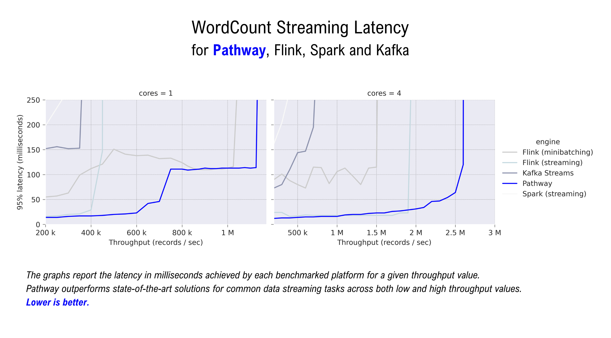

# Pathway：解锁实时数据处理的新路径

实时数据流难以驾驭？复杂的 ETL 管道让工程师头疼？当用户行为和业务事件源源不断涌入系统，传统的批处理方法常常力不从心，会导致数据延迟和系统瓶颈。想象一下，在股票交易高峰或电商大促时刻，系统需要极快地处理海量数据，更新风险指标，调整已有库存，生成实时推荐。这对传统架构来说是个巨大挑战。然而，**Pathway** 的出现，为实时数据处理打开了一条全新道路。这个开源框架正以其独特的方式，帮助我们解决实时数据处理的难题。

## Pathway 是什么？解决了哪些问题？

Pathway 是一个基于 Python 的实时数据处理框架，支持流处理、实时分析、LLM 管道和 RAG（检索增强生成）等场景。简单来说，它让开发者能够使用熟悉的 Python 语言来构建**统一的批处理和流处理**管道——同一套代码既可处理历史批量数据，又能处理源源不断的实时数据流。

Pathway 的初衷是为了解决现代企业在物联网传感器、供应链系统产生的海量数据处理中遇到的问题——这些数据需要快速反应，并结合机器学习等进行复杂分析。传统工具往往将批处理与流处理分开执行，这使得实时计算复杂算法时显得力不从心。而 Pathway 实现了"流批一体"：无论数据是静态批量还是无穷流式，都可以用同样的代码和模型来处理，大大减轻了开发和运维的负担。

更重要的是，Pathway 内置了一套强大的**增量计算引擎**。虽然开发者编写的是 Python 代码，但底层是由 Rust 实现的高性能引擎驱动，通过 Differential Dataflow 技术对数据变化执行增量式更新。通俗地说，当新数据到来时，Pathway 只重新计算必要的部分，而不像传统方法每次从头计算整个批次的数据。借助 Rust 引擎的多线程与分布式能力，Pathway 可以在保持 Python 开发体验的同时，提供和底层语言比肩的性能。

官方资料显示 Pathway 在流处理和批处理中性能超越了业界常用的 Flink、Spark 等框架。比如在经典的单词计数（WordCount）测试中，Pathway 在不同吞吐量下都展示出更低的处理延迟（如下图所示），体现出卓尔不群的性能优势：

*Pathway 在 WordCount 基准测试中的处理延迟相较于 Apache Flink、Apache Spark 和 Kafka Streams 更低（纵轴为延迟，越低越好）*

从诞生以来，Pathway 就瞄准了一些传统流处理框架难以涉足的复杂场景。比如，Pathway 能在流模式下执行**迭代算法**（如动态 PageRank 图算法）或机器学习模型更新，这些在 Flink 等框架上往往难以实现或者不支持，而在 Pathway 中却是跟处理简单聚合差不多的常规操作。

同时，Pathway 针对实时数据的**时序一致性**做了精心设计——当数据乱序到达或出现延迟时，框架会自动更新计算结果，确保最终结果一致可靠。这一点对于金融风控等严苛场景特别重要。总的来说，Pathway 通过统一引擎、增量计算和高性能，将过去需要多套系统才能完成的任务合为一，大大降低了实时数据处理的复杂度。

**与传统方法有何不同？**

- **统一批流，开发友好：** Pathway 最大的优势就是把批处理和流处理统一了起来。以前用 Hadoop/Spark 做批处理，用 Kafka Streams/Flink 做流处理，要写两套代码，维护两套系统。现在用 Pathway，一套 Python 代码就能搞定，本地开发完后可直接部署到线上。
- **增量计算，高性能低延迟：** Pathway 用 Rust 提供的引擎，采用增量计算，新数据到来只计算变化的部分，延迟能做到毫秒级。测试下来，吞吐和延迟都比同类工具好不少。做高频交易等对响应时间要求极高的场景很有用。
- **易于使用的 Python API：** 简单的 Python API，不像 Flink、Spark 需要搭集群。可以直接用各种 Python 的 ML 库，方便地编写自定义函数。
- **高级算法与ML支持：** 功能上支持窗口、join、排序这些基本操作，还支持机器学习和图算法。比如实时推荐、异常检测这些以前很难做的场景，现在都能比较容易实现。在 Pathway 的统一模型下，即使是处理**实时机器学习推理**或**多步事务关联**，也如同编写普通数据转换。这让诸如**实时推荐系统**、**动态图算法**等从理论变成了现实。
- **生态连接与一致性保障：** 数据接入方面，内置了很多连接器，Kafka、PostgreSQL、Google Sheet 等，还支持 Airbyte 的上百种数据源。输出也能写回数据库或消息队列。可靠性上，开源版保证 at-least-once，企业版保证 exactly-once，以及持久化机制保证重启后能继续处理。基本上该有的企业级特性都一应俱全。

## Pathway 的实际应用场景

一个好的技术框架，最终要在真实场景中证明自己。Pathway 目前已经在多个领域展示了它的价值，下面我们看看几个具体应用场景：

### 实时金融数据处理：极速响应的风险分析

金融领域对实时性要求极高。从股票交易、期权定价到风控报警，每秒都可能意味着巨大的差异。传统方案往往使用 Kafka + Spark Streaming 等架构来处理行情和交易流水，但部署和运维成本高昂，且难以做到毫秒级延迟。Pathway 提供了一个更轻量但强大的选择。

Pathway 团队与市场数据公司 Databento 合作构建了一个**实时期权希腊值计算**管道：通过 Pathway 连接 Databento 的实时行情数据流，利用 Black-76 金融模型计算期权的 Delta、Gamma 等希腊指标，并随行情变化实时更新这些风险值。在这个方案中，Pathway 作为核心引擎，不仅消化来自交易所的高频数据，还在内存中执行定价模型的计算，每当市场数据变动时几乎立即输出新的风险指标。

更难得的是，同一套 Pathway 代码既可用于对历史数据重放计算以验证策略，又可用于无缝切换到实时流数据以驱动交易决策——这充分体现了 Pathway "流批一体"的威力。用 Pathway 来替代沉重的传统大数据系统，可以将延迟从分钟级降低到亚秒级甚至毫秒级，大幅提升市场反应速度。

### 供应链与物流管理：全局实时可视化

在供应链和物流领域，实时数据处理能够带来**全局可视化**和**快速响应**。设想一家大型物流企业需要监控数百辆运输卡车的实时状态：包括车辆位置、温度、油耗、故障警报等。如果采用传统方案，可能需要将数据发送至消息队列，再由流处理框架批次计算，然后存入数据库供监控平台查询。这种链路往往复杂且延迟较高。

Pathway 则可以简化整个流程。有社区开发者分享了使用 **NATS + Pathway** 来实现车队（fleet）监控的案例。车辆 IoT 设备将传感数据直接发布到轻量级消息系统 NATS，Pathway 通过原生 NATS 连接器订阅这些数据，实时执行流分析和异常检测，然后将结果（如异常报警）推送回 NATS 的另一个主题供系统订阅。这样的架构替代了传统的 Kafka + Flink 方案，显著降低了系统复杂度。

在这个车队监控示例中，Pathway 实时计算每辆车的状态，并检测诸如超速、引擎过热、油量过低等异常，一旦发现就立即通过 NATS 触发警报。比如引擎温度超过阈值时，几乎瞬时地通知调度人员采取行动，实现了让供应链管理者对运输环节的问题**秒级响应**。

值得一提的是，Pathway 背后的公司已与国际航运巨头 **CMA CGM**、欧洲物流领军企业 **DB Schenker** 等展开合作，从港口航运到仓储配送，引入 Pathway 打造新一代的实时数据分析平台。这预示着 Pathway 在供应链领域有着广阔的应用前景。

### 推荐系统与用户个性化：实时响应用户行为

在互联网产品中，推荐系统和个性化功能需要随着用户行为的变化不断调整。传统推荐架构往往分为离线模型训练和在线推断两部分：用户行为数据先批量存储，供离线计算生成特征和模型，再用于线上服务。这样的流程通常存在数小时甚至数天的滞后。而随着实时流处理技术的发展，业界开始追求**实时推荐**，即用户行为发生后几秒内就反映到推荐结果中。

Pathway 天生适合构建这样的实时推荐管道。得益于**实时机器学习**的支持，Pathway 可以持续地接收用户行为事件流，比如电商网站上的点击、浏览、加购等。通过流式 join 将这些行为与用户和商品特征关联，再通过滑动窗口统计近期热度或利用增量模型更新用户画像，最终将计算结果输出给推荐服务。这一切在 Pathway 中可以**持续不断地运行**，而不需要设定人工的批处理间隔。

当用户在短视频平台点赞某类内容，Pathway 管道可以在几秒内将此信息融入推荐算法，调整该用户稍后刷到的视频排序。这种近乎实时的反馈在传统架构中难以实现，而 Pathway 将其变成可能。同时，由于 Pathway 容易与 Python 的机器学习生态结合，开发者可以快速试验新的推荐特征计算或算法，并观察其实时效果。

## 社区与企业采纳：Pathway 生态现状

自开源以来，Pathway 在开发者社区和企业界都引起了不小关注。截至目前其 GitHub 仓库已获得 **4万+** 星标（Star），可见社区对实时数据处理解决方案的强烈需求。一些开发者在社区分享了使用 Pathway 的经验，比如用 Pathway + Streamlit 构建实时数据分析仪表板，或以 Pathway 作为替代传统 Lambda 架构的新选择。

而在企业应用方面，Pathway 的身影也已出现在多个**关键领域**。除了前文提及的金融、物流案例，Pathway 官方公布的成功案例中，包括了 **一级方程式赛车车队**、**欧洲某国家级邮政服务（La Poste）**、**北约防务** 等重量级用户。其中某 F1 方程式车队在使用 Pathway 之前，面临着原有数据框架僵化难用的问题，而 Pathway 帮助他们构建了灵活的实时数据平台：全队超过 80 条数据流水线由 Pathway 驱动，将数据处理延迟压缩到 **2 毫秒**以内，处理速度相比过去提升了 90 倍！这支车队的技术负责人反馈说："有了 Pathway，我们终于可以让终端工程师自行定义和部署数据处理逻辑，Python 代码易于维护，上生产也非常简单"。

在邮政和航运领域，引入 Pathway 则帮助这些传统企业实现了运营流程的数字化升级——以前可能需要人工整合的多源数据，如今通过 Pathway 实时汇聚，管理者可以随时掌握网络中的异常和变化。这些成功实践充分证明了 Pathway 在**性能、易用性和可靠性**方面已经达到了企业生产环境的要求。

## 未来展望：实时数据处理的黄金时代？

Pathway 的出现契合了当前数据领域的一个重要趋势：**实时智能 (Real-time Intelligence)** 正逐渐成为企业核心竞争力的一部分。从早年的批处理大数据，到如今对毫秒级响应的追求，数据处理正在经历一场变革。Pathway 作为这一浪潮中的新秀，以其统一流批、增量计算和 Python 亲和性，展现了实时数据处理的全新可能性。

当然，未来仍有不少值得思考的问题：Pathway 能否成为下一代流处理的事实标准？在更广泛的生态中，它会如何与云原生平台、AI 基础设施融合？面对不断增长的数据规模和复杂度，Pathway 的架构能否持续保持高性能和稳定性？这些都还有待时间检验。

但可以确定的是，在追求**更低延迟、更智能自动化**的数据时代，Pathway 已经率先迈出了一大步，给业界提供了新的思路和工具。对于开发者和架构师而言，或许正是拥抱这些新型框架的时候了——毕竟，谁不想站在技术演进的前沿，去探索数据处理的无限可能呢？