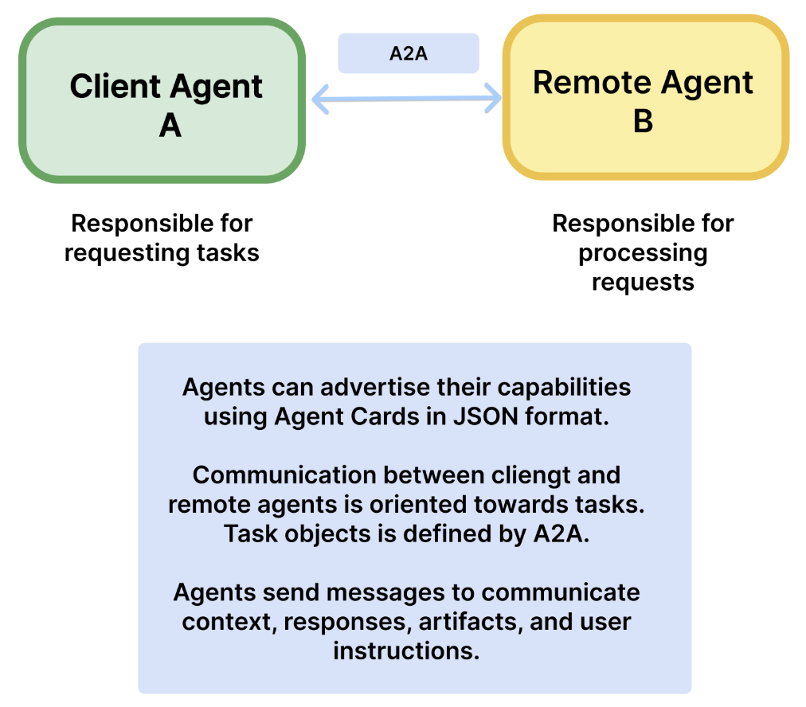

# 解锁 Agent 协作新范式！深入解析 Google A2A 协议

在智能体（Agent）系统成为 AI 应用趋势的今天，如何让各类 Agent 高效、安全、标准化地“说话”和“协作”，成为了技术落地的关键难题。为此，Google 推出了 A2A（Agent-to-Agent）协议 —— 一个专为智能体通信设计的开放协议，致力于为 Agent 之间构建一套通用的“交流语言”。

你可以把 A2A 想象成 Agent 世界里的 “TCP/IP” 协议，它不仅打通了不同平台、模型与框架之间的信息壁垒，还让 Agent 可以像专业团队一样分工协作，各自调用工具、传递任务、共享上下文，真正实现“多 Agent 一体化作战”。

接下来，本文将带你快速了解 A2A 的核心理念、技术结构，以及它如何助力下一代 AI 应用架构。

---

## 1 什么是 A2A？

A2A（Agent-to-Agent）协议是 Google 推出的一种开放协议，旨在标准化不同 AI Agent 之间的通信和协作。通过 A2A，各种由不同厂商或框架构建的 Agent 可以直接对话，安全地交换信息，并在各种工具、服务和企业系统之上协调工作。

通俗来讲，A2A 协议为 AI Agent 打造了一个统一沟通的“语言”。它解决了过去多 Agent 系统中缺乏标准造成的通讯不一致、数据格式不兼容、扩展困难等问题。通过 A2A，不同专业特长的 Agent 可以各司其职，又通过标准接口互相配合，协同完成复杂任务。

### 1.1 A2A 的参与者


如图所示，A2A 协议涉及三种参与者：

- **用户（User）：** 即终端用户，通过 Agent 系统来完成任务。
- **客户端（Client）：** 使用 A2A 服务的应用程序或其他 Agent，它将请求（例如 `tasks/send`）发送到 A2A 服务器的 URL。
- **远程代理（Remote Agent / Server）：** 一个 Agent，它暴露一个实现了 A2A 协议方法的 HTTP 端点，接收请求并管理任务的执行。

### 1.2 A2A 的通信方式

- A2A 协议使用 HTTP 作为客户端与远程代理之间的传输方式。根据客户端和远程代理的功能，它们可以使用 SSE 来支持服务器推送更新的流式通信。
- A2A 使用 JSON-RPC 2.0 作为客户端与远程代理之间通信的数据交换格式。
- A2A 遵循 OpenAPI 的认证规范进行身份认证。值得注意的是，A2A 协议中，代理之间不会交换身份信息。相反，它们会通过协议外的方式获取认证材料（如令牌），并将其通过 HTTP 请求头发送，而不是包含在 A2A 的数据体中。
    
    尽管 A2A 不在协议中直接传输身份信息，但服务器仍会在 A2A 的数据体中发送其认证要求。例如在 Agent Card 中对 "authentication" 进行描述：
    
    ```json
    {
    "name": "Google Maps Agent",
    ...
    "authentication": {
      "schemes": "OAuth2"
    },
    ...
    }
    ```
    
    相应地，客户端应使用服务器公布的某种认证协议来验证身份，并获取凭证。
    
    此外，如果某个代理在任务执行过程中要求客户端/用户提供额外凭据（例如，为了使用特定工具），代理应返回任务状态为 input-required，并在数据体中附带一个 Authentication 结构体。此时客户端仍需通过协议外方式获取凭证材料。
    

### 1.3 A2A 与 MCP 的关系


A2A 常被拿来与 Anthropic 提出的 MCP（Model Context Protocol）协议一起讨论。实质上，两者定位不同但互补。

MCP  是连接 LLM 与数据、资源和工具的新兴标准。具体来说，MCP 为不同模型与框架统一函数调用方式，从而构建了一个工具服务提供者的生态系统，并显著降低了代理连接工具和数据的复杂性。通过 MCP 开放标准，LLM 驱动的应用可以快速连接到外部数据源和工具，例如数据库、文件系统、第三方 API、业务应用等。例如，一个基于 MCP 的系统可以让 chatbot 查询数据库，调用 API，或是访问用户日历。MCP 相当于给 Agent 提供了一个“工具箱”，使其能够在需要时获取外部能力。

A2A 则专注于解决另一类问题。A2A 是一种应用层协议，旨在让 Agent 以其自然的方式进行协作。它使 Agent 之间能够像“Agent”或“用户”那样进行交流，而不是仅仅像“工具”。当每个 Agent 本身（可能内部已经结合了 LLM 和工具）作为一个功能完备的单位时，不同 Agent 之间需要有标准协议来交换任务、信息和结果，这就是 A2A 要做的事情。如果说 MCP 让 AI Agent 拥有并使用各种工具，那么 A2A 就是规定这些“技师”如何彼此对话、互相配合来完成更复杂的任务。

A2A 的官方文档中提供了这样一个例子：

考虑一个汽车修理厂，负责修理汽车。修理厂雇佣了一些工人，他们使用专用工具（如千斤顶、多用电表、套筒扳手等）来诊断并修复汽车问题。这些工人经常需要应对他们从未遇到过的新问题。维修过程中可能涉及与客户的详细对话、资料查找以及与零件供应商的协调。

现在我们将这些修理厂的员工建模为 AI Agent：

- MCP 协议用于将这些 Agent 连接到其结构化工具（例如：“将平台升高2米”，“将扳手向右转动4毫米”）。
- A2A 协议使得终端用户或其他 Agent 可以与这些修理工（Agent）进行交流（例如：“我的车发出咔哒声”）。A2A 支持持续的双向沟通与动态的任务计划调整（例如：“请拍一张左侧车轮的照片”，“我发现有液体泄漏，多久了？”）。此外，A2A 也可以帮助修理工与其他 Agent（如零件供应商）协作。

一个合理的构想是，A2A + MCP 可以帮助构建分布式的 Agents 网络。

---

## 2 A2A 核心组成与机制

A2A 协议定义了一系列核心概念和机制，来规范 Agent 间如何发现彼此、描述能力，以及如何发起任务和交换信息。下面对关键概念逐一解析。

### 2.1 Agent Card

Agent 通过 Agent Card 向外界公布自己的元数据和能力描述。Agent Card 通常是一个公开的 JSON 元数据文件（通常位于`/.well-known/agent.json`），其中包含该 Agent 的名称、提供者、版本、对外服务的 URL、所支持的输入/输出模式、认证方式，以及该 Agent 具备的技能清单等。

客户端（Client）可以获取这个 Agent Card 来了解 Agent 能做什么，以及如何与之通信和认证。简单来说，Agent Card 相当于智能体的“名片”或“能力说明书”，可用于 Agent 发现阶段：通过读取 Agent Card，一个 Agent 就能判断另一个 Agent 是否有自己所需的功能。

下面是一个简单的 Agent Card 的 JSON 示例：

```json
{
"name": "Google Maps Agent",
"description": "Plan routes, remember places, and generate directions",
"url": "https://maps-agent.google.com",
"provider": {
  "organization": "Google",
  "url": "https://google.com"
},
"version": "1.0.0",
"authentication": {
  "schemes": "OAuth2"
},
"defaultInputModes": ["text/plain"],
"defaultOutputModes": ["text/plain", "application/html"],
"capabilities": {
  "streaming": true,
  "pushNotifications": false
},
"skills": [
  {
    "id": "route-planner",
    "name": "Route planning",
    "description": "Helps plan routing between two locations",
    "tags": ["maps", "routing", "navigation"],
    "examples": [
      "plan my route from Sunnyvale to Mountain View",
      "what's the commute time from Sunnyvale to San Francisco at 9AM",
      "create turn by turn directions from Sunnyvale to Mountain View"
    ],
    "outputModes": ["application/html", "video/mp4"]
  },
  {
    "id": "custom-map",
    "name": "My Map",
    "description": "Manage a custom map with your own saved places",
    "tags": ["custom-map", "saved-places"],
    "examples": [
      "show me my favorite restaurants on the map",
      "create a visual of all places I've visited in the past year"
    ],
    "outputModes": ["application/html"]
  }
]
}
```

上述 Agent Card 例子表明，该 Agent 由 Google 提供，支持 OAuth2 认证，可以进行流式响应，具备“路线规划”和“自定义地图”两个技能，每个技能都有说明和输出格式等信息。在实际开发中，Agent Card 也可以自动生成，关键是确保信息准确反映 Agent 能力。

### 2.2 Task

任务（Task）是 A2A 交互中的核心工作单元。客户端通过发送消息（`tasks/send` 或 `tasks/sendSubscribe`）来启动一个任务。每个任务都有唯一的 ID，并在执行过程中经历一系列状态转换，如：已提交（submitted）、处理中（working）、需要输入（input-required）、已完成（completed）、失败（failed）、已取消（canceled）。

具体而言，任务是一个有状态的实体，用于帮助客户端与远程代理达成特定目标并生成结果。任务总是由客户端创建，其状态始终由远程代理决定。在一个任务中，客户端与远程代理会交换消息（Messages），远程代理则会以成果形式生成工件（Artifacts）。任务用于传输 Artifacts（即任务结果）和 Messages（包括思考、指令、上下文等），同时维持任务状态，并可选择记录其历史。

### 2.3 Message

消息（Message）表示客户端（角色："user"）与代理（角色："agent"）之间的一轮通信。每条消息由一个或多个内容单元（Part）组成。

Message 用于承载任务过程中除结果之外的任何内容，例如代理的思考、用户上下文、指令、错误提示、状态信息等。所有来自客户端的内容均以 Message 形式传递。代理也通过发送消息告知状态或指令，而非用作最终输出。

### 2.4 Part

内容单元（Part）是 Message 或 Artifact 中的基本内容单位按照协议，Part 有不同类型，用于表示不同形式的内容片段。主要包括：

- TextPart：文本内容；
- FilePart：文件内容（可以是内嵌的 base64 编码字节，或指向文件的 URI）；
- DataPart：结构化数据（如用于表单的 JSON 对象）。

### 2.5 Artifact

工件（Artifact）表示代理在任务过程中生成的输出结果（例如生成的文件、最终结构化数据等）。Artifact 也由一个或多个 Part 组成。对于流式响应，可在已有 Artifact 上追加新部分。

### 2.6 Streaming

A2A 支持流式通信（Streaming）。对于长时间运行的任务，可使用 `tasks/sendSubscribe` 接口。客户端将通过 SSE 实时接收事件更新，这些事件包括 TaskStatusUpdateEvent 和 TaskArtifactUpdateEvent。例如，当任务执行耗时较长，Agent 可以先发出“正在检索数据...”“处理中...”之类的进度消息，最后再发送结果。Streaming 提高了长任务的用户体验，使用户无需长时间等待而不见任何响应。

### 2.7 Push Notifications

A2A 支持一种安全的通知机制，使 Agent 可通过推送通知服务（PushNotificationService）在未连接状态下通知客户端。企业级环境下，代理需验证通知服务的身份，并使用受信凭据认证自己，同时提供用于标识任务的唯一 ID。

具体而言，支持推送通知（Push Notifications）的服务器可以主动将任务更新发送到客户端提供的 webhook 地址。该地址通过 `tasks/pushNotification/set` 接口进行配置。推送通知服务应视为独立于客户端的服务，代理不一定直接通知客户端本身。该服务负责代理身份验证和授权，并将消息转发至正确的终端（如 pub/sub 队列、邮箱、API 端点等）。

对于本地隔离场景（如 VPC 中的服务网格），客户端可选择自身作为通知服务。企业级实现通常使用集中式服务管理通知并处理在线/离线状态。

---

以上概念共同构成了 A2A 协议的基础结构。简而言之，Agent 通过 Agent Card 公告自身能力，Client 发现合适的 Agent 后，通过 HTTP 接口发送任务请求（Message 封装用户需求）给 Agent（Server 端）。双方围绕 Task 进行多轮 Message 交互，在过程中可能涉及流式更新或额外输入，最终由 Agent 产出 Artifact 结果返回客户端。整个通信遵循标准的 JSON 格式和 HTTP/SSE 通道，使得不同技术栈的 Agent 都能用这一统一方式对接。

---

## 3 A2A 基本工作流程

下面通过一个典型的任务交互流程，说明 A2A 网络中从 Agent 发现到任务完成的完整过程。这个流程涵盖了上述概念在实际中的串联使用：



A2A 协议下典型的 Agent 通信流程示意图：左侧为 Client Agent（客户端代理 A），右侧为 Remote Agent（远程代理 B）。首先，Agent B 通过公开 JSON 的 Agent Card 来让 Agent A 发现并了解自己的能力。随后 Agent A 可经由 A2A 接口与 Agent B 建立任务通信，双方以 Task 为单位协作完成用户请求，并通过 Message 交换上下文、响应、产出物等内容。整个过程在 HTTP/SSE 信道中进行，确保安全协作和状态管理。

1. 发现（Discovery）：Client 首先需要找到能够完成其需求的合适 Agent。在 A2A 中，Client 会尝试获取候选 Agent 的 Agent Card。具体方式可以通过已知 URL（如对方提供的服务地址）直接抓取 `/.well-known/agent.json`。
    
    获取到 Agent Card 后，Client 解析其中的信息，了解该 Agent 的技能清单、端点地址以及所需认证等。比如 Client 想找一个“货币兑换”功能的 Agent，它会查找 Agent Card 中是否有相关技能描述。只有当 Agent 的能力匹配需求且认证方式可接受时，Client 才会选择与之通信。
    
2. 任务发起（Initiation）：客户端通过 `tasks/send` 或 `tasks/sendSubscribe` 接口发送初始用户消息，并附带唯一的任务 ID。
    
    一旦选定目标 Agent，Client 就会向该 Agent 发送任务请求来启动任务处理流程。通常，Client 调用 A2A 协议的 `tasks/send` 方法，提交一个包含初始 Message 的请求 JSON。其中包括一个生成的唯一任务 ID 和用户请求内容（例如用户的问题：“1人民币等于多少美元？”）。若 Client 希望获得流式结果，它也可以调用 `tasks/sendSubscribe` 订阅此任务。
    
3. 任务处理（Processing）：如上所述，根据 `tasks/send` 或 `tasks/sendSubscribe` 接口，服务器进行流式/非流式处理。
    - （流式处理）：任务执行过程中，服务器通过 SSE 向客户端持续发送事件（如状态更新、工件生成等）。
    - （非流式处理）：服务器同步处理任务，并在响应中返回最终的 Task 对象。
    
    在任务执行流程，服务器根据请求内容选择相应技能或工具开始处理。例如，在货币兑换场景中，Agent 识别到用户询问汇率，便调用其内部集成的汇率查询工具。Agent 可以通过调用外部 API（如 Frankfurter 汇率服务）获取数据，并利用 LLM 的推理能力得出答案。
    
4. 交互（可选，Interaction）：如果任务进入 `input-required` 状态，客户端需通过相同的任务 ID 使用 `tasks/send` 或 `tasks/sendSubscribe` 接口发送后续消息。
    
    例如，在某些情况下，Agent 处理过程中可能发现缺少必要的信息而无法继续（典型的场景如：Agent 让用户填写表单的某些字段，然后继续处理）。这时 Agent 可以将任务状态置为 `input-required`，并通过响应消息向 Client 请求补充信息。Client 接收到该状态后，需要提示用户提供所需信息（或自动从上下文补全），然后再次调用 `tasks/send` 接口，附上相同的任务 ID 和用户补充的 Message，将信息发送给 Agent。任务由此得到继续推进。这个交互可能多轮进行，直到 Agent 认为获取了完成任务所需的全部信息。
    
5. 任务结束（Completion）：任务最终达到终止状态（如：`completed` 完成，`failed` 失败，`canceled` 取消）。
    
    当 Agent 成功完成任务后，会返回任务的最终结果。结果通常包含于 Task 对象的 `artifacts` 字段中，可能是一个或多个 Artifact 项。Agent 还会将任务状态标记为 `completed` 并通知 Client。Client 收到完成消息后，会提取 Artifact 中的内容用于后续处理或展示给用户。例如，在汇率查询任务完成时，Artifact 可能包含一个文本 Part：“1 人民币 = 0.14 美元”，Client 将其显示给用户。
    
---

上述流程展示了 A2A 协议支持下，从发现 Agent 到多轮交互再到完成任务的全过程。A2A 确保各阶段都有明确的规范：发现阶段通过 Agent Card 实现能力披露与选择，任务发送和结果返回通过标准方法调用和 JSON 格式数据传递，中间交互有状态管理和统一的 Message 结构，结束有清晰的状态标识和结果封装。如此一来，开发者在构建多 Agent 系统时，有章可循地实现复杂交互流程，且不同团队或厂商开发的 Agent 只要遵循协议就能无缝对接，极大提升了体系的扩展性和健壮性。

---

## 4 A2A 实现示例说明

为了帮助开发者上手，Google 开源了 A2A 协议的参考实现和示例代码，提供了 Python 和 JavaScript 版本。下面结合 Python 示例介绍 Agent 与 Host 实现的基本结构和运行方式。

### 4.1 示例代码结构

在[官方 GitHub 仓库](https://github.com/google/A2A)的 `samples/python` 目录下，代码被组织为三个主要部分：

- `common/` 子目录：所有 Agent 示例和应用程序用于通过 HTTP 与 A2A 通信的通用代码，封装了一些基础类、工具函数和 A2A 协议所需的数据结构。
- `agents/` 子目录：使用多种框架编写的 Agent 示例，这些代理通过工具执行示例任务。所有 Agent 都使用通用的 `A2AServer`。示例主要包括 Google ADK（模拟填写报销表）， LangGraph（使用工具进行货币转换），CrewAI（图像生成）等。
- `hosts/` 子目录：使用 `A2AClient` 的宿主应用程序。包括以下几种形式：
    - 命令行接口（CLI），展示了如何通过单个代理完成简单任务；
    - mesop Web 应用，可与多个代理通信；
    - 调度代理（orchestrator agent），可将任务委派给多个远程 A2A 代理中的一个。

### 4.2 A2A 示例说明

以 LangGraph 实现的 Agent 为例，该 Agent 使用 LangGraph 与 Google Gemini 相结合，通过 ReAct 代理模式提供货币兑换信息。A2A 协议实现了与该 Agent 的标准化交互，使客户端可以发送请求并实时接收更新。

1. 克隆仓库并进入示例目录：
    
    ```bash
    git https://github.com/google/A2A.git
    cd samples/python/agents/langgraph
    ```
    
2. 使用 API 密钥创建一个环境变量文件：
    
    ```bash
    echo "GOOGLE_API_KEY=your_api_key_here" > .env
    ```
    
3. 运行 Agent：
    
    ```bash
    uv run . --host 0.0.0.0 --port 8080
    ```
    
4. 在另一个终端窗口中，运行 A2A 客户端：
    
    ```bash
    cd samples/python
    uv run hosts/cli --agent http://localhost:8080
    ```
    

连接时在 Agent 运行的终端窗口可以看到，该 Agent 接收到如下请求，即获取 Agent Card：

```bash
INFO:     127.0.0.1:62315 - "GET /.well-known/agent.json HTTP/1.1" 200 OK
```

在浏览器打开 [http://localhost:8080/.well-known/agent.json](http://localhost:8080/.well-known/agent.json)，可以看到以下信息：

```json
{
  "name": "Currency Agent",
  "description": "Helps with exchange rates for currencies",
  "url": "http://0.0.0.0:8080/",
  "version": "1.0.0",
  "capabilities": {
    "streaming": true,
    "pushNotifications": true,
    "stateTransitionHistory": false
  },
  "defaultInputModes": [
    "text",
    "text/plain"
  ],
  "defaultOutputModes": [
    "text",
    "text/plain"
  ],
  "skills": [
    {
      "id": "convert_currency",
      "name": "Currency Exchange Rates Tool",
      "description": "Helps with exchange values between various currencies",
      "tags": [
        "currency conversion",
        "currency exchange"
      ],
      "examples": [
        "What is exchange rate between USD and GBP?"
      ]
    }
  ]
}
```

当前 Agent 只有一个技能，即汇率转换（convert_currency）。

尝试在 A2A 客户端终端窗口查询 USD 和 GBP 的汇率：

```bash
=========  starting a new task ======== 

What do you want to send to the agent? (:q or quit to exit): What is exchange rate between USD and GBP?
Select a file path to attach? (press enter to skip): 
stream event => {"jsonrpc":"2.0","id":"f170c0a720b5489a858ac3d3d6d16158","result":{"id":"20fa3a48af5347e49207124f4dda43f9","status":{"state":"working","message":{"role":"agent","parts":[{"type":"text","text":"Looking up the exchange rates..."}]},"timestamp":"2025-04-24T06:21:33.802921"},"final":false}}
stream event => {"jsonrpc":"2.0","id":"f170c0a720b5489a858ac3d3d6d16158","result":{"id":"20fa3a48af5347e49207124f4dda43f9","status":{"state":"working","message":{"role":"agent","parts":[{"type":"text","text":"Processing the exchange rates.."}]},"timestamp":"2025-04-24T06:21:34.954666"},"final":false}}
stream event => {"jsonrpc":"2.0","id":"f170c0a720b5489a858ac3d3d6d16158","result":{"id":"20fa3a48af5347e49207124f4dda43f9","artifact":{"parts":[{"type":"text","text":"The exchange rate between USD and GBP is 1 USD = 0.75158 GBP."}],"index":0,"append":false}}}
stream event => {"jsonrpc":"2.0","id":"f170c0a720b5489a858ac3d3d6d16158","result":{"id":"20fa3a48af5347e49207124f4dda43f9","status":{"state":"completed","timestamp":"2025-04-24T06:21:36.664791"},"final":true}}
```

可以在 "artifact" 中看到最终的输出结果："The exchange rate between USD and GBP is 1 USD = 0.75158 GBP."

同时，在 Agent 终端窗口可以看到 Agent 调用了 Frankfurter API：

```bash
INFO:httpx:HTTP Request: GET https://api.frankfurter.app/latest?from=USD&to=GBP "HTTP/1.1 200 OK"
```

---

## 参考文档

- 技术文档：[https://google.github.io/A2A/#/documentation](https://google.github.io/A2A/#/documentation)
- 官方博客：[https://developers.googleblog.com/en/a2a-a-new-era-of-agent-interoperability/](https://developers.googleblog.com/en/a2a-a-new-era-of-agent-interoperability/)
- github 仓库：[https://github.com/google/A2A](https://github.com/google/A2A)
- 协议结构的 json 规范：[https://github.com/google/A2A/blob/main/specification/json/a2a.json](https://github.com/google/A2A/blob/main/specification/json/a2a.json)