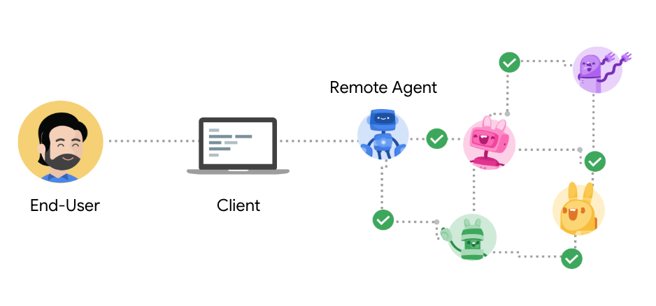
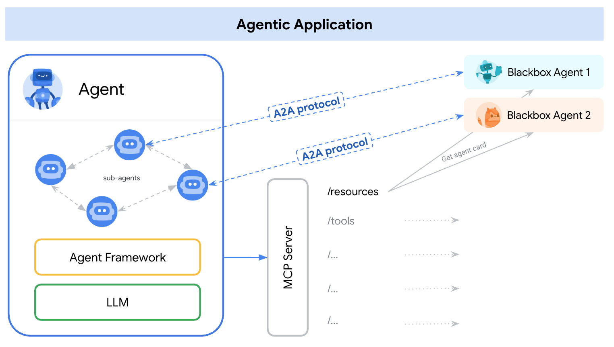

# Unlocking a New Paradigm in Agent Collaboration: An In-Depth Look at Google's A2A Protocol

In an era where agent-based systems are becoming a dominant trend in AI applications, a critical challenge emerges: how can diverse agents communicate and collaborate in a standardized, secure, and efficient way? To address this, Google has introduced the A2A (Agent-to-Agent) protocol—an open protocol specifically designed for agent communication. It aims to establish a universal “language of interaction” among agents.

You can think of A2A as the “TCP/IP” of the agent world. It not only breaks down information silos between different platforms, models, and frameworks, but also enables agents to collaborate like a professional team—delegating tasks, invoking tools, and sharing context—ultimately achieving true multi-agent integration and operation.

In this article, we’ll quickly walk you through the core concepts of A2A, its technical structure, and how it empowers the next generation of AI application architectures.

---

## 1 What is A2A?

The A2A (Agent-to-Agent) protocol is an open protocol introduced by Google, designed to standardize communication and collaboration among different AI agents. With A2A, agents built by different vendors or frameworks can directly communicate, securely exchange information, and coordinate over various tools, services, and enterprise systems.

In simple terms, A2A gives AI agents a unified “language” for communication. It solves issues in multi-agent systems such as inconsistent communication, incompatible data formats, and difficulties in scaling—issues that stem from the lack of standardization. Through A2A, agents with different areas of expertise can focus on their respective responsibilities while working together via standard interfaces to accomplish complex tasks collaboratively.

### 1.1 Participants in A2A



As illustrated above, the A2A protocol involves three types of participants:

- **User:** The end-user who initiates tasks via the agent system.
- **Client:** An application or another agent that uses A2A services. It sends requests (e.g., `tasks/send`) to the A2A server's URL.
- **Remote Agent / Server:** An agent that exposes an HTTP endpoint implementing the A2A protocol methods. It receives requests and manages the execution of tasks.

### 1.2 Communication in A2A

- The A2A protocol uses HTTP as the transport mechanism between the client and the remote agent. Depending on their capabilities, they may use SSE to support streaming updates from the server.
- A2A uses JSON-RPC 2.0 as the data exchange format for communication between the client and the remote agent.
- A2A follows the OpenAPI authentication specification for identity verification. Notably, within the A2A protocol, agents do not exchange identity information directly. Instead, they obtain authentication materials (e.g., tokens) out-of-band and transmit them through HTTP headers, rather than including them in the A2A message body.

    Although A2A does not transmit identity information in-band, servers still declare their authentication requirements within the A2A message body. For example, the Agent Card may include an "authentication" section:

    ```json
    {
      "name": "Google Maps Agent",
      ...
      "authentication": {
        "schemes": "OAuth2"
      },
      ...
    }
    ```

    Accordingly, the client must authenticate using the scheme published by the server and obtain the required credentials.

    Additionally, if a remote agent requires the client/user to provide extra credentials during task execution (for example, to access a specific tool), the agent should return a task status of `input-required`, along with an `Authentication` structure in the message body. In such cases, the client must still obtain the credential materials through an out-of-band method.


### 1.3 Relationship Between A2A and MCP



A2A is often discussed alongside MCP (Model Context Protocol), proposed by Anthropic. In essence, the two serve different but complementary purposes.

MCP is an emerging standard for connecting large language models (LLMs) with data, resources, and tools. Specifically, MCP standardizes function-calling across various models and frameworks, thus enabling an ecosystem of tool service providers and significantly reducing the complexity of connecting agents to tools and data. Through the open MCP standard, LLM-powered applications can quickly connect to external data sources and tools—such as databases, file systems, third-party APIs, or business applications. For example, a system based on MCP might allow a chatbot to query a database, call APIs, or access a user’s calendar. MCP essentially equips agents with a "toolbox" of capabilities that can be invoked when needed.

A2A, on the other hand, focuses on a different set of problems. It is an application-level protocol designed to allow agents to collaborate in their natural modalities. It enables agents to interact as “agents” or “users,” rather than merely as “tools.” When each agent is a fully functional entity (possibly integrating an LLM and tools internally), a standard protocol is needed for these agents to exchange tasks, information, and results—this is where A2A comes into play. If MCP empowers AI agents with the tools they need, then A2A defines how these “technicians” can converse and collaborate with each other to complete more complex tasks.

The official A2A documentation provides the following analogy:

Consider an auto repair shop responsible for fixing vehicles. The shop employs workers who use specialized tools (like car jacks, multimeters, and socket wrenches) to diagnose and repair car problems. These workers often face new, previously unseen issues. The repair process may involve detailed conversations with customers, reference lookups, and coordination with parts suppliers.

Now, model those repair shop employees as AI agents:

- MCP is used to connect these agents to their structured tools (e.g., “Raise the platform by 2 meters,” “Turn the wrench clockwise by 4 millimeters”).
- A2A allows end-users or other agents to communicate with the repair workers (e.g., “My car is making a clicking sound”). A2A supports ongoing, bidirectional communication and dynamic task adjustments (e.g., “Please take a photo of the left front wheel,” “I see a fluid leak—how long has it been there?”). Additionally, A2A helps repair workers collaborate with other agents (e.g., parts suppliers).

A reasonable vision is that **A2A + MCP** together could help build a distributed network of agents.

---

## 2 Core Components and Mechanisms of A2A

The A2A protocol defines a set of core concepts and mechanisms that govern how agents discover each other, describe their capabilities, initiate tasks, and exchange information. The following sections break down these key concepts.

### 2.1 Agent Card

Agents use an **Agent Card** to publish metadata and a description of their capabilities. An Agent Card is typically a public JSON metadata file (usually located at `/.well-known/agent.json`) that includes the agent's name, provider, version, service URL, supported input/output modes, authentication methods, and a list of available capabilities or skills.

Clients (or other agents) can fetch the Agent Card to understand what the agent can do, how to communicate with it, and how to authenticate. In essence, the Agent Card serves as the agent’s “business card” or “capability profile,” playing a key role during the discovery phase: by reading an Agent Card, one agent can determine whether another agent offers the needed functionality.

Here’s a simple example of an Agent Card in JSON format:

```json
{
"name": "Google Maps Agent",
"description": "Plan routes, remember places, and generate directions",
"url": "https://maps-agent.google.com",
"provider": {
  "organization": "Google",
  "url": "https://google.com"
},
"version": "1.0.0",
"authentication": {
  "schemes": "OAuth2"
},
"defaultInputModes": ["text/plain"],
"defaultOutputModes": ["text/plain", "application/html"],
"capabilities": {
  "streaming": true,
  "pushNotifications": false
},
"skills": [
  {
    "id": "route-planner",
    "name": "Route planning",
    "description": "Helps plan routing between two locations",
    "tags": ["maps", "routing", "navigation"],
    "examples": [
      "plan my route from Sunnyvale to Mountain View",
      "what's the commute time from Sunnyvale to San Francisco at 9AM",
      "create turn by turn directions from Sunnyvale to Mountain View"
    ],
    "outputModes": ["application/html", "video/mp4"]
  },
  {
    "id": "custom-map",
    "name": "My Map",
    "description": "Manage a custom map with your own saved places",
    "tags": ["custom-map", "saved-places"],
    "examples": [
      "show me my favorite restaurants on the map",
      "create a visual of all places I've visited in the past year"
    ],
    "outputModes": ["application/html"]
  }
]
}
```

The Agent Card example above shows that this agent is provided by Google, supports OAuth2 authentication, enables streaming responses, and offers two capabilities: “Route Planning” and “Custom Map.” Each capability includes descriptions and output formats. In actual development, Agent Cards can be generated automatically, with the key requirement being that the information accurately reflects the agent’s capabilities.

### 2.2 Task

A **Task** is the core unit of work in A2A interactions. A client initiates a task by sending a message using `tasks/send` or `tasks/sendSubscribe`. Each task has a unique ID and progresses through a series of states during execution, such as: `submitted`, `working`, `input-required`, `completed`, `failed`, or `canceled`.

In detail, a task is a stateful entity that helps the client and the remote agent collaborate to achieve a specific goal and produce a result. A task is always initiated by the client, but its state is fully determined by the remote agent. Within a task, the client and agent exchange **Messages**, and the agent produces **Artifacts** as the result. A task serves as the container for both Artifacts (task outputs) and Messages (e.g., reasoning, instructions, or context), while maintaining the task state and optionally recording its history.

### 2.3 Message

A **Message** represents a single round of communication between the client (role: `"user"`) and the agent (role: `"agent"`). Each message consists of one or more **Parts**.

Messages are used to carry any content exchanged during a task, excluding the final result. This includes the agent's internal reasoning, user context, instructions, error messages, and status updates. All client inputs are transmitted as Messages. Likewise, the agent sends Messages to report its status or provide prompts, rather than to return final outputs.

### 2.4 Part

A **Part** is the basic content unit within a Message or Artifact. According to the protocol, Parts come in various types, representing different forms of content. The main types include:

- **TextPart:** For textual content.
- **FilePart:** For file content (either embedded as base64-encoded bytes or as a URI link to a file).
- **DataPart:** For structured data such as JSON objects, commonly used for forms.

### 2.5 Artifact

An **Artifact** represents the output generated by the agent during the task (e.g., generated files, final structured data). Like Messages, Artifacts consist of one or more Parts. For streaming responses, new Parts may be appended to an existing Artifact incrementally.

### 2.6 Streaming

A2A supports **streaming communication**. For long-running tasks, the `tasks/sendSubscribe` endpoint can be used. The client receives real-time event updates via Server-Sent Events (SSE), such as `TaskStatusUpdateEvent` and `TaskArtifactUpdateEvent`. For example, if a task takes time to complete, the agent may first send progress messages like “Retrieving data…” or “Processing…”, followed by the final result. Streaming enhances the user experience by keeping the user informed during lengthy operations, rather than leaving them waiting without feedback.

### 2.7 Push Notifications

A2A includes a **secure push notification mechanism**, allowing agents to notify clients even when they are not actively connected. In enterprise environments, agents must authenticate themselves to the notification service using trusted credentials and verify the service's identity. The notification must also include the unique ID of the task.

Specifically, servers that support **push notifications** can proactively send task updates to a webhook URL provided by the client. This webhook is configured via the `tasks/pushNotification/set` interface. The push notification service should be treated as an entity separate from the client. The agent does not necessarily notify the client directly; instead, the service authenticates and authorizes the agent and forwards the message to the appropriate destination (such as a pub/sub queue, email, or API endpoint).

For isolated environments (e.g., services within a VPC or service mesh), the client itself can act as the notification service. In enterprise implementations, it is common to use a centralized service to manage notifications and track online/offline status.

---

Together, these components form the foundation of the A2A protocol. In short:

1. An agent advertises its capabilities through an **Agent Card**.
2. A **Client** discovers a suitable agent and sends a **Task** request via HTTP (with user needs encapsulated in a **Message**) to the **Agent** (server side).
3. The client and agent engage in multi-turn **Message** interactions.
4. Streaming updates or additional input may be involved.
5. Finally, the agent returns an **Artifact** result to the client.

The entire interaction uses standard JSON formats and HTTP/SSE channels, enabling agents from diverse tech stacks to interoperate seamlessly through this unified protocol.

---

## 3 A2A Basic Workflow

The following describes a typical interaction process in an A2A network, illustrating the full cycle from agent discovery to task completion. This workflow connects the previously described concepts in a practical context:

![A typical communication workflow under the A2A protocol: On the left is the Client Agent (Agent A), and on the right is the Remote Agent (Agent B). First, Agent B exposes its capabilities through a publicly available JSON Agent Card, allowing Agent A to discover and understand its functionality. Agent A then initiates task communication with Agent B through A2A interfaces. The two agents collaborate around a Task, exchanging context, responses, and outputs via Messages. The entire process runs over HTTP/SSE channels, ensuring secure coordination and state management.](pictures/img3.png)

This diagram shows a typical communication flow under the A2A protocol. On the left is the **Client Agent** (Agent A), and on the right is the **Remote Agent** (Agent B). First, Agent B exposes its capabilities through a publicly accessible JSON Agent Card, allowing Agent A to discover and understand what it can do. Then, Agent A initiates a task via A2A interfaces. The two agents collaborate around a Task, exchanging Messages that carry context, responses, and outputs. The entire process runs over HTTP/SSE channels to ensure secure coordination and state tracking.

1. Discovery: 
The **Client** first needs to find a suitable agent that can fulfill its request. In A2A, this is done by fetching the candidate agent’s **Agent Card**, typically by retrieving the `/.well-known/agent.json` file from a known URL (e.g., the agent’s service address).
    
    After obtaining the Agent Card, the client parses its contents to understand the agent’s skill set, endpoint, and authentication requirements. For instance, if the client needs a “currency conversion” service, it will look for related capabilities in the Agent Card. The client only proceeds if the agent’s skills match the request and the authentication method is acceptable.

2. Initiation: 
The client initiates a task by sending a message via `tasks/send` or `tasks/sendSubscribe`, including a unique task ID.

    Once a target agent is selected, the client sends a task request to begin the process. Typically, the client calls the `tasks/send` method of the A2A protocol with a JSON payload that includes the generated task ID and an initial user Message (e.g., “How much is 1 RMB in USD?”). If the client wants real-time updates, it can instead call `tasks/sendSubscribe` to subscribe to the task.

3. Processing: Depending on the method used, the server performs either streaming or non-streaming task handling:
    - **Streaming:** During execution, the server sends event updates to the client using SSE (e.g., status updates, new artifacts).
    - **Non-streaming:** The server synchronously processes the task and returns the final Task object in the response.

    For example, in a currency conversion task, the agent recognizes the query and calls an internal tool to look up exchange rates. It may access an external API (e.g., the Frankfurter service) and use LLM reasoning to generate the answer.

4. Interaction (Optional): If the task enters the `input-required` state, the client must continue communication using the same task ID via `tasks/send` or `tasks/sendSubscribe`.

    In some scenarios, the agent may need additional information before proceeding—for instance, asking the user to fill in missing form fields. In such cases, the agent sets the task status to `input-required` and sends a message requesting the necessary input. The client, upon receiving this status, prompts the user (or auto-fills based on context) and replies with another `tasks/send` call, reusing the task ID and including the user's follow-up message. This interaction may involve multiple rounds until the agent gathers enough information to complete the task.

5. Completion: The task ultimately reaches a terminal state: `completed`, `failed`, or `canceled`.

    Once the agent finishes processing, it returns the final output. This output is usually found in the `artifacts` field of the Task object and may contain one or more Artifacts. The agent also updates the task status to `completed` and notifies the client. The client then extracts the content from the Artifacts and displays or processes it accordingly. For example, in the currency conversion scenario, the returned Artifact might include a text Part: “1 RMB = 0.14 USD,” which the client then shows to the user.

---

This workflow illustrates the full process supported by the A2A protocol—from agent discovery to multi-turn interaction and task completion. A2A ensures clear standards at every stage:

- **Discovery:** Capability exposure and agent selection via Agent Card.
- **Task initiation and result delivery:** Standard method calls and JSON data exchange.
- **Interaction:** State-managed, structured message exchanges.
- **Completion:** Explicit status updates and result packaging.

These standardized mechanisms give developers a clear framework for building complex multi-agent systems. As long as different agents adhere to the protocol, they can seamlessly interoperate—regardless of who developed them—dramatically enhancing system scalability and robustness.

---

## 4 A2A Implementation Example

To help developers get started, Google has open-sourced a reference implementation and sample code for the A2A protocol, available in both Python and JavaScript. Below is an overview of the basic structure and execution method, using the Python example to demonstrate how to implement an agent and host.

### 4.1 Sample Code Structure

In the [official GitHub repository](https://github.com/google/A2A), under the `samples/python` directory, the code is organized into three main parts:

- **`common/` subdirectory**: This contains shared code used by all agent samples and applications to communicate with A2A over HTTP. It includes foundational classes, utility functions, and the data structures required by the A2A protocol.

- **`agents/` subdirectory**: This includes agent examples written using different frameworks. These agents perform sample tasks using tools and all use a common `A2AServer`. Key examples include:
  - **Google ADK** – simulates filling out an expense report.
  - **LangGraph** – performs currency conversion using tools.
  - **CrewAI** – generates images.

- **`hosts/` subdirectory**: Host applications that use the `A2AClient`. It includes:
  - A **command-line interface (CLI)** that demonstrates simple task execution with a single agent;
  - A **mesop web application** capable of communicating with multiple agents;
  - An **orchestrator agent** that can delegate tasks to one of several remote A2A agents.

### 4.2 A2A Sample Demonstration

Let’s take the LangGraph-based agent as an example. This agent uses LangGraph together with Google Gemini to provide currency exchange information through a ReAct-style agent pattern. A2A enables standardized interaction with the agent, allowing clients to send requests and receive real-time updates.

#### Steps to Run the Example:

1. **Clone the repository and navigate to the sample directory**:

    ```bash
    git clone https://github.com/google/A2A.git
    cd samples/python/agents/langgraph
    ```

2. **Create an environment file with your API key**:

    ```bash
    echo "GOOGLE_API_KEY=your_api_key_here" > .env
    ```

3. **Run the agent**:

    ```bash
    uv run . --host 0.0.0.0 --port 8080
    ```

4. **In a separate terminal window, run the A2A client**:

    ```bash
    cd samples/python
    uv run hosts/cli --agent http://localhost:8080
    ```

While the client is connecting, you will see the agent receiving a request in the terminal, such as:

```bash
INFO:     127.0.0.1:62315 - "GET /.well-known/agent.json HTTP/1.1" 200 OK
```

If you open [http://localhost:8080/.well-known/agent.json](http://localhost:8080/.well-known/agent.json) in your browser, you will see output similar to the following:

```json
{
  "name": "Currency Agent",
  "description": "Helps with exchange rates for currencies",
  "url": "http://0.0.0.0:8080/",
  "version": "1.0.0",
  "capabilities": {
    "streaming": true,
    "pushNotifications": true,
    "stateTransitionHistory": false
  },
  "defaultInputModes": [
    "text",
    "text/plain"
  ],
  "defaultOutputModes": [
    "text",
    "text/plain"
  ],
  "skills": [
    {
      "id": "convert_currency",
      "name": "Currency Exchange Rates Tool",
      "description": "Helps with exchange values between various currencies",
      "tags": [
        "currency conversion",
        "currency exchange"
      ],
      "examples": [
        "What is exchange rate between USD and GBP?"
      ]
    }
  ]
}
```

The current agent has only one skill: **currency conversion** (`convert_currency`).

Try querying the exchange rate between USD and GBP in the A2A client terminal:

```bash
=========  starting a new task ======== 

What do you want to send to the agent? (:q or quit to exit): What is exchange rate between USD and GBP?
Select a file path to attach? (press enter to skip): 
stream event => {"jsonrpc":"2.0","id":"f170c0a720b5489a858ac3d3d6d16158","result":{"id":"20fa3a48af5347e49207124f4dda43f9","status":{"state":"working","message":{"role":"agent","parts":[{"type":"text","text":"Looking up the exchange rates..."}]},"timestamp":"2025-04-24T06:21:33.802921"},"final":false}}
stream event => {"jsonrpc":"2.0","id":"f170c0a720b5489a858ac3d3d6d16158","result":{"id":"20fa3a48af5347e49207124f4dda43f9","status":{"state":"working","message":{"role":"agent","parts":[{"type":"text","text":"Processing the exchange rates.."}]},"timestamp":"2025-04-24T06:21:34.954666"},"final":false}}
stream event => {"jsonrpc":"2.0","id":"f170c0a720b5489a858ac3d3d6d16158","result":{"id":"20fa3a48af5347e49207124f4dda43f9","artifact":{"parts":[{"type":"text","text":"The exchange rate between USD and GBP is 1 USD = 0.75158 GBP."}],"index":0,"append":false}}}
stream event => {"jsonrpc":"2.0","id":"f170c0a720b5489a858ac3d3d6d16158","result":{"id":"20fa3a48af5347e49207124f4dda43f9","status":{"state":"completed","timestamp":"2025-04-24T06:21:36.664791"},"final":true}}
```

You will see the final output result in the `"artifact"`:  
**"The exchange rate between USD and GBP is 1 USD = 0.75158 GBP."**

Meanwhile, in the agent terminal, you’ll see that the agent called the Frankfurter API:

```bash
INFO:httpx:HTTP Request: GET https://api.frankfurter.app/latest?from=USD&to=GBP "HTTP/1.1 200 OK"
```

---

## Reference Documentation

- **Technical documentation**: [https://google.github.io/A2A/#/documentation](https://google.github.io/A2A/#/documentation)  
- **Official blog**: [https://developers.googleblog.com/en/a2a-a-new-era-of-agent-interoperability/](https://developers.googleblog.com/en/a2a-a-new-era-of-agent-interoperability/)  
- **GitHub repository**: [https://github.com/google/A2A](https://github.com/google/A2A)  
- **JSON specification for protocol structure**: [https://github.com/google/A2A/blob/main/specification/json/a2a.json](https://github.com/google/A2A/blob/main/specification/json/a2a.json)
