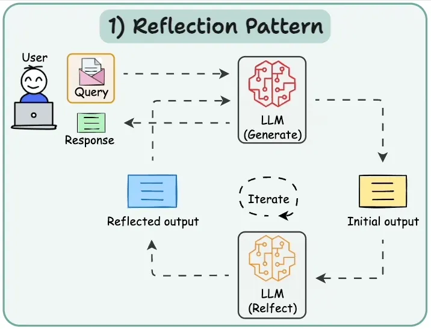

# Decoding Agentic AI: From Self-Reflection to Collective Collaboration

As large language models and the intelligent systems they power continue to advance, more and more applications are entering the so-called “agentic” era—systems that not only generate answers but can also plan, act, collaborate, and self-reflect. In this wave, what we need is not just a mindset of “getting the model to answer questions,” but a paradigm perspective that “treats the Agent as a component within a design system.”

---

# **Why Do We Need an Agentic AI Design Paradigm?**

As large language models (LLMs) and intelligent systems rapidly evolve, we are entering an “Agentic AI” era—systems no longer merely generate answers; they are capable of planning, acting, collaborating, and even self-reflection.

However, traditional architectures often struggle with the following scenarios:

- Decomposing and planning multi-step tasks;
- Dynamic collaboration among multiple agents;
- Management complexity caused by the explosion in the number of tools;
- Lack of unified governance and scalable mechanisms.

At this moment, the “Agentic AI design paradigm” becomes the core conceptual framework for building modern intelligent systems.

It provides us with a structured design approach, enabling agent systems to achieve scalability, modularity, and autonomy.

---

# **Mainstream Agentic AI Design Patterns**

When building Agentic systems, developers typically revolve around five representative design patterns:

**Reflection, Tool Use, ReAct, Planning, Multi-Agent.**
They can be used independently or combined to form complex agent behavior logic.

## **1. Reflection Pattern**

The Reflection pattern emphasizes the agent’s ability for self-examination and correction.

After execution, the agent reviews whether the output meets the goal and whether errors exist, then performs self-correction or regeneration.

*Image source: Daily Dose of Data Science*

**Key Mechanisms:**

- After taking an action, an initial output is produced → the agent reviews whether the goal is achieved and whether defects exist;
- If deviations or errors are found, trigger “reflection” logic: generate corrective steps, call tools to assist verification, regenerate or fix the result;
- This can loop multiple times until a quality threshold is met or the budget is reached.

**Typical Applications:**

- High-risk domains (such as finance, compliance, healthcare) requiring high output accuracy and carrying high error costs;
- Automated content production and code generation systems that require continuous iterative optimization;
- Intelligent assistants that learn user preferences and self-adjust during interactions.

---

## 2. Tool Use Pattern

This pattern enables agents to extend their capabilities through external tools (APIs, databases, scripts, etc.), moving beyond pure text generation to perform real operations.

*Image source: Daily Dose of Data Science*

- Intelligent assistants executing tasks (sending emails, updating spreadsheets, generating reports).
- Calling databases, automation scripts, search APIs;

**Typical Applications:**

- The output is not just recommendations, but actual execution or actionable results.
- Tool invocations may be single-step or chained across multiple tools;
- The agent can identify “when a tool is needed, which tool to choose, how to call it, and how to handle the tool’s returned result”;

**Key Mechanisms:**

## 3. **ReAct Pattern**

The ReAct (Reason + Act) pattern emphasizes an alternating loop of “think–act–observe” during execution.

It allows the model to think while acting and adjust decisions in real time based on feedback.

*Image source: Daily Dose of Data Science*

**Key Mechanisms:**

- Typical loop: the agent thinks → decides to call a tool or act → executes the action → obtains observations → thinks again based on the result → …;
- Suitable for scenarios where the task is not fully determined and where interaction or feedback is needed;
- Actions are not just static generation, but include dynamic processing, tool invocation, and environment sensing.

**Typical Applications:**

- In Q&A systems, an agent may first retrieve materials, then ask questions, and modify its questioning strategy based on the answers;
- In automated workflows, an agent may decide to call tool A first, check whether the result is sufficient, and then decide whether to call tool B;
- In multi-step tasks, the agent needs to determine the next step based on the result of the previous action.

## 4. Planning Pattern

The Planning pattern focuses on global task decomposition and path design prior to execution.

The agent first determines the goal → creates a plan → executes → adjusts dynamically.

*Image source: Daily Dose of Data Science*

**Key Mechanisms:**

- Step 1: clarify the final goal;
- Step 2: decompose it into multiple stages/subtasks;
- Step 3: develop an action plan for each subtask;
- Step 4: execute the subtasks and monitor results; if deviations occur, it may return to the planning stage to adjust.

**Application Scenarios:**

- Project-management-style agents, e.g., “draft report → collect data → analyze → proofread → deliver”;
- Automated process design, e.g., “identify issues → develop strategy → call tools for implementation → monitor feedback”;
- Multi-step interactive tasks, e.g., “confirm requirements with users → create a plan → implement the plan → track feedback.”

## 5. Multi-Agent Pattern

When a single agent cannot cover complex tasks, the system can leverage division of labor and collaboration among multiple agents.

Different agents take on roles such as planning, execution, review, and coordination to complete tasks together.

*Image source: Daily Dose of Data Science*

**Key Mechanisms:**

- Communication/task delegation/information sharing among agents;
- Each agent may possess different capabilities: such as retrieval, analysis, generation, action;
- The collaboration flow includes: task decomposition → assign to different agents → agents execute in parallel or sequence → aggregate results → a “lead agent” may consolidate the output.

**Typical Applications:**

- Enterprise-level automation systems: multiple agents responsible for customer research, market analysis, decision recommendations, and implementation;
- Complex interaction systems: in an intelligent customer service team, one agent identifies user intent, one agent manages dialogue, and one agent monitors quality;
- Multi-task environments: for example, in an autonomous driving fleet, each vehicle is an agent that collaborates to complete traffic tasks.

These design patterns are not single-choice! They are not mutually exclusive; rather, they can be flexibly combined to create new possibilities! When selecting solutions or designing the architecture of Agentic systems, you can compare and consider from these five dimensions to select the “dream team” that best fits business needs.

| **Pattern** | **Core Emphasis** | **Advantages** | **Considerations** | **Recommended Scenarios** |
| --- | --- | --- | --- | --- |
| Reflection | Self-checking, self-optimization | Improves output quality, reduces error rate | Requires extra computation/loop cost | Tasks with high reliability requirements |
| Tool Use | Extending agent capabilities, tool invocation | Rapidly integrates diverse capabilities, enhances functions | Tool management complexity, invocation failure risk | Tasks that need support from multiple external capabilities |
| ReAct | Think–act–observe loop | Flexible response, adapts to dynamic environments | Decision paths may be unstable, debugging is difficult | Interactive/exploratory tasks |
| Planning | Upfront decomposition, stepwise execution | Structured processes, clear pathways | Requires clear task goals in advance, planning cost | Multi-step processes, project-style tasks |
| Multi-Agent | Multi-agent collaboration | Clear division of labor, parallelizable, scalable | High requirements for communication, synchronization, coordination | Enterprise systems, large-scale task scenarios |

---

## “Control Plane as a Tool” Paradigm: Architectural Perspective

After understanding the five Agentic patterns, we observe a common issue:
As the number of agents, tools, and task complexity increase, **governance, scalability, and security** gradually become bottlenecks.

This is precisely the core issue targeted by the recent arXiv paper

> *Kandasamy, “Control Plane as a Tool: A Scalable Design Pattern for Agentic AI Systems” (2025)*
> 

### Core Idea of “Control Plane as a Tool”

“Control Plane as a Tool” proposes an architectural solution:

> Treat the control plane as a unified “super tool,” responsible for tool registration, input validation, invocation routing, output verification, and feedback logging.
> 

Thus, the agent only needs to interact with a single unified interface, rather than directly managing dozens of different tools or microservices.

### Design Advantages

| **Dimension** | **Traditional Agent Architecture** | **Control Plane Pattern** |
| --- | --- | --- |
| Tool Invocation | Agents directly manage multiple tools | Centrally routed by the control plane |
| Scalability | Adding each tool requires modifying the agent | Tool registration takes effect automatically |
| Security Governance | Decentralized, hard to audit | Centralized auditing and access control |
| Maintainability | Highly coupled, fragile | Modular, replaceable, governable |

This architecture provides a system-level platform mindset: whether you adopt ReAct, Planning, or Multi-Agent patterns, you can leverage the Control Plane to manage tool flow, logging, and feedback loops.

---

## How to Select and Implement These Patterns?

In practical development of Agentic AI systems, you can achieve a closed loop from paradigm to concrete implementation through the following chain of thought:

1. **Clarify task characteristics:** Is the task open-ended/unknown? Does it require tool invocation? Multiple steps? Multiple agents?
    1. If the task is clear and a single-step output suffices, “Tool Use” may be enough;
    2. If the task requires decomposition and planning before execution, then “Planning” is critical;
    3. If the task requires continuous feedback response and iterative output, then “ReAct” or “Reflection” is more suitable;
    4. If the task is large in scale and involves multiple roles and multiple agents, then “Multi-Agent” is inevitable.
2. **Assess system scale and governance needs:** When the number of tools, agents, and call frequency increase, it is recommended to introduce the “Control Plane as a Tool” architecture to improve scalability, maintainability, and auditability.
3. **Design combination paths:** Patterns are not used in isolation; combinations often work better. For example:
    1. Planning → adopt ReAct during execution → if output quality needs assurance, add Reflection → use tools via Tool Use;
    2. In a Multi-Agent system, each agent can adopt ReAct + Tool Use, while the overall flow is coordinated by the control plane.
4. **Monitoring and feedback mechanisms:** Regardless of the pattern, introducing feedback, logging, and performance monitoring is essential. The “feedback module” mentioned in the control plane architecture is a best practice.
5. **Expand gradually, avoid over-design:** As some literature reminds us: “Do not start with complex Multi-Agent setups, complex routing, or an explosion of tools. Start with simple patterns and expand as needed.”
6. **Representative Agentic AI frameworks and ecosystems:**
    
    If the five design patterns introduced above are the “conceptual blueprints” of agent agents, then these open-source frameworks are the “construction tools” that turn the blueprints into reality. The table below shows community activity on GitHub for four mainstream Agent frameworks, as well as the Agentic Pattern types they best align with. Through these data, we can not only see differences in ecosystem heat, but also gain insight into the design focus of different frameworks.
    
    | **Pattern** | **CrewAI** | **LangGraph** | **LangChain** | **AutoGen** |
    | --- | --- | --- | --- | --- |
    | Stars | 34,459 | 16,163 | 111,265 | 46,057 |
    | Commits | 7,218 | 11,864 | 34,236 | 14,539 |
    | Issues | 1,475 | 974 | 8,863 | 2,827 |
    | Forks | 5,300 | 3,579 | 19,469 | 7,803 |
    | PR Creators | 431 | 379 | 4,646 | 653 |
    | Language | Python | python | Python | Python |
    | Preferred Agentic Pattern | Multi-Agent Pattern | Planning Pattern + Reflection Pattern | Tool Use Pattern | React Pattern + Planning Pattern |
    
    *Data source: GitHub*
    

---

## From Concept to Ecosystem

Agentic AI is turning “model users” into “system designers.” By making good use of the five design paradigms and layering on the Control Plane architecture, we can enable agents to possess system characteristics that are controllable, scalable, and collaborative.

From LangChain to AutoGen, from Tool Use to Multi-Agent, these paradigms and tools are jointly building the cornerstone of the next generation of intelligent systems.

In the future, agents will not only be models that answer questions, but digital partners that think, act, and collaborate.

---

## References

- Kandasamy, A. (2025). *Control Plane as a Tool: A Scalable Design Pattern for Agentic AI Systems*. arXiv preprint arXiv:2501.12345.
- Bijit Ghosh (2024). *Agentic Design Patterns*. Medium. [https://medium.com/@bijit211987/agentic-design-patterns-cbd0aae2962f](https://medium.com/@bijit211987/agentic-design-patterns-cbd0aae2962f)
- Avi Chawla. *5 Agentic AI Design Patterns*. Daily Dose of Data Science. (Accessed 2025-11-13). [https://blog.dailydoseofds.com/p/5-agentic-ai-design-patterns](https://blog.dailydoseofds.com/p/5-agentic-ai-design-patterns)

