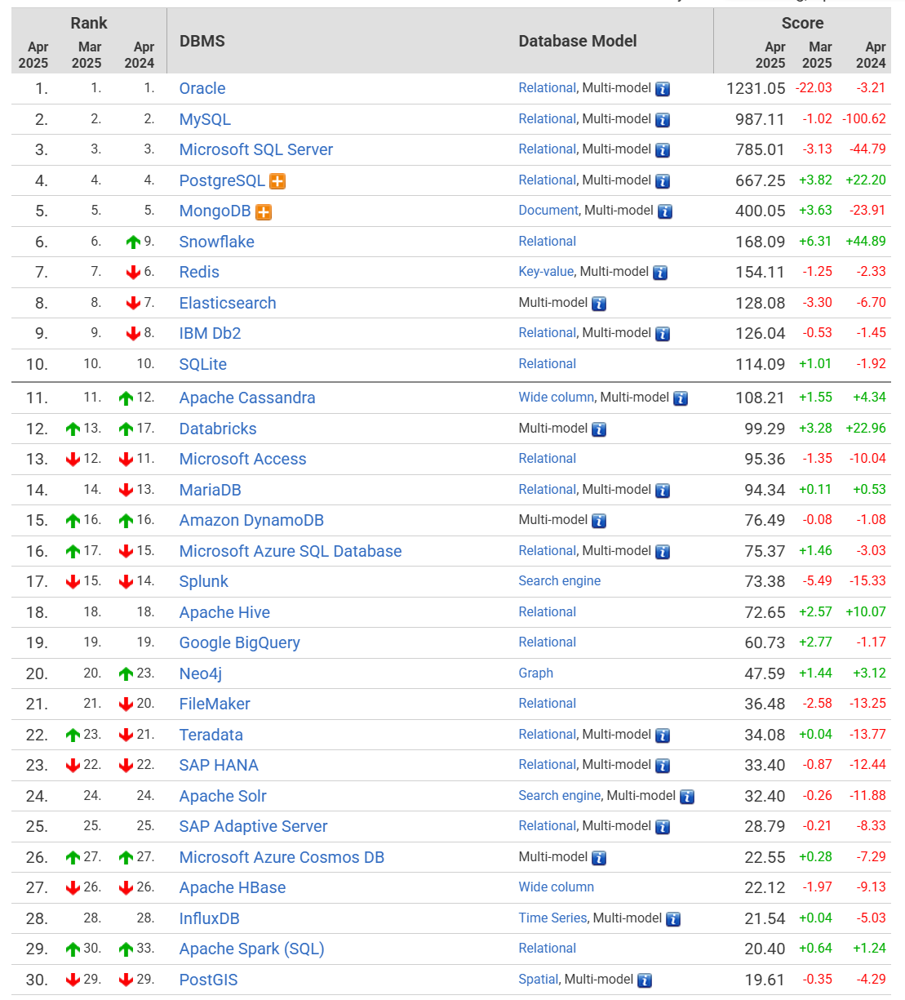
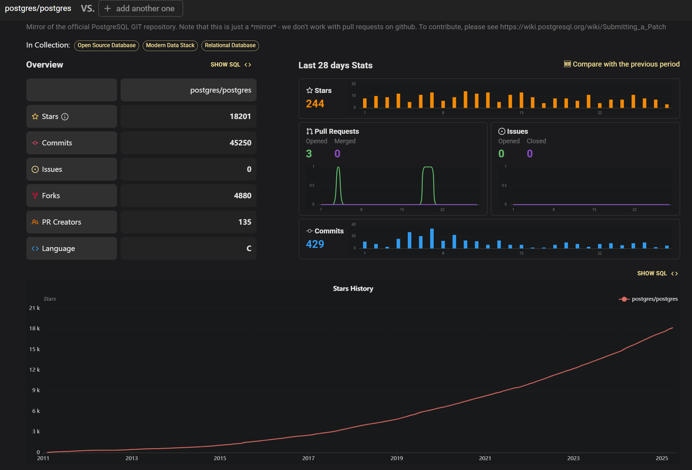
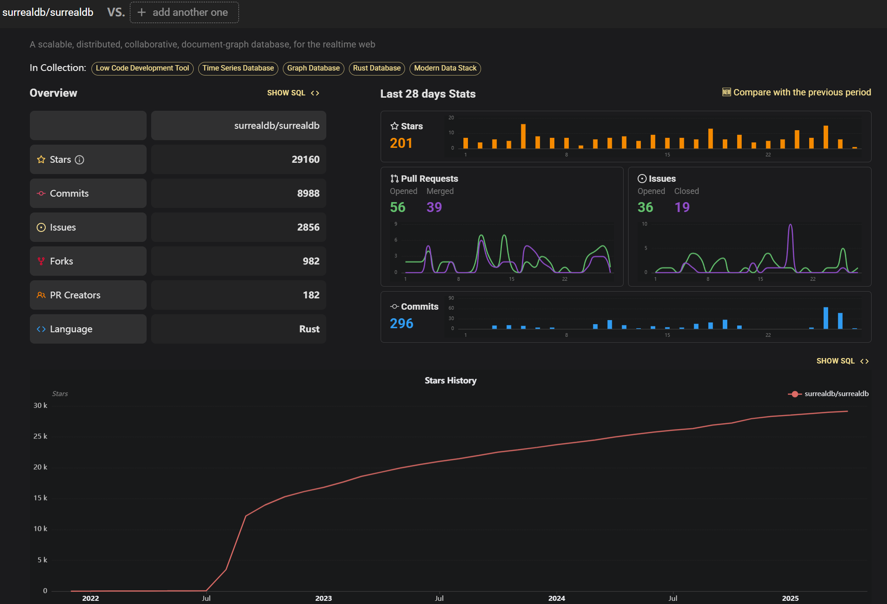
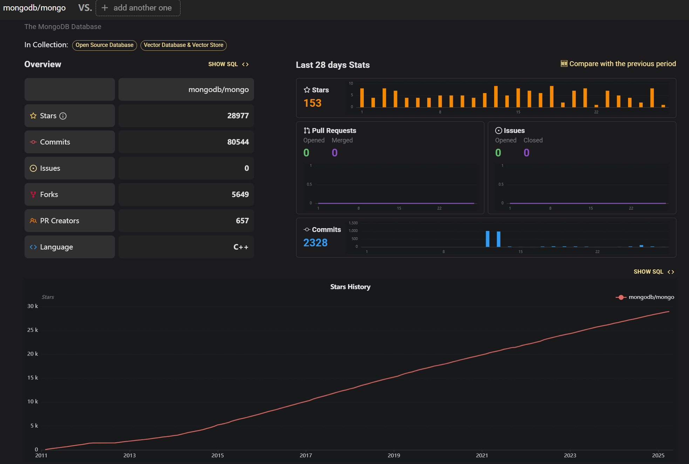

# 现代数据库综合比较报告：PostgreSQL、SurrealDB、Redis、MongoDB、SQLite与TiKV

本报告对六种主流数据库系统进行了全面比较，涵盖数据类型灵活性、可扩展性、资源占用、并发性能、事务支持、查询能力、生态兼容性、接入友好度和许可协议等多个维度。这些数据库各具特色，适用于不同的应用场景，报告将帮助您根据具体需求做出最佳选择。

## 当前数据库排名TOP-30以及开源情况









**PostgreSQL**是综合场景下的最佳选择。

## 数据类型灵活性对比

**PostgreSQL**在数据类型支持方面表现出色，堪称"**最灵活的关系型数据库**"。它不仅支持传统的关系型数据，还通过JSON/JSONB类型提供完整的文档存储功能。PG的扩展生态更是令人印象深刻——通过扩展可支持向量(pgvector)、时间序列(TimescaleDB)、图数据(AGE)等多种专业数据类型。这种"**一专多长**"的特性使PostgreSQL能够替代许多专用数据库，成为真正的全栈数据库解决方案。

**SurrealDB**作为新兴的多模型数据库，其最大优势在于**同时支持关系型、文档型和图数据模型**。它使用JSON格式存储数据，支持复杂嵌套结构，并内置GraphQL接口，使得处理关联数据变得直观。特别值得注意的是，SurrealDB允许开发者使用熟悉的SQL语法来查询图数据，这大大降低了学习曲线。对于需要同时处理文档和关系的应用场景，SurrealDB提供了独特价值。

**MongoDB**是**文档数据库的典型代表**，使用BSON(二进制JSON)格式存储高度灵活的非结构化数据。MongoDB 8.0版本进一步优化了性能，读写操作相比7.0版本分别提升20-36%和35-58%。其"**模式自由**"(schema-free)特性允许同一集合中的文档拥有不同结构，非常适合快速迭代的开发场景。然而，MongoDB在处理强结构化数据时不如关系型数据库直观。

**Redis**作为内存键值数据库，支持**多种基础数据结构**：字符串、列表、集合、有序集合和哈希等。虽然数据结构相对简单，但Redis通过模块系统(如RedisSearch、RedisJSON)扩展了能力，可以处理JSON文档、执行全文搜索等。Redis的高性能内存特性使其成为缓存和会话存储的理想选择。

**SQLite**作为轻量级嵌入式数据库，主要面向**结构化数据存储**。它支持标准的SQL数据类型和ACID事务，但缺乏对复杂文档或图数据的原生支持。SQLite的简洁性是其最大优势，但在数据类型灵活性上无法与多模型数据库竞争。

**TiKV**是分布式键值存储引擎，数据模型相对简单，主要存储**原始的键值对**。作为TiDB的底层存储，它更注重分布式特性和一致性保证，而非数据类型的多样性。TiKV通过RocksDB存储数据，适合结构化但不复杂的数据场景。

*表：各数据库数据类型支持比较*

| **数据库** | **结构化数据** | **文档数据** | **图数据**    | **向量数据** | **扩展能力**   |
| ---------- | -------------- | ------------ | ------------- | ------------ | -------------- |
| PostgreSQL | 优秀           | 优秀(JSONB)  | 通过扩展      | 通过pgvector | 极强(400+扩展) |
| SurrealDB  | 优秀           | 优秀(JSON)   | 优秀(SQL语法) | 有限         | 中等           |
| MongoDB    | 中等           | 优秀(BSON)   | 有限          | 有限         | 中等           |
| Redis      | 基础类型       | 通过模块     | 无            | 无           | 通过模块       |
| SQLite     | 优秀           | 有限         | 无            | 无           | 有限           |
| TiKV       | 键值对         | 无           | 无            | 无           | 有限           |

## 可扩展性对比


**TiKV**在可扩展性方面表现最为突出，采用**Multi-Raft分布式架构**，将数据按key范围划分为Region(默认256MB)，每个Region有多个副本(通常3个)，通过Raft协议保证一致性。这种设计使TiKV能够**线性扩展**存储和计算能力，PD(Placement Driver)组件负责Region的自动平衡和调度，确保集群资源充分利用。TiKV还支持**自动分片分裂与合并**，当Region大小超过384MiB时会自动分裂，小于54MiB时可能合并相邻Region。

**MongoDB**提供成熟的**分片集群**解决方案，支持水平扩展。MongoDB 8.0进一步优化了reshard性能，使分片调整更加高效。其分片策略包括基于范围、哈希和zone等多种方式，适合不同访问模式。阿里云MongoDB还支持批量变配时同步节点配置，简化了大规模集群管理。MongoDB的扩展能力已在许多大型互联网应用中得到验证。

**PostgreSQL**在单机性能强劲，但原生分布式支持有限。不过，通过**Citus扩展**可转变为分布式HTAP系统，支持多租户和分片。近年来还出现了像OrioleDB这样的云原生存储引擎，号称能实现4倍吞吐量提升。PostgreSQL的逻辑复制和物理复制机制也能满足一定规模的扩展需求，但不如专门的分布式数据库那么弹性。

**SurrealDB**设计上考虑了分布式场景，采用**多租户架构**，可以在多个节点上分布数据和负载。虽然相对年轻，但其分布式架构设计理念现代，长期扩展潜力值得期待。SurrealDB的分布式支持仍在演进中，目前可能不如TiKV或MongoDB成熟。

**Redis**可通过**Redis Cluster**实现分布式部署，数据自动分片存储在多个节点上。Redis支持主从同步，数据可以从主服务器向任意数量的从服务器同步。然而，Redis的分布式能力主要针对高可用和读写分离，而非无限水平扩展。大集群管理复杂度较高，跨分片事务不支持。

**SQLite**作为**嵌入式数据库**，本质上不具备分布式能力。虽然可以通过Litestream实现流式备份，或使用LiteFS提供分布式访问，但这些方案更多是针对特定场景的补充，无法实现真正的弹性扩展。SQLite适合数据量有限或单机应用场景。

*表：各数据库可扩展性比较*

| **数据库** | **分片能力**   | **数据分布** | **自动平衡** | **多租户** | **扩展成熟度** |
| ---------- | -------------- | ------------ | ------------ | ---------- | -------------- |
| TiKV       | 自动Region分片 | Multi-Raft   | PD调度       | 支持       | 生产级成熟     |
| MongoDB    | 手动/自动分片  | 配置式       | 平衡器       | 支持       | 非常成熟       |
| PostgreSQL | 通过Citus扩展  | 依赖扩展     | 有限         | 通过扩展   | 中等           |
| SurrealDB  | 设计支持       | 多租户架构   | 发展中       | 原生支持   | 早期阶段       |
| Redis      | Redis Cluster  | 哈希槽       | 手动reshard  | 有限       | 成熟但有限     |
| SQLite     | 不支持         | 单机         | 无           | 无         | 不适用         |

## 资源占用与效率对比

资源占用直接影响部署成本和运维复杂度，特别是在资源受限环境或大规模部署时尤为重要。

**SQLite**在资源占用方面无疑是**最轻量级**的选择，整个数据库引擎仅需几百KB内存，整个数据库存储在单一磁盘文件中。其简洁架构使其在嵌入式设备和移动应用中表现出色，处理速度甚至比某些大型数据库更快。SQLite的零配置特性进一步降低了运维开销，是资源效率的典范。

**Redis**作为**内存数据库**，所有数据常驻内存，提供极高的读写性能。内存占用与数据量成正比，可能成为成本限制因素。Redis会周期性持久化数据到磁盘，但主要设计目标仍是内存效率。在纯内存场景下，Redis的资源利用率极高，特别是考虑到其惊人的吞吐能力。

**TiKV**采用RocksDB作为存储引擎，同一节点的所有Region数据存储在一个RocksDB实例中，优化I/O效率。TiKV的设计注重**平衡性能与资源使用**，通过Region大小控制(默认256MB)确保资源分配合理。作为分布式系统，TiKV需要额外资源用于Raft复制和PD调度，整体资源开销大于单机数据库但小于某些同类分布式系统。

**PostgreSQL**的资源占用**高度可配置**，可以根据可用资源调整共享缓冲区、工作内存等参数。PG不是最轻量的数据库，但其资源使用与功能丰富度成正比。通过正确配置，PostgreSQL可以在有限资源下表现良好，但为了发挥全部功能通常需要较多内存和CPU资源。

**MongoDB**的内存使用采用**动态分配**策略，积极利用可用内存缓存热点数据。MongoDB 8.0引入了升级版TCMalloc，优化了内存管理。在SSD上，MongoDB的存储效率良好，但相比关系型数据库，其文档存储方式可能产生一定冗余。WiredTiger存储引擎提供压缩选项帮助减少磁盘占用。

**SurrealDB**基于Rust构建，理论上应具备良好的**内存安全性和效率**，但作为较新系统，实际资源占用数据较少。其多模型特性可能带来一定开销，但Rust的性能优势可能抵消这部分成本。SurrealDB的分布式设计也会引入额外协调开销，具体资源需求取决于部署规模。

*表：各数据库资源占用比较*

| **数据库** | **内存占用**   | **磁盘占用** | **CPU效率** | **适用规模** | **调优空间** |
| ---------- | -------------- | ------------ | ----------- | ------------ | ------------ |
| SQLite     | 极低           | 极低(单文件) | 极高        | 小型数据集   | 有限         |
| Redis      | 高(全内存)     | 低(持久化用) | 极高        | 中小型数据集 | 中等         |
| TiKV       | 中等           | 中等(压缩)   | 高          | 超大规模     | 较大         |
| PostgreSQL | 中到高         | 中等         | 高          | 中小到大型   | 极大         |
| MongoDB    | 中到高         | 中到高       | 高          | 中小到大型   | 较大         |
| SurrealDB  | 未知(预计中等) | 预计中等     | 预计高      | 中小到大型   | 未知         |

## 并发性能对比

并发性能决定了数据库在高负载下的响应能力，是支撑关键业务应用的重要指标。

**Redis**在并发性能方面**表现最为突出**，这主要得益于其**内存存储**设计和单线程无锁架构。Redis能够处理极高的吞吐量，官方基准测试显示单实例可达10万+ QPS。Redis 6.0引入的多线程I/O进一步提升了并发能力。作为缓存使用时，Redis的响应时间通常保持在亚毫秒级，是低延迟应用的理想选择。

**TiKV**的并发性能源自其**分布式架构**和**Raft优化**。写请求在Leader上处理，需要写入多数副本(默认3副本中至少2个成功)才会返回。这种设计保证了强一致性，同时通过并行处理不同Region的请求实现高吞吐。TiKV的协处理器(Coprocessor)功能可将部分计算下推到存储层，减少网络开销。对于大规模分布式场景，TiKV的并发能力优于大多数单机数据库。

**PostgreSQL**的并发性能近年来有显著提升，最新PostgreSQL 17相比六年前的PG 10在写入吞吐上提升了30%-70%。在Mark Callaghan的sysbench测试中，PostgreSQL 16相比MySQL 8.0.34在某些写场景下吞吐量高出200%-500%。PG的MVCC实现和多版本并发控制使其在高并发读写混合负载下表现优异。

**MongoDB**的并发能力在文档数据库中名列前茅，8.0版本相比7.0读性能提升20-36%，写性能提升35-58%。MongoDB的**锁粒度从集合级细化到文档级**，大大提升了并发写入能力。分片集群进一步分散负载，使MongoDB能够处理极高吞吐量。WiredTiger存储引擎的压缩和缓存优化也贡献了性能提升。

**SurrealDB**宣称具有**高性能**特性，但作为新兴数据库缺乏广泛的第三方基准测试。其Rust实现和实时查询引擎设计理论上应具备良好的并发处理能力。SurrealDB的变更流功能适合实时应用场景，但具体性能极限尚需验证。

**SQLite**在**轻量级并发**场景下表现良好，但其全局写锁设计限制了高并发写入能力。SQLite适合读多写少的中低并发场景，在移动应用和小型网站中表现优异。对于高并发写入需求，SQLite可能很快成为瓶颈。

*表：各数据库并发性能比较*

| **数据库** | **读吞吐量**    | **写吞吐量**   | **响应时间** | **锁机制** | **最佳并发场景** |
| ---------- | --------------- | -------------- | ------------ | ---------- | ---------------- |
| Redis      | 极高(10万+ QPS) | 高             | 亚毫秒级     | 单线程无锁 | 缓存/会话        |
| TiKV       | 高              | 高(分布式)     | 毫秒级       | Region级   | 大规模分布式     |
| PostgreSQL | 高              | 高(提升显著)   | 毫秒级       | 行级MVCC   | 复杂OLTP         |
| MongoDB    | 高(提升20-36%)  | 高(提升35-58%) | 毫秒级       | 文档级     | 文档密集型       |
| SurrealDB  | 宣称高(待验证)  | 宣称高(待验证) | 预计毫秒级   | 未知       | 实时应用         |
| SQLite     | 中等            | 低(全局锁)     | 微秒到毫秒   | 数据库级   | 低并发本地应用   |

## 事务与一致性支持对比

事务支持是保证数据完整性的关键特性，不同数据库提供不同级别的事务保证和一致性模型。

**TiKV**提供**强一致性**的**分布式事务**支持，基于两阶段提交实现跨Region的ACID事务。其事务模型源自Google Spanner，通过Raft协议保证多副本数据一致性，任何写请求都需要在多数副本上成功才会返回。TiKV还支持乐观事务模型，适合冲突较少的场景。这种强一致性保证使TiKV适合金融级应用。

**PostgreSQL**是关系型数据库中事务支持的标杆，提供完整的**ACID保证**和多级别隔离(包括可串行化)。与MySQL相比，PostgreSQL的事务正确性得到广泛认可，JEPSEN测试确认其隔离级别行为符合文档描述。PostgreSQL的MVCC实现避免了锁竞争，同时保持强一致性，适合复杂事务场景。

**MongoDB**早期版本缺乏多文档事务支持，但**4.0版本**后引入了**跨文档ACID事务**。MongoDB 8.0进一步优化了事务性能，使其更适合关键业务场景。不过，MongoDB的事务开销仍高于关系型数据库，建议谨慎使用。其默认一致性模型是可调制的，可在一致性和延迟之间权衡。

**SurrealDB**宣称支持**ACID事务**，但作为新兴数据库，其实现细节和成熟度尚待验证。多模型设计可能带来事务协调的复杂性，特别是涉及跨模型操作时。SurrealDB的分布式事务能力尤其需要考察，这通常是分布式系统的难点。

**Redis**通过**单线程执行模型**保证命令的原子性，但缺乏传统意义上的多操作事务。Redis提供MULTI/EXEC命令组实现简单事务，但不支持回滚。Redis模块可以扩展事务能力，但整体事务支持有限，适合非关键数据或补偿事务场景。

**SQLite**作为嵌入式数据库，出人意料地提供**完整ACID支持**，即使在系统崩溃后也能保持数据完整性。SQLite的锁机制相对简单，全局写锁限制了并发事务吞吐量。对于单机应用，SQLite的事务保证足够强大，但不涉及分布式场景。

*表：各数据库事务支持比较*

| **数据库** | **ACID支持** | **隔离级别**       | **分布式事务** | **冲突解决** | **适用场景** |
| ---------- | ------------ | ------------------ | -------------- | ------------ | ------------ |
| TiKV       | 完整         | 可串行化           | 支持(2PC)      | 乐观锁       | 金融/分布式  |
| PostgreSQL | 完整         | 读已提交到可串行化 | 单机           | MVCC         | 企业OLTP     |
| MongoDB    | 多文档ACID   | 快照               | 有限支持       | 文档级锁     | 文档事务     |
| SurrealDB  | 宣称支持     | 未知               | 设计中         | 未知         | 多模型应用   |
| Redis      | 有限(单命令) | 无传统隔离         | 不支持         | 无           | 非关键数据   |
| SQLite     | 完整         | 可串行化           | 不支持         | 全局锁       | 单机应用     |

## 查询能力对比

查询能力决定了从数据库中提取和分析数据的灵活性与效率，是数据库系统的核心功能之一。

**PostgreSQL**拥有**最强大的查询引擎**，支持标准SQL的全部功能以及大量扩展。PG的查询优化器不断改进，复杂查询性能显著提升。通过扩展，PostgreSQL支持全文检索、地理空间查询、JSON路径查询以及向量搜索(pgvector)。特别是pgvector在AWS支持下实现了一年150倍的性能飞跃，几乎取代了专用向量数据库。PostgreSQL还支持CTE、窗口函数等高级特性，是分析型查询的强者。

**SurrealDB**的查询能力独特之处在于**用SQL语法处理图数据**，大大简化了关联查询。例如查询用户所有帖子只需:`SELECT *, ->authored->post.* AS posts FROM user;`，这种语法结合了SQL的熟悉性和图查询的表达能力。SurrealDB还内置实时查询和变更流功能，适合需要即时反馈的应用。不过，其分析型查询能力可能不如PostgreSQL全面。

## 查询能力对比（续）

**MongoDB**的查询能力专注于**文档操作**和**聚合管道**，支持丰富的查询操作符和索引类型。MongoDB 的查询语言是面向文档的，适合嵌套数据结构，但复杂关联查询（如多表JOIN）不如SQL直观。MongoDB 支持全文检索（通过文本索引）和地理空间查询，但向量搜索能力有限，通常需要结合外部工具（如Elasticsearch）。

**Redis**的查询能力相对有限，主要围绕**键值操作**和**数据结构命令**（如LPUSH、ZRANGE等）。通过RedisSearch模块，Redis可以支持全文检索和简单聚合查询，但不适合复杂分析型查询。RedisJSON模块扩展了JSON文档查询能力，但仍不如专门的文档数据库灵活。

**SQLite**支持标准SQL查询，包括JOIN、子查询和窗口函数，但缺乏**高级分析功能**（如全文检索、向量搜索）。SQLite的查询优化器针对小型数据集高度优化，但在大数据量下性能可能下降。

**TiKV**作为分布式键值存储，查询能力主要围绕**键值扫描**和**范围查询**，支持通过协处理器（Coprocessor）下推部分计算逻辑。TiKV本身不提供SQL层，需结合TiDB使用才能支持复杂SQL查询。

*表：各数据库查询能力对比*

| **数据库** | **SQL支持**          | **全文检索** | **向量搜索** | **嵌套查询**     | **最佳查询场景** |
| ---------- | -------------------- | ------------ | ------------ | ---------------- | ---------------- |
| PostgreSQL | 完整SQL              | 通过扩展     | 通过pgvector | 优秀             | 复杂分析型查询   |
| SurrealDB  | SurrealQL（SQL变体） | 内置         | 内置         | 优秀（图查询）   | 多模型混合查询   |
| MongoDB    | 有限（聚合管道）     | 内置         | 有限         | 优秀（文档嵌套） | 文档型查询       |
| Redis      | 无                   | 通过模块     | 无           | 有限             | 键值/简单聚合    |
| SQLite     | 标准SQL              | 有限         | 无           | 中等             | 小型OLTP查询     |
| TiKV       | 无（需TiDB）         | 无           | 无           | 无               | 键值/范围查询    |

---

## 生态兼容性与接入友好度对比

**PostgreSQL**拥有**最成熟的生态系统**，支持几乎所有主流编程语言（Python、Java、Go等），ORM框架（如Django ORM、SQLAlchemy、Hibernate）丰富，运维工具（pgAdmin、PostGIS）齐全。PostgreSQL的部署方式灵活，支持Docker、Kubernetes及各大云平台，数据迁移工具（pg_dump、Logical Replication）完善。

**MongoDB**的生态同样强大，官方提供**多语言驱动**（MongoDB Driver），ORM框架（Mongoose、Spring Data MongoDB）成熟，并拥有Atlas云服务简化运维。MongoDB Compass提供图形化管理，数据迁移可通过mongodump/mongorestore或Atlas Live Migration实现。

**Redis**生态以**客户端库**和**缓存工具**为主，支持Python（redis-py）、Java（Jedis）、Node.js（ioredis）等语言。RedisInsight提供管理界面，但Redis缺乏原生ORM支持，通常需手动封装数据访问层。

**SQLite**因其嵌入式特性，**无需独立服务**，集成简单，但缺乏分布式支持。大多数语言（Python、C/C++、Java）提供SQLite绑定，ORM框架（如SQLAlchemy、Room）支持良好，但运维工具较少。

**TiKV**生态围绕**TiDB生态**（如TiUP、PD Control），客户端库主要支持Go和Java。TiKV本身较底层，需搭配TiDB使用才能获得完整SQL能力，适合已有TiDB经验的团队。

**SurrealDB**作为新兴数据库，生态仍在发展中，但已提供**官方SDK**（JavaScript、Python、Go、Rust）。其HTTP/WebSocket API简化了接入，但ORM支持有限（如Prisma适配尚在实验阶段）。SurrealDB的云服务（Surreal Cloud）降低了部署难度，适合快速原型开发。

*表：各数据库生态与接入友好度对比*

| **数据库** | **客户端支持**      | **ORM支持**          | **运维工具**    | **部署复杂度** | **最佳适用场景** |
| ---------- | ------------------- | -------------------- | --------------- | -------------- | ---------------- |
| PostgreSQL | 极丰富              | 丰富（SQLAlchemy等） | 完善（pgAdmin） | 中等           | 企业级应用       |
| MongoDB    | 丰富                | 良好（Mongoose）     | 完善（Compass） | 低（Atlas）    | 文档型应用       |
| Redis      | 丰富                | 有限                 | RedisInsight    | 低             | 缓存/会话存储    |
| SQLite     | 广泛                | 良好（Room等）       | 有限            | 极低           | 嵌入式应用       |
| TiKV       | 有限（Go/Java）     | 无                   | TiUP/PD Control | 高             | TiDB生态用户     |
| SurrealDB  | 发展中（JS/Rust等） | 有限                 | 云管理控制台    | 低（云服务）   | 实时/多模型应用  |

---

## License类型对比

- **SurrealDB**：核心代码采用**Apache 2.0**，商业托管服务需付费（如Surreal Cloud的Start/Scale计划）。
- **PostgreSQL**：**PostgreSQL License**（类似BSD/MIT），无商业限制。
- **MongoDB**：社区版为**SSPL**（Server Side Public License），商业版需订阅。
- **Redis**：核心代码**BSD 3-Clause**，Redis Modules部分功能需商业许可。
- **SQLite**：**公有领域**（Public Domain），无使用限制。
- **TiKV**：**Apache 2.0**，商业支持由PingCAP提供。

---

## 综合推荐

根据用户需求（多模数据、扩展性、向量存储等），推荐优先级如下：
1. **PostgreSQL**：功能全面，扩展性强，适合需要稳定成熟方案的企业。
2. **SurrealDB**：多模型与实时查询优势明显，适合创新项目。
3. **MongoDB**：文档处理优秀，生态成熟。
4. **TiKV**：超大规模分布式场景首选。
5. **Redis**：适合缓存/会话等高频读写场景。
6. **SQLite**：仅推荐嵌入式或小型应用。

## 实践

测试环境为ubuntu 24.04。部署方法都比较简单。

### **1. 安装 SurrealDB**
   ```bash
   curl -sSf https://install.surrealdb.com | sh
   ```
   在`.bashrc`中添加：
   ```
   export PATH=/home/shinshi/.surrealdb:$PATH
   ```

   测试：
   ```
   surreal start --log trace --user root --pass password
   curl http://127.0.0.1:8000/health
   ```
---


### **2. 安装 PostgreSQL**

   ```bash
   sudo apt update
   sudo apt install -y postgresql
   ```

   测试：
   ```bash
   sudo -i -u postgres
   psql
   CREATE DATABASE testdb;
   \q
   psql -d testdb
   ```

### **3. 安装 Redis**

   ```bash
   sudo apt update
   sudo apt install -y redis-server
   ```

   测试：
   ```
   redis-cli ping
   ```

### **4. 安装 MongoDB**

1. **导入 MongoDB 的官方 GPG 密钥和源（Ubuntu 24.04）：**
   ```bash
   sudo apt-get install gnupg curl
   curl -fsSL https://www.mongodb.org/static/pgp/server-8.0.asc | \
   sudo gpg -o /usr/share/keyrings/mongodb-server-8.0.gpg \
   --dearmor
   echo "deb [ arch=amd64,arm64 signed-by=/usr/share/keyrings/mongodb-server-8.0.gpg ] https://repo.mongodb.org/apt/ubuntu noble/mongodb-org/8.0 multiverse" | sudo tee /etc/apt/sources.list.d/mongodb-org-8.0.list
   ```

2. **安装 MongoDB：**
   ```bash
   sudo apt update
   sudo apt install -y mongodb-org
   sudo systemctl start mongod
   sudo systemctl enable mongod
   ```

   测试：
   ```
   mongosh
   ```

### **5. 安装 SQLite**
   ```bash
   sudo apt update
   sudo apt install -y sqlite3
   ```

   测试：
   ```
   sqlite3
   ```

---

### **6. 安装 TiKV**
   ```bash
   curl --proto '=https' --tlsv1.2 -sSf https://tiup-mirrors.pingcap.com/install.sh | sh
   ```

   测试：
   ```
   tiup playground
   ```

---

### 目标数据兼容性分析

目标数据形式：每一个文件夹对应一篇论文，其中包含一个PDF论文原文和一组提取了文章相关信息的JSON文件。

- SurrealDB：支持JSON和结构化数据，适用于此数据集。
- PostgreSQL：支持JSON和二进制数据，适用于此数据集。
- Redis：主要是键值存储，不适合深度嵌套的JSON或类似图的关系。
- MongoDB：原生支持JSON和二进制数据，非常适合此数据集。
- SQLite：可以存储JSON和二进制数据，但缺乏嵌套结构的高级查询功能。
- TiKV：键值存储，不适合JSON或复杂关系。

实际参与测试的为SurrealDB, PostgreSQL, MongoDB。

schema:
            List of relations
 | Schema | Name         | Type  | Owner    |
 | ------ | ------------ | ----- | -------- |
 | public | _edges       | table | postgres |
 | public | background   | table | postgres |
 | public | challenge    | table | postgres |
 | public | contribution | table | postgres |
 | public | experiment   | table | postgres |
 | public | paper        | table | postgres |
 | public | solution     | table | postgres |

#### IO测试结果：

Total write time for SurrealDB: 0.9940774440765381 seconds
Total read time for SurrealDB: 0.013937950134277344 seconds

Total write time for MongoDB: 1.087291955947876 seconds
Total read time for MongoDB: 0.004241466522216797 seconds

Total write time for PostgreSQL: 0.09826374053955078 seconds
Total read time for PostgreSQL: 0.005629062652587891 seconds
