# 开源文档解析工具测评

本报告对当前主流的开源文档解析工具（包括 Marker、MinerU、Docling、olmOCR 等）进行了全面的比较和分析，系统地调研了其在结构识别、OCR 处理、文档格式支持、资源占用、处理速度、本地/云端部署、API 集成能力以及 License 友好度等方面的实际表现。

这些文档解析工具各具特色，适用于不同的应用场景。报告旨在帮助您根据具体需求，做出最优的工具选型决策。

## 1 开源文档解析工具介绍

### 1.1 MinerU

[MinerU](https://github.com/opendatalab/MinerU) 是由 OpenDataLab 开发的一款开源文档提取工具，专注于将 PDF 高质量转化为机器可读的结构化数据。它具有以下特性：

- 在文档解析方面，MinerU 能够自动删除页眉、页脚、脚注和页码等干扰元素，确保提取后的文本保持语义连贯，并能输出符合人类阅读顺序的文本，适配单栏、多栏及复杂排版。同时，它可以完整保留原文档的结构信息，如标题、段落、列表等，并支持提取图像、图片描述、表格、表格标题及脚注内容。工具内置的公式识别功能可将文档中的公式自动转换为 LaTeX 格式，表格则可转换为 HTML 格式。此外，MinerU 能够自动检测扫描版 PDF 或乱码 PDF，并启用 OCR 功能，OCR 模块支持 84 种语言的检测与识别。输出方面，MinerU 支持多种格式，包括适用于多模态和 NLP 任务的 Markdown、按阅读顺序排序的 JSON，以及包含丰富文档信息的中间格式，并提供 layout 可视化、span 可视化等功能，便于高效质检和确认输出效果。
    
    然而，MinerU 在文档处理上也存在一些已知限制。例如，阅读顺序由模型根据可读内容的空间分布自动推断，在极为复杂的排版下，部分区域可能出现顺序错乱的问题。目前暂不支持竖排文本。目录和列表的识别基于规则实现，因此对于某些非常规的列表格式，可能无法准确识别。标题结构方面，MinerU 目前仅支持单层级标题，尚不支持多层级标题的解析。同时，布局模型暂未支持代码块的识别。对于漫画、画册、小学教材以及练习册类型的文档，解析效果也较为有限。在表格处理方面，对于结构复杂的表格，可能会出现行列识别错误。OCR 功能虽然支持 84 种语言，但在处理一些小语种 PDF 时（如拉丁文中的附加符号、阿拉伯文中易混淆字符）仍可能产生识别误差。此外，部分公式在 Markdown 格式输出中可能渲染不完全准确。
    
- 在部署方面，MinerU 支持在纯 CPU 环境下运行，同时也兼容 GPU（CUDA）、NPU（CANN）和 MPS 加速，适配 Windows、Linux 和 Mac 平台，具体配置需求如下：
    
    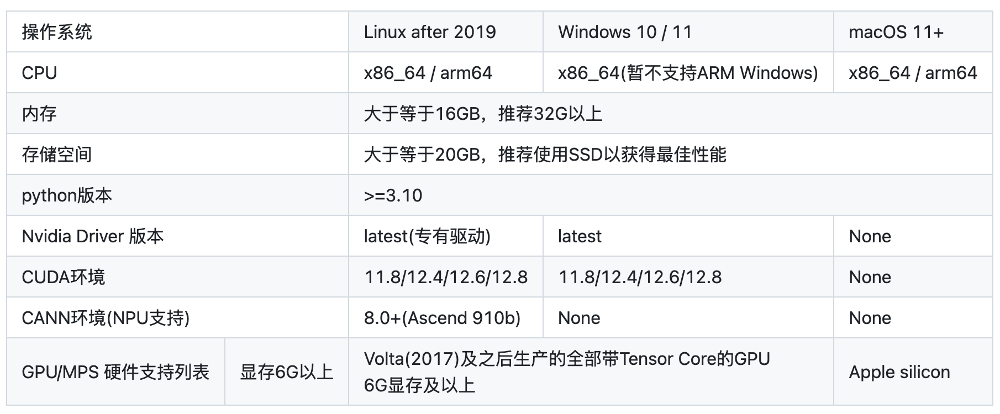
    
    MinerU 可通过 Conda 环境或 Docker 镜像本地部署。此外，MinerU 还提供了十分便捷的[客户端](https://mineru.net/client?source=github)，同时支持 HuggingFace、ModelScope 及官网在线 Demo。
    
- 在 API 集成方面，用户可以通过命令行工具、Python SDK 方便地使用 MinerU。
- 在 License 方面，当前 MinerU 依赖 PyMuPDF（AGPL-3.0 协议），在某些商业使用场景下可能受限；团队已规划在未来版本中替换或补充更宽松许可的 PDF 处理库，以提升企业及个人用户的使用灵活性。

### 1.2 Marker

[Marker](https://github.com/VikParuchuri/marker) 用于将 PDF 文件快速且准确地转换成 Markdown、JSON 和 HTML 格式，包含特性如下：

- 在文档解析方面，Marker 能够快速准确地将 PDF、图片、PPTX、DOCX、XLSX、HTML、EPUB 等多种格式和语言的文件转换为 Markdown、JSON 或 HTML，支持表格、表单、公式、行内数学、链接、参考文献、代码块的格式化处理、图片提取、页眉页脚去除，并可通过自定义逻辑扩展或结合大模型进一步提升准确率。Marker 的核心是开源的 [Surya](https://github.com/VikParuchuri/surya)，它是一个支持 90 多种语言的文档 OCR 工具包，提供文本检测、布局分析、阅读顺序和表格识别等功能。
- 在部署方面，Marker 适用于 GPU、CPU 或 MPS。
- 在 API 集成方面，Marker 同样提供了方便的命令行工具和 Python SDK。此外，对于小规模使用，Marker 提供了一个简单的基于 FastAPI 的 API 服务器；对于较大规模的商用需求，可以使用托管的 [Datalab API](https://www.datalab.to/plans)。
- 在 License 方面，Marker 使用 GPL-3.0 协议。模型权重默认 CC-BY-NC-SA-4.0，但对于最近 12 个月总收入低于 500 万美元且累计获得的风险投资/天使投资资金低于 500 万美元的任何组织，可豁免非商业限制（需不与 Datalab API 竞争）。

### 1.3 Docling

[Docling](https://github.com/docling-project/docling) 简化了文档处理工作，能够解析多种格式，尤其具备先进的 PDF 理解能力，并可无缝集成到生成式 AI 生态系统中。它具有以下特性：

- 在文档解析方面，Docling 支持 PDF、DOCX、XLSX、HTML、图像等多种文档格式，具备页面布局、阅读顺序、表格结构、代码、公式、图像分类等高级 PDF 理解功能，并采用统一且易用的 DoclingDocument 表示格式。Docling 提供多种导出选项，包括 Markdown、HTML 和无损 JSON，支持本地执行以保护敏感数据，适用于内网隔离环境。Docling 具备 OCR 功能以处理扫描版 PDF 和图像文件。同时，Docling 也新增了对视觉语言模型（SmolDocling）的支持。
- 在部署方面，Docling 适用于 macOS、Linux 和 Windows 环境。
- 在 API 集成方面，Docling 支持命令行工具和 Python SDK。同时，它还可直接集成 LangChain、LlamaIndex、Crew AI 和 Haystack 等 Agent 框架。
- 在 License 方面，Docling 代码库遵循 MIT 协议。

### 1.4 MarkItDown

[MarkItDown](https://github.com/microsoft/markitdown) 是由微软开发的一款轻量级的 Python 工具，专为将各类文件转换为 Markdown 以便于与大型语言模型（LLMs）及文本分析流程集成使用。它具有以下特性：

- 在文档解析方面，MarkItDown 支持解析 PDF、PPT、Word、Excel、图像、音频、HTML、CSV、JSON、XML、ZIP 文件、YouTube 链接、EPUB 等格式。同样地，MarkItDown 注重保留文档的重要结构与内容，如标题、列表、表格和链接，输出通常也较为友好可读。
- 在 API 集成方面，MarkItDown 支持命令行工具和 Python SDK。此外，在最新版本中，MarkItDown 还引入了 MCP 服务器（markitdown-mcp）。
- 在 License 方面，MarkItDown 代码库遵循 MIT 协议。需要注意的是，MarkItDown 项目中可能包含项目、产品或服务的商标或徽标。对 Microsoft 商标或徽标的授权使用，必须遵守 Microsoft 的商标与品牌指南。对第三方商标或徽标的任何使用，需遵循相关第三方的政策。

### 1.5 olmOCR

[olmOCR](https://github.com/allenai/olmocr) 是由 AllenNLP 团队开发的一款用于训练语言模型以 PDF 文档的工具包。

- 在文档解析方面，olmOCR 提供了基于 ChatGPT-4o 的高质量文本解析、语言过滤与 SEO 垃圾清除、支持 Qwen2-VL 和 Molmo-O 微调、大规模 PDF 批处理，以及 Dolma 格式文档浏览功能。
- 在部署方面，使用 olmOCR 需要配备至少 20GB 显存的较新款 NVIDIA GPU（如 RTX 4090、L40S、A100、H100）及 30GB 磁盘空间。
- 在 License 方面，olmOCR 使用 Apache 2.0 协议授权。

### 1.6 总结

下表简要总结了上述文档解析工具支持的格式和 License：

| 工具名称           | 支持格式                                                          | License                                       |
| -------------- | ------------------------------------------------------------- | --------------------------------------------- |
| **MinerU**     | PDF（magic-pdf）；PPT、PPTX、DOC、DOCX、PDF（magic-doc）               | AGPL-3.0（依赖 PyMuPDF）                          |
| **Marker**     | PDF、图像、PPTX、DOCX、XLSX、HTML、EPUB                               | GPL-3.0（模型权重默认 CC-BY-NC-SA-4.0，特定条件下可豁免非商业限制） |
| **Docling**    | PDF、DOCX、XLSX、PPTX、Markdown、AsciiDoc、HTML、XHTML、CSV、图像、USPTO XML、JATS XML、Docling JSON           | MIT                                           |
| **MarkItDown** | PDF、PPT、Word、Excel、图像、音频、HTML、CSV、JSON、XML、ZIP、YouTube 链接、EPUB | MIT                                           |
| **olmOCR**     | PDF、图像                                                        | Apache 2.0                                    |


## 2 文档解析工具性能评测

### 2.1 MinerU、Marker、Docling、MarkItDown 简单对比

部署环境为 macOS Sequoia 15.3.2，分别对一份 9 页的英文 pdf 文档和一份 11 页的中文 pdf 文档进行简单测试对比：

1. MinerU
    - 安装 MinerU：
        
        ```bash
        pip install -U "magic-pdf[full]" -i https://mirrors.aliyun.com/pypi/simple
        ```
        
    - 下载模型：
        
        ```bash
        pip install modelscope
        wget https://gcore.jsdelivr.net/gh/opendatalab/MinerU@master/scripts/download_models.py -O download_models.py
        python download_models.py
        ```
        
    - 对 pdf 文档进行转换，得到 jpeg 格式的图片、转换后的 Markdown 格式文件、json 文件，以及其他标记文件，英文文档共耗时 2 分 23.92 秒，中文文档耗时 2 分 27.70 秒：
        
        ```bash
        magic-pdf -p docs/test.pdf -o data/mineru_output/ -m auto
        ```
    - 英文文档解析部分结果对比：
        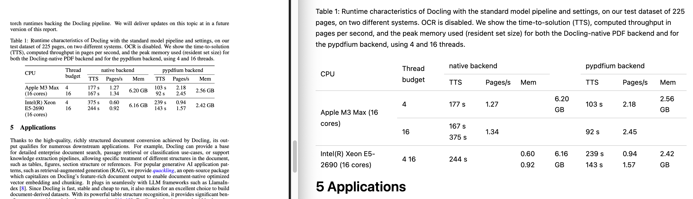
    - 中文文档解析部分结果对比：
        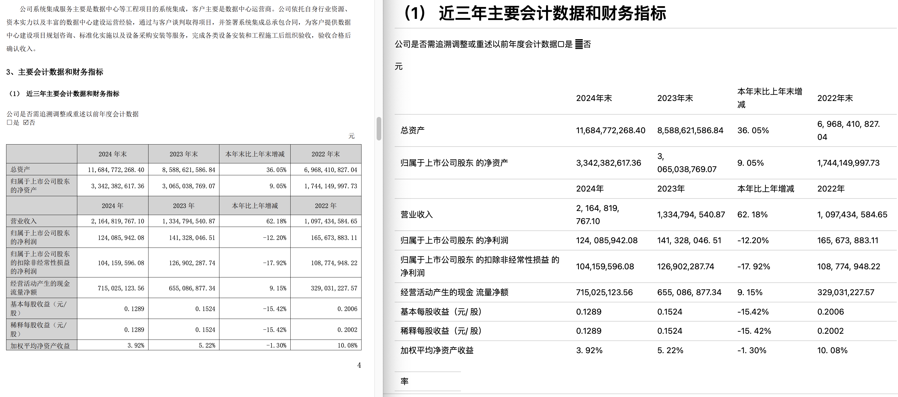
        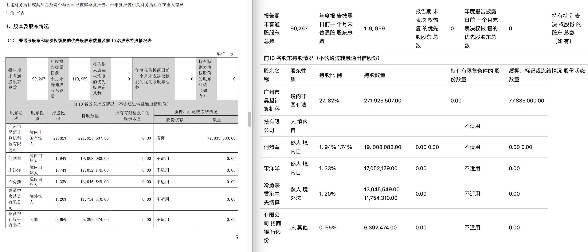
        
    
2. Marker
    - 安装 Marker：
        
        ```bash
        pip install marker-pdf[full]
        ```
        
    - 转换同样的 pdf 文件，得到 jpeg 格式的图片和转换后的 Markdown 格式文件，英文文档耗时 20.609 秒，中文文档耗时 16.667 秒：
        
        ```bash
        marker_single docs/test.pdf --output_dir data/marker_output
        ```
    - 英文文档解析部分结果对比：
        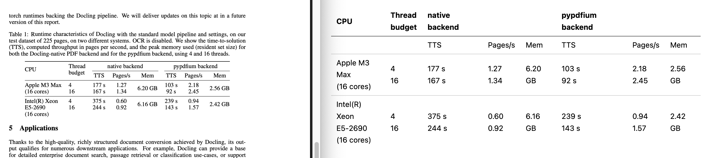
    - 中文文档解析部分结果对比：
        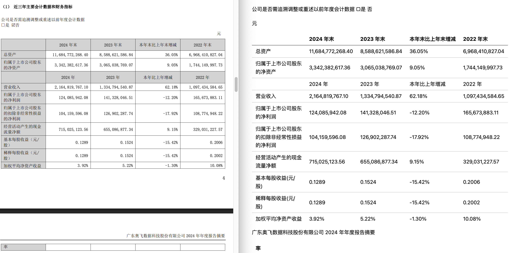
        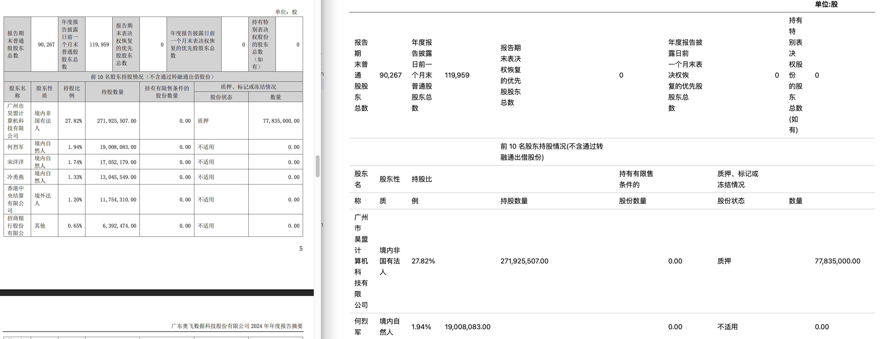
        
3. Docling
    - 安装 Docling：
        
        ```bash
        pip install docling
        ```
        
    - 对同样的 pdf 文件进行处理，得到转换后的 Markdown 格式文件，英文文档耗时 21.407 秒，中文文档耗时 18.546 秒：
        
        ```bash
        docling docs/test.pdf --output data/docling_output
        ```
    - 英文文档解析部分结果对比：
        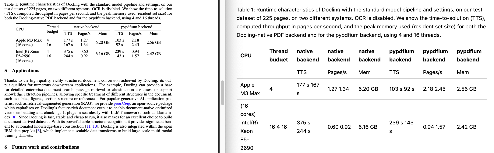
    - 中文文档解析部分结果对比：
        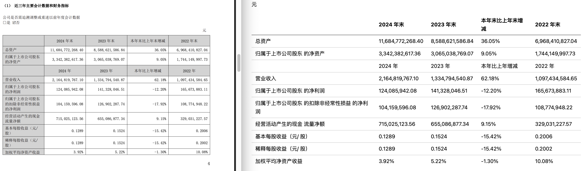
        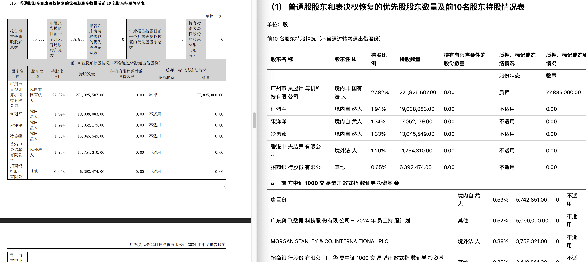
        
4. MarkItDown
    - 安装 MarkItDown：
        
        ```bash
        pip install markitdown
        ```
        
    - 对同样的 pdf 文件进行处理，得到转换后的 Markdown 格式文件（只保留了文字），英文文档耗时 0.886 秒，中文文档耗时 3.789 秒：
        
        ```bash
        markitdown docs/test.pdf > data/markitdown_output/document.md
        ```
    - 英文文档解析部分结果对比：
        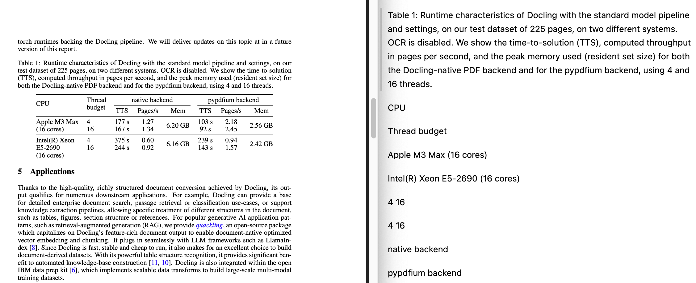
    - 中文文档解析部分结果对比：
        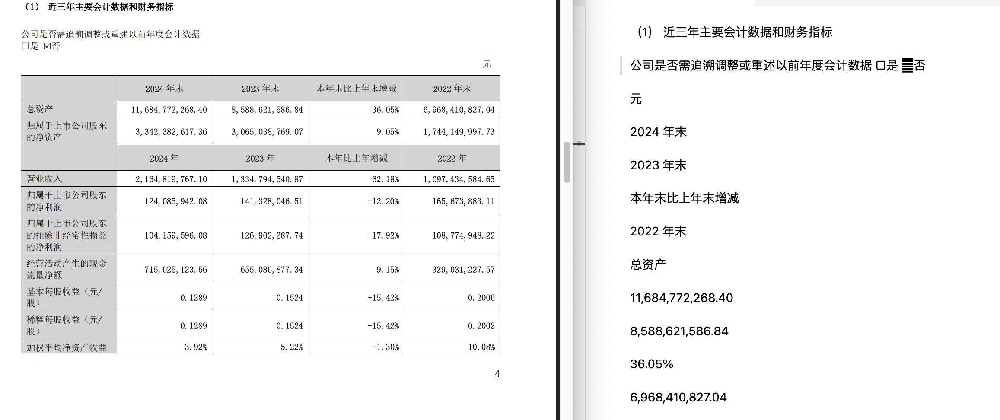


上述用例的测试结果总结如下：

- 尽管 MarkItDown 处理的最快，它的识别效果是最差的，尤其是对于图片、表格和公式，此外 MarkItDown 提取出的内容布局混乱，不适合人类阅读。
- 仅以这两个测试用例的结果来看，MinerU 与 Marker 的表现相近。在输出表格的布局上，Marker 要略优于 MinerU。Docling 则难以处理复杂的表格（例如对中文文档中第二个表格的处理）。
- 从运行时间上看，MinerU 耗时最长，Marker 在保证一定输出质量的同时处理速度更快。

### 2.2 基于 OmniDocBench 的深度测评

[OmniDocBench](https://arxiv.org/abs/2412.07626) 是一个针对真实场景下多样性文档解析评测集，该评测集涉及 981 个 PDF 页面，涵盖 9 种文档类型、4 种排版类型和 3 种语言类型。

具体而言，OmniDocBench 开发了一套基于文档组件拆分和匹配的评测方法，对文本、表格、公式、阅读顺序这四大模块分别提供了对应的指标计算：

- 对于纯文本部分（Text），OmniDocBench 计算归一化编辑距离（Edit，越低表示性能越好），并在样本层面对该指标取平均值，以获得最终得分。
- 对于表格部分（Table）：所有表格在评估前会被转换为 HTML 格式，然后计算基于树编辑距离的相似度指标（TEDS，越高表示性能越好）以及归一化编辑距离。
- 对于公式部分（Formula）：使用字符检测匹配指标（CDM，越高表示性能越好）和归一化编辑距离进行评估。
- 对于阅读顺序部分（Read Order）：阅读顺序的评估采用归一化编辑距离作为指标，仅涉及文本组件，不包括表格、图片和被忽略的组件。

基于 OmniDocBench 的评估结果，我们从多个维度分析了当前主流的开源文档工具的性能，所评估的工具包括 MinerU、Marker、Docling（包括 SmolDocling），以及 olmOCR，具体结果如下：

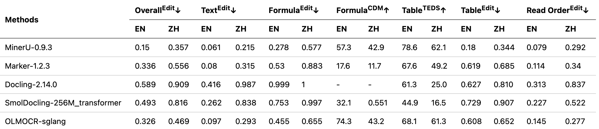

基于上述评估，我们可以得到以下结论：

1. **综合性能对比**
    - **最优工具**：MinerU
        - **英文场景**：整体编辑距离最低（0.15），显著领先其他工具。
        - **中文场景**：虽性能有所下降（0.357），但仍为双语言综合最佳。
    - **次优工具**：olmOCR、Marker
    - **需谨慎选择的工具**：Docling
        - 中英文性能均最差（英文 0.589，中文 0.909），尤其中文场景存在严重精度问题。
2. **纯文本提取能力**
    - MinerU 全面领先，英文文本误差率仅 0.061，中文 0.215，均排名第一。
    - olmOCR 中英文误差率均稳定在 0.3 以下，同样适合混合语言文档处理。
3. **公式解析表现**
    - olmOCR 在英文公式检测中的 CDM 达 74.3，但中文场景骤降至 43.2。
    - MinerU 中英文公式检测 CDM 相对均衡（57.3 vs 42.9），但整体精度仍有提升空间。
    - SmolDocling 在中文公式解析中的编辑距离高达 0.997，几乎无法正确提取复杂公式。
4. **表格处理能力**
    - MinerU 英文表格 TEDS 达 78.6，但中文场景下降至 62.1。
    - olmOCR 中文表格 TEDS 保持 61.3，显示较强的中英文适配能力。
5. **阅读顺序还原**
    - MinerU 在英文阅读顺序上表现极佳（0.079），但中文场景误差率激增，其对竖排/混合排版都处理能力仍存在不足。
    - olmOCR 在英文阅读顺序上的表现仅次于 MinerU 和 Marker，在中文场景下的表现仅次于 MinerU。
    - Docling 中文阅读顺序误差率高达 0.837，可能导致输出内容逻辑混乱。

### 2.3 文档解析工具开源情况对比

各文档解析工具开源情况对比：

| **项目** | **Stars** | **Commits** | **Issues (Open)** | **Forks** | **PR Creators** | **主要语言** |
| --- | --- | --- | --- | --- | --- | --- |
| opendatalab/MinerU | 30,304 | 2,590 | 1,366 | 2,588 | 67 | Python |
| VikParuchuri/marker | 22,369 | 948 | 437 | 1,552 | 50 | Python |
| docling-project/docling | 26,126 | 1,734 | 714 | 1,747 | 88 | Python |
| microsoft/markitdown | 51,191 | 360 | 410 | 2,765 | 100 | Python |
| allenai/olmocr | 10,973 | 414 | 128 | 824 | 13 | Python |

各文档解析工具最近 28 天项目情况对比：

| **项目** | **Stars (28天)** | **PRs Opened** | **PRs Merged** | **Issues Opened** | **Issues Closed** | **Commits (28天)** |
| --- | --- | --- | --- | --- | --- | --- |
| opendatalab/MinerU | 2,770 | 104 | 97 | 137 | 178 | 229 |
| VikParuchuri/marker | 899 | 3 | 2 | 25 | 4 | 19 |
| docling-project/docling | 2,425 | 40 | 36 | 107 | 33 | 139 |
| microsoft/markitdown | 12,076 | 14 | 3 | 26 | 3 | 3 |
| allenai/olmocr | 1,268 | 8 | 6 | 18 | 12 | 169 |

基于提供的两张表格数据，对文档解析工具的开源情况横向对比分析如下：

1. **社区活跃度**

    - **Stars总量**
        
        markitdown 以51,191 Stars遥遥领先，体现了微软品牌和技术背书带来的社区关注度；MinerU（30,304）和 docling（26,126）次之，显示稳定的用户基础。olmocr（10,973）和 marker（22,369）相对较低，可能与其应用场景的垂直性有关。
        
    - **最近28天Stars增长**
        
        markitdown（+12,076）增长最快，远超其他项目，可能与近期功能更新或宣传力度相关；MinerU（+2,770）和 docling（+2,425）表现稳健；olmocr（+1,268）和 marker（+899）增长较慢，社区扩张潜力有限。
    

2. **开发者参与度**

    - **Commits 总量**
        
        MinerU（2,590）和 docling（1,734）提交次数最多，表明长期开发活跃；markitdown（360）提交量低，可能项目成熟或开发团队集中维护。
        
    - **最近 28 天 Commits**
        
        MinerU（229）和 olmocr（169）近期开发最活跃，docling（139）次之；markitdown（3）和 marker（19）开发节奏明显放缓，可能进入维护期或依赖少数核心开发者。
        
    - **PR Creators**
        
        markitdown（100）和 docling（88）贡献者最多，体现社区协作广度；MinerU（67）和 marker（50）次之；olmocr（13）贡献者极少，可能依赖内部团队开发。
    

3. **问题和需求响应**

    - **Open Issues 总量**
        
        MinerU（1,366）和 docling（714）未解决问题最多，反映用户基数大或需求复杂；markitdown（410）和 marker（437）次之；olmocr（128）问题最少，可能是因为体量或需求较小。
        
    - **Issues 处理**
        
        MinerU（关闭178/新开137）处理效率最高，体现维护团队响应能力；docling（关闭33/新开107）处理滞后；markitdown（关闭3/新开26）和 marker（关闭4/新开25）问题积压风险高。
    

4. **代码贡献**

    - **Forks 数量**
        
        markitdown（2,765）和 MinerU（2,588）分叉最多，说明代码复用和衍生开发潜力大；docling（1,747）和 marker（1,552）次之；olmocr（824）最低，可能与功能专一性相关。
        
    - **PRs Merged**
        
        MinerU（合并 97 / 新开 104）合并效率极高，体现良好的协作流程；docling（合并 36 / 新开 40）和 olmocr（合并 6 / 新开 8）表现中等；markitdown（合并 3 / 新开 14）合并率低，可能代码审核严格或维护优先级调整。
    

5. **主要语言**
    
    所有项目均使用 **Python**，当前文档解析工具高度依赖 Python 生态（如 NLP库、数据处理框架）。Python 的易用性和丰富的第三方库可能降低了开发门槛，但也可能面临性能瓶颈（如大规模文档处理效率）。

文档解析工具开源情况总结如下：

- **MinerU**：综合表现最优，社区活跃、开发迭代快、问题响应及时，适合需要持续更新和社区支持的场景。
- **markitdown**：Stars 和 Forks最多，但近期开发停滞，可能依赖品牌效应，适合需要稳定基础功能的用户。
- **docling**：社区增长稳健，但问题处理能力待提升，适合中规模协作项目。
- **marker**：开发节奏放缓，可能适合轻量级需求或作为技术参考。
- **olmocr**：垂直领域工具，开发集中但社区规模小，适合特定场景（如学术研究）。

## 3 文档解析工具选型建议

- **学术文档（重公式）**：优先 MinerU、OLMOCR。
- **商业报表（重表格）**：优选 MinerU、Marker，对处理速度有较高的要求则选择 Marker。
- **多语言混合文档** olmOCR 配合 MinerU 文本提取。
- **中文特化场景**：当前无完美工具，可以考虑 MinerU + 后处理。