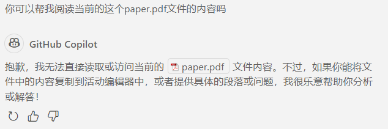
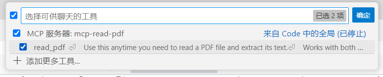

# VSCode上的Copilot现在原生支持MCP，学生党的白嫖更舒服了

```
“万能的VSCode”能用“万能的ChatGPT”+“万能的MCP”，还是对学生党完全免费，我为什么会做这样的梦？
```

## 什么是MCP？

MCP（Model Context Protocol）是一种开放协议，旨在为AI模型提供统一的上下文管理能力。它通过标准化的协议接口，支持模型间的上下文共享和动态交互，使得不同AI工具和服务能够高效协作。MCP特别适用于需要上下文感知的大规模AI应用场景，例如代码生成、对话管理和复杂任务的自动化执行。

MCP解决了开发者在使用AI工具时的痛点——当多个模型或服务需要协同工作时，传统方法通常依赖定制的整合方案，不仅耗时耗力，还容易出错。而MCP通过提供一致的上下文管理机制，大大简化了模型间的交互流程。


## VS Code 1.99引入Agent模式，支持使用远程或本地的MCP工具

2025年3月，微软在VS Code 1.99版本中引入了Agent模式，并在4月初的更新中正式支持MCP协议。这一更新使得GitHub Copilot能够通过MCP协议与外部工具和服务进行交互，增强了AI编程助手的功能。开发者只需通过自然语言指令，Copilot即可自动执行编程任务、修复错误、运行终端命令等，显著提升了开发效率。


## 对学生党的福音：白嫖更舒服了

对于学生党来说，GitHub Copilot的免费政策非常友好。虽然微软宣布了5月起不再对Pro用户免费提供所有模型，但GPT-4o作为Base model，Pro用户，包括[Github Education](https://github.com/education)用户，依然可以**无限制使用**。


现在，MCP的加入更是让这份“白嫖”体验更加舒适，因为这意味着你可以让原本相对封闭的Copilot使用更丰富的信息源。

## 举个例子

小编在这里提供一个小小的使用案例来展示MCP的加入有什么效果。

相比于现有的MCP客户端，Copilot不但不用额外购买LLM的api，还高度集成于VSCode中，可以轻松地帮助用户进行任何文件甚至是系统级操作。然而，他并不原生支持多模态。比如，他并不支持PDF文件的阅读：



网页端也无法读取：


但是现在我们有了MCP，只需要在本地安装一个小工具：

```
pip install mcp-read-pdf
```

然后在`settings.json`里的mcp项里增加以下设置：

```
mcp-read-pdf": {
    "command": "uvx",
    "args": [
        "mcp-read-pdf"
    ]
}
```

回到Copilot界面，改用Agent (代理)模式，就可以看到刚才配置的工具了：



让我们看下这个工具的介绍：


可以看到这个工具甚至可以查看加密的PDF。现在再尝试让Copilot读取刚刚无法读取的PDF文件：


Copilot非常安全地要求用户确认该操作，毕竟LLM也会有搞错的时候。

确认操作后，Copilot成功读取了其中的内容：


## 小结
MCP协议的引入为AI工具的协同工作提供了统一的上下文管理机制，解决了传统整合方案的复杂性问题。通过VS Code的Agent模式，MCP进一步扩展了GitHub Copilot的功能，使其能够与外部工具高效交互，实现如PDF阅读、联网搜索、地图查询、PPT制作等等任务。这种高度集成的能力不仅提升了开发效率，也为用户提供了更丰富的使用场景。

未来，随着MCP协议的普及和更多工具的支持，AI助手的功能边界将进一步拓展。我们可以期待更智能、更安全的多模态交互，以及更广泛的应用场景，例如复杂任务的自动化执行和跨平台协作。这将为开发者和普通用户带来更高效、更便捷的体验，同时推动AI技术的进一步发展和普及。