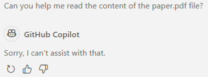
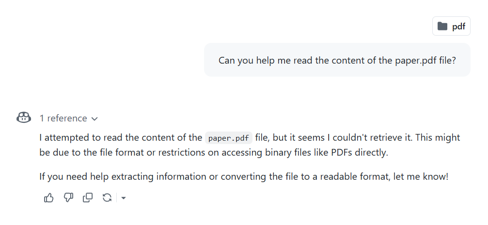
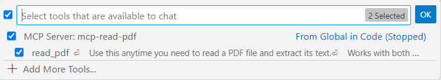
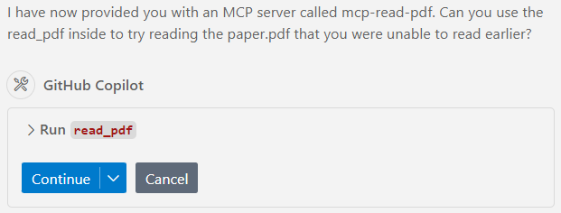
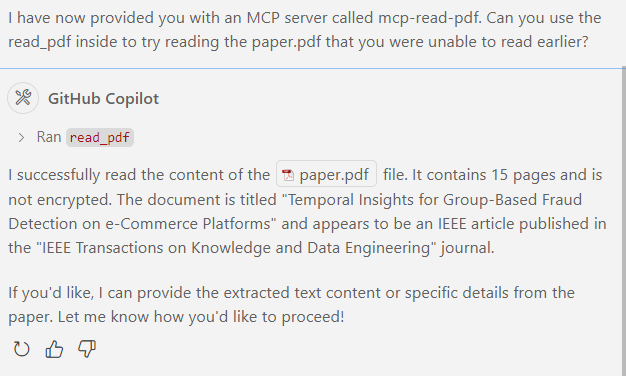

# Copilot on VSCode Now Natively Supports MCP: A Great Bonus for Students

```
"Universal VSCode" combined with "Universal ChatGPT" + "Universal MCP," and it's completely free for students. Why does this dream feel so real?
```

## What is MCP?

MCP (Model Context Protocol) is an open protocol designed to provide unified context management capabilities for AI models. By standardizing protocol interfaces, MCP supports context sharing and dynamic interaction among models, enabling different AI tools and services to collaborate efficiently. MCP is particularly suitable for large-scale AI applications that require context awareness, such as code generation, conversation management, and automated execution of complex tasks.

MCP addresses a common pain point for developers using AI tools. Traditionally, when multiple models or services need to work together, developers rely on custom integration solutions, which are time-consuming, labor-intensive, and error-prone. By offering a consistent context management mechanism, MCP significantly simplifies the interaction process between models.

## VS Code 1.99 Introduces Agent Mode, Supports Remote or Local MCP Tools

In March 2025, Microsoft introduced Agent Mode in version 1.99 of VS Code. In early April, it officially added support for the MCP protocol. This update enables GitHub Copilot to interact with external tools and services via the MCP protocol, enhancing the functionality of the AI-powered programming assistant. Developers can now issue natural language commands to Copilot to automatically perform programming tasks, fix bugs, run terminal commands, and more, greatly improving development efficiency.

## A Blessing for Students: Free Access Just Got Better

For students, GitHub Copilot's free policy is incredibly friendly. Although Microsoft announced that starting in May, Pro users will no longer have free access to all models, GPT-4o remains the base model. Pro users, including [GitHub Education](https://github.com/education) users, can still enjoy **unlimited access**.


With the addition of MCP, this "free access" experience becomes even more enjoyable, as it allows Copilot, which was previously relatively closed, to leverage richer sources of information.

## An Example

Here’s a small example to demonstrate the impact of adding MCP.

Compared to existing MCP clients, Copilot not only eliminates the need to purchase additional LLM API access but is also highly integrated into VSCode. It can effortlessly assist users with file-level and even system-level operations. However, it does not natively support multimodal functionalities. For instance, it cannot read PDF files:



It also cannot read them via the web interface:



But now, with MCP, all you need to do is install a small tool locally:

```
pip install mcp-read-pdf
```

Then, add the following configuration to the `mcp` section of your `settings.json` file:

```
"mcp-read-pdf": {
    "command": "uvx",
    "args": [
        "mcp-read-pdf"
    ]
}
```

Return to the Copilot interface, switch to Agent Mode, and you will see the tool you just configured:



Let’s check out the tool's description:


You can see that the tool even supports reading encrypted PDFs. Now, let’s try to get Copilot to read the previously unreadable PDF file:



Copilot safely asks the user for confirmation, as LLMs can sometimes make mistakes.

After confirming the action, Copilot successfully reads the content:



## Summary

The introduction of the MCP protocol provides a unified context management mechanism for AI tool collaboration, resolving the complexity of traditional integration solutions. Through VS Code’s Agent Mode, MCP further extends GitHub Copilot’s capabilities, allowing it to interact efficiently with external tools to perform tasks such as PDF reading, online searches, map queries, PowerPoint creation, and more. This highly integrated ability not only enhances development efficiency but also offers users richer usage scenarios.

In the future, as MCP becomes more widespread and more tools adopt it, the functional boundaries of AI assistants will expand further. We can look forward to smarter, safer multimodal interactions and broader application scenarios, such as automated execution of complex tasks and cross-platform collaboration. This will bring a more efficient and convenient experience to developers and everyday users alike while driving further development and adoption of AI technology.