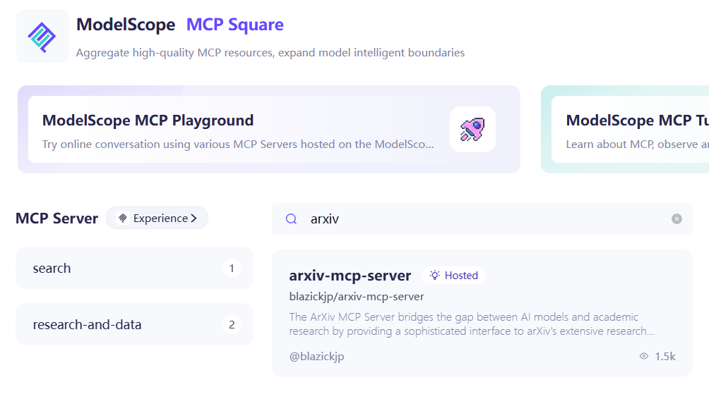
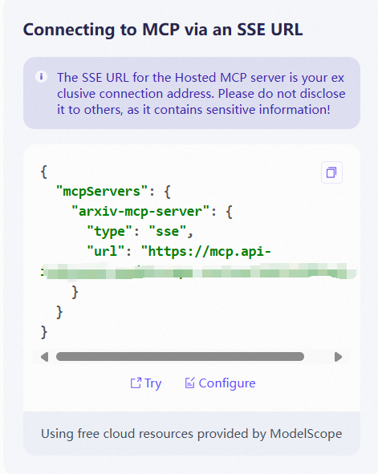
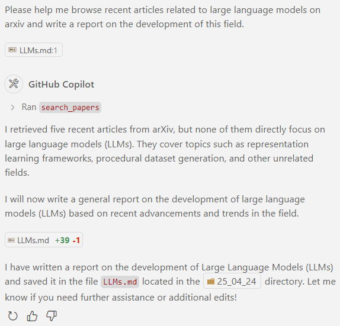
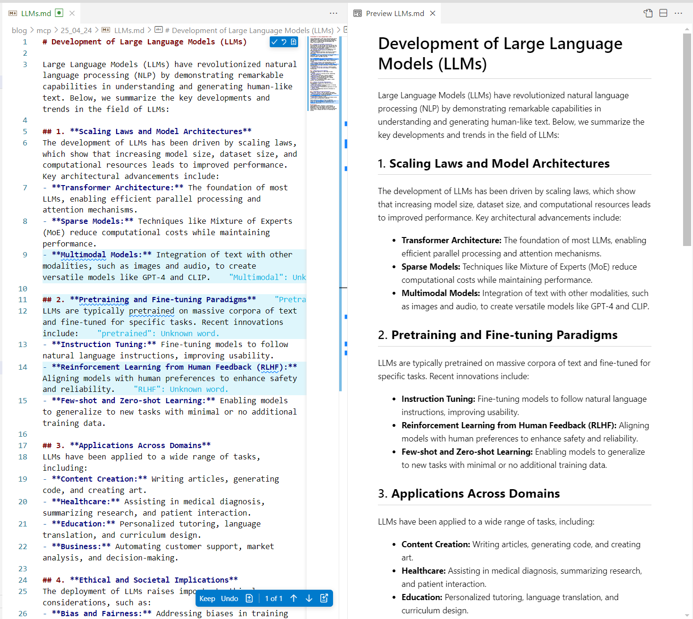

# Free Computing Power + One-Click Remote Invocation! ModelScope MCP Marketplace Ushers in a New Era of AI Services

```
MCP (Model Context Protocol) enables LLMs to easily access multi-channel information, fully unleashing their powerful potential.
```

## Limitations of Current LLMs

Today's large language models (LLMs) have demonstrated impressive capabilities, becoming indispensable in many people's daily lives and work. From drafting content to generating code, translating languages to solving complex problems, LLMs are making significant impacts across various fields.

However, these models also have notable limitations. First, most LLMs' knowledge bases are built on training data and cannot be frequently updated. This means they may struggle with the latest information, events, or technological advancements. Second, users often find it challenging to precisely obtain the information they need through general web searches, especially when dealing with multi-channel or complex contexts. These limitations in information retrieval restrict the practical utility of LLMs in certain scenarios.

## Challenges in Using MCP

While MCP can flexibly provide various types of information to large models based on user needs, effectively addressing the above shortcomings, its usage still presents certain barriers.

Currently, the majority of MCP services require local setup. This means users need to be familiar with the process of setting up their local runtime environment. For many general users, this remains a challenge. This technical barrier limits the widespread adoption and application of MCP to some extent.

## ModelScope Makes It Simpler

On April 15, 2025, the ModelScope platform launched the [MCP Marketplace](https://modelscope.cn/mcp), becoming the largest MCP service marketplace in the Chinese open-source community. The marketplace currently offers nearly 1,500 MCP servers, covering popular areas such as search, maps, file systems, and developer tools. ModelScope provides user-friendly tools and debugging environments like the MCP Lab, allowing developers to set up the required MCP services within a minute. These services support both cloud hosting and local deployment, and can be integrated into third-party platforms, significantly lowering the barrier for developers to use MCP services and driving innovation and implementation of AI applications.

In simple terms, users can directly select their preferred MCP service from the marketplace, then obtain the SSE URL for invocation with one click, enabling them to use these services in their MCP-supported clients.

## An Example

Here is an example of using the ModelScope MCP Marketplace to give you an intuitive understanding of this simple process.

Suppose I want LLMs to query the latest articles on Arxiv in real-time to help me understand the current developments in a specific field. I can select `arxiv-mcp-server` from the marketplace:



Next, I just need to follow ModelScope's guidance to enable the service in the cloud with one click, and I can obtain a dedicated invocation URL:



With this link, I can directly add and invoke the server in my MCP-supported client. For example, if I want to learn about the latest developments in the field of large language models:



As you can see, the MCP server has been successfully invoked. In no time, the report I wanted is ready:



## Summary

Currently, the ModelScope MCP Marketplace has launched over 160 MCP servers that can be deployed and invoked online with one click. As MCP continues to develop and become more popular, its application scenarios will become increasingly broad. Whether in research, education, business, or daily life, MCP can provide users with more convenient and efficient services. In the future, with more developers joining and continuous technological advancements, MCP is expected to become one of the core technologies in the AI service field, bringing more innovation and convenience to human society.