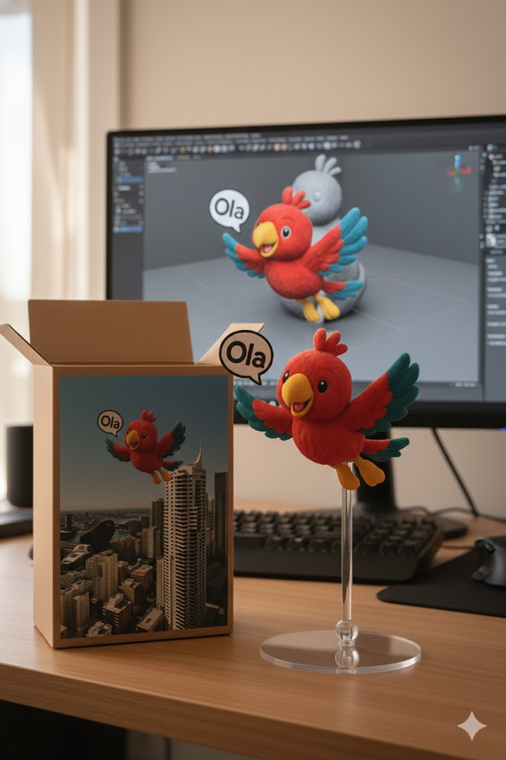
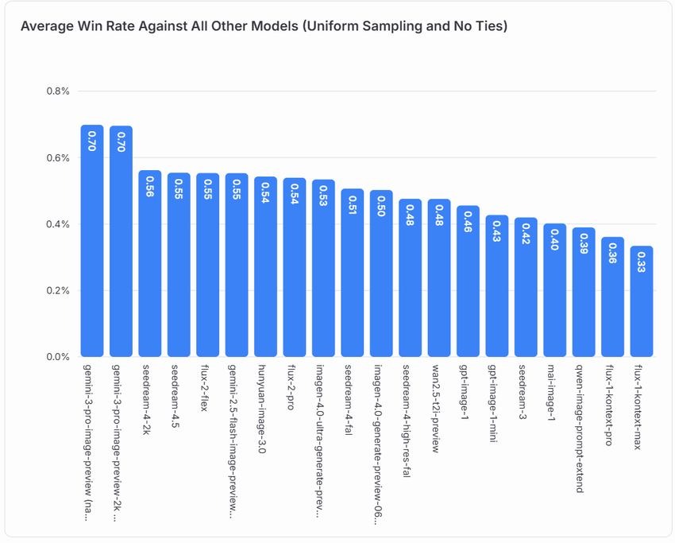

If you've been actively surfing the internet lately, you've probably been bombarded by images like these:

Whether it's stunningly realistic figurine renderings or character designs with extraordinary consistency, these images that have amazed artists and designers all share one common thread: a name that has recently "ascended to godhood" in the image generation field—**Nano Banana**.

This seemingly whimsical codename not only represents Google's powerful counterattack in the AI image field but also vividly presents a spectacular drama of "the hidden master returns as the Dragon King."

# A Low-Key Beginning

Let's rewind the timeline to August 2025.

LMArena, a crowdsourced model testing platform—this is the famous AI arena where thousands of users "blind test" various large models daily, trying to rank them through brutal A/B testing. Users were comparing generation results from various models as usual, attempting to identify differences between current models. On this particular day, without any announcement or launch event, users unexpectedly encountered an unfamiliar model codename: "Nano banana". This model didn't appear in any official product list nor had any prior announcement—like a ghost, it simply appeared in this model arena.

Initially, people didn't pay much attention to this rather casual-sounding name, until test results began appearing on their screens. Compared to mainstream AI image editing tools at the time, Nano banana demonstrated astonishing character and scene consistency: when editing images, it could preserve facial features, lighting, and composition almost perfectly. It exhibited terrifyingly precise control. This model's appearance made August particularly special.

# Unveiling the Mystery

Starting from mid-August, as more and more users experienced Nano banana's capabilities, everyone realized this model was no ordinary player. People's surprise gradually transformed into curiosity, but no one knew where this model came from, and there was no official documentation. Its identity and capabilities became a mystery.

AI enthusiasts immediately launched a collective detective operation, analyzing Nano banana's technical characteristics, performance metrics, and naming patterns. Although there was no official documentation, we could still glimpse clues from user feedback. Geeks began analyzing its token response speed and image generation fingerprint characteristics, attempting to reverse-engineer its architecture. On platform X, the #NanoBanana hashtag garnered over fifty thousand uses within 48 hours, with every tech blog and YouTube creator producing testing and comparison content about this model. All of this demonstrated the model's power, and speculation about it grew increasingly intense.

It wasn't until August 19th that a post hinted at the model's origin. Logan Kilpatrick, head of Google AI Studio, posted something bewildering on social media. No text, no links, just a simple emoji:

The entire community immediately realized this might be an official clue, and this emoji became the key to unlocking the model's identity mystery.

From that day forward, as if receiving some signal, other Google DeepMind employees began posting banana-related content on social media, forming a series of hints. Like subtle traces left by a snake in the grass, all clues eventually converged at one point. On August 29, 2025, Nano banana finally transitioned from mysterious model to official product. Google formally announced the existence of the Gemini 2.5 Flash Image model, and its development codename was precisely that name that had captivated the entire internet for a whole month: Nano Banana.

The Nano Banana story is not just a technological victory but a textbook-level marketing triumph.

Google's model launch strategy pioneered a new approach—a community-driven, experience-first, virally-propagated model. It also provided important insights for the AI industry: a high-quality AI tool with user participation and community-driven promotion is far more important than a flashy launch event. Nano Banana's mysterious appearance and eventual confirmation not only showcased Google's technical leadership in AI image editing but, more importantly, created an entirely new product launch model. The August launch process perfectly demonstrated how modern AI products can maximize their impact through community power.

The Nano Banana case proves one truth to all AI developers and enterprises:

In an era of transparent information, an excellent technical product is its own best advertisement.

When your foundation is solid enough, just a touch of mystery as the fuse, and user enthusiasm can ignite unexpected market effects. The success of Gemini 2.5 Flash Image perhaps marks AI product launches entering a new era—a new standard era of demystification and emphasis on experience.

# Topping: How to Master Nano Banana

We haven't obtained Google's internal technical documentation or papers yet, so we can't know exactly the algorithmic mechanisms behind Nano Banana. However, we can already maximize its capabilities through official documentation and public community experience—making Nano Banana a powerful tool in our creative/product/prototype design work.

For Nano banana, there's a fundamental principle for image generation:

Describe the scene, not just list keywords. The model's core advantage lies in its profound language understanding capability. Compared to a string of unrelated words, narrative descriptive paragraphs almost always generate better, more coherent images.

The following strategies can help you construct more effective prompts to generate the images you want.

## Image Generation Prompt Template

The more detailed the prompt, the better the model's generation results will be. For Nano banana, we recommend this structure:

Subject + Composition + Action + Location + Style + Technical Controls

Each part can be considered a minimal prompt unit that you can freely combine with your creativity:

### Subject

The more specific the subject description, the closer the result to the image in your mind. Here's a simple example:

- Wrong: "a cat" (The model only knows you want "a cat," but what breed? What expression? Is it stretching in the sunlight or sneaking fish in the kitchen?)
- Good: "a fluffy calico cat wearing a tiny wizard hat with star patterns"

### Composition

Just like real photography, Nano banana has excellent understanding of photographic composition. Be sure to use it in your prompts:
- "wide shot / extreme close-up / low-angle / portrait / symmetrical composition"

### Action
- "brewing coffee / reading / casting a spell / running mid-stride"

    
    

### Location

Let the model more accurately understand the physical environment.
- "in a futuristic Mars café with red dust outside"
- "in a cluttered alchemist's library"

### Style

The more specific the style, the more stable the result.
- "1990s product photography"
- "photorealistic"
- "watercolor illustration"
- "film noir lighting"

### Technical Controls

For different styles of images, such as realistic styles, stylized illustrations, or commercial photography, you can use different prompt styles in corresponding scenarios. Based on the model's understanding of photography and technical terminology, it can fully accomplish this, for example:
- Realistic scenes: The scene is illuminated by [lighting description], creating a [mood] atmosphere. Captured with a [camera/lens details], emphasizing [key textures and details]. The image should be in a [aspect ratio] format.
- Stylized illustrations and stickers: The design should have [line style] and [shading style]. The background must be transparent.

# A New Paradigm of Community-Driven Launches in the AI Era

The Nano Banana story is far from over, and its impact on the world has only just begun. Through this mysterious "blind test" launch, Google has demonstrated Gemini Image model's top-tier technical prowess in image control and consistency. More importantly, it has pioneered a new product launch paradigm for the entire tech industry—one that is community-driven and centered on user experience.

🍌The victory of this codename proves that in today's surging AI wave, excellent technology itself is the most powerful propagation vehicle. Users are no longer satisfied with flashy rhetoric and grand launch events; they crave direct experience and participation in technological evolution. For developers, the Nano Banana case serves as a wake-up call: polish your technology and let the product speak for itself.
