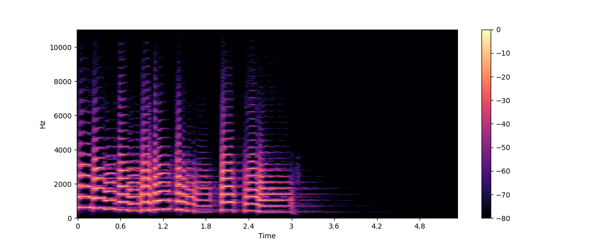

# AI Text-to-Speech: Who’s the Real “Voice Magician”?
We live in an AI-for-everything era. AI can draw pictures, make videos, and even write articles. Now, it’s changing something more human — the voice.

Think about it:\
Podcast narration, customer-service calls, video dubbing, or even your own digital twin — all can now speak with an AI voice that sounds almost real.

But when you actually try these tools, you notice something strange:

- Some voices sound warm and natural.
- Others sound robotic, flat, and emotionless.

Why such a big difference?\
It all depends on how each AI voice model is built — its logic, training, and data.

Let’s explore the world of **AI Text-to-Speech (TTS)** and find out who’s truly the voice magician.

## From Talking to Expressing: The Journey of AI Voice
Old-school speech synthesis was pretty dumb. It just stitched tiny pieces of recorded sounds together — like a robot reading a script.

Then came **parametric synthesis (HMM-based)**, which made speech smoother but still dull.

The real game-changer arrived in 2016: Google’s WaveNet. For the first time, AI learned to create sound waves directly from text — it could speak with real rhythm, pauses, and tone.

Since then, AI voice has evolved fast — Tacotron, FastSpeech, VITS, StyleTTS, CosyVoice, ChatTTS and more. Each generation sounds closer to human. AI no longer just “reads text” — it understands meaning and mood. That’s the step from **talking to expressing**.

## How AI Text-to-Speech Works: From Text to Sound
A complete Text-to-Speech (TTS) system typically goes through several key stages:

1. Text Input
    The user starts by entering the text they want to convert into speech. This serves as the foundation of the entire process.

2. Text Analysis
    The system first needs to understand the input text. It splits sentences, segments words, and converts them into a sequence of phonemes (the smallest sound units of speech).It also marks prosodic features such as intonation, stress, and pauses to capture the natural rhythm of language.

3. Acoustic Modeling
    At this stage, the AI converts the phoneme sequence into a spectral representation of sound, commonly known as a Mel Spectrogram — a two-dimensional image showing how the energy of sound changes over time and frequency.
    
    > *Illustration from: huggingface*
    - The x-axis represents time (each frame corresponds to a short segment of sound)
    - The y-axis represents frequency (the pitch or tone)
    - The color intensity shows how strong the sound energy is at each frequency

    To generate the spectrogram, the system first performs a Short-Time Fourier Transform (STFT) to obtain a linear frequency spectrum. Then it applies a Mel filter bank, which remaps the frequency axis onto the Mel scale — a perceptual scale that better matches how humans hear sound. Finally, it applies a logarithmic or decibel compression, producing this “heatmap of sound.” This step is the heart of speech synthesis.

4. Vocoder Generation
    Now the AI has a “heatmap” of sound, but we can’t hear an image — it must be turned into an actual **audio waveform**. A waveform is essentially the change in air pressure over time:
    
    > *Illustration from: gettyimages*

5. Audio Output
    Finally, the synthesized waveform is played through a speaker or headphone — and what you hear is an AI-generated human-like voice produced entirely by deep learning.
## The Main AI Voice Models
Here’s a quick look at today’s popular TTS systems:
| Model                        | Key Features              | Strength                  | Common Use                 |
| ---------------------------- | ------------------------- | ------------------------- | -------------------------- |
| **WaveNet (Google)**         | Deep neural vocoder       | Very natural sound        | Voice assistants, movies   |
| **Tacotron 2**               | Encoder-decoder model     | Smooth rhythm, clear tone | General voice use          |
| **FastSpeech 2 (Microsoft)** | Non-autoregressive        | Fast generation, scalable | Real-time apps             |
| **VITS (Naver)**             | End-to-end model          | Supports many speakers    | Virtual humans, AI hosts   |
| **CosyVoice (Alibaba)**      | Multi-emotion large model | Flexible tone & emotion   | Content creation           |
| **ChatTTS (Open source)**    | Language-aware TTS        | Natural dialogue style    | Chatbots, voice assistants |

Each model has its own personality — \
some focus on **realism**, some on **speed**, and some on **understanding context**. But they all chase one goal: make AI sound human.

## Why Do Some AI Voices Sound More Natural?
Sometimes, you may notice that the same sentence read by different AI models can sound dramatically different — as if one speaks like a human, and the other like a robot.
Behind this gap lie three key technologies: prosody control, semantic–acoustic integration, and text–speech alignment.

1. Prosody

    Humans don’t pronounce every syllable with equal duration or energy — we naturally emphasize certain words, pause, raise or lower pitch. If an AI doesn’t learn this rhythmic pattern, it ends up reading like a script. That’s why advanced TTS (Text-to-Speech) systems explicitly model **prosodic features**, such as **phoneme duration**, **fundamental frequency**, and **energy**.

    During training, the model doesn’t just predict spectrograms — it also learns these prosodic variables and feeds them as conditions into the acoustic model or vocoder. This helps the AI know where to emphasize and where to slow down.For instance, **FastSpeech2** adopts a multi-task approach, generating both audio and rhythmic patterns simultaneously. More sophisticated models — such as **Prosody-TTS** and **CLAPSpeech** — go further by leveraging pre-trained speech representations to extract prosody embeddings from large speech datasets. These embeddings allow the model to sense context — speaking softly in emotional scenes or firmly when expressing confidence. 
    
    As a result, the AI’s voice no longer sounds flat or mechanical, but instead breathes, pauses, and emotes — just like a human speaker.

2. Semantic–Acoustic Coupling

    A natural-sounding voice isn’t enough — a truly human-like AI must understand the meaning behind what it says. If the model simply reads words without comprehension, its tone and emotion will always feel off. Modern TTS systems tackle this with **semantic encoders**. These modules take not only the text itself but also its **contextual embeddings** (often from large language models, or LLMs) as input, allowing the acoustic model to generate speech that aligns with the text’s intent and emotion. 
    
    For example, **CosyVoice** (Alibaba) and **ChatTTS** integrate semantic-driven modules that enable the model to adjust tone and rhythm according to context — sounding curious for a question, or calm in a statement. 
    More advanced architectures like **Qwen2.5-Omni** even adopt a **Thinker–Talker** dual-module design: the Thinker module interprets the text semantically, while the Talker module generates the speech waveform based on the Thinker’s internal representation. This allows the AI to speak with understanding, not just articulation — capturing the correct emotion, intent, and rhythm in every sentence.

3. Emotion and meaning

    When generating speech, the AI must know how long each phoneme lasts and exactly when it ends. If this **text–speech alignment** goes wrong, you’ll hear missing words, repetition, or unnatural pacing — one of the hardest yet most critical challenges in TTS. Earlier models like the Tacotron family used attention mechanisms to learn alignments between text tokens and spectrogram frames. However, attention-based alignment can be unstable, sometimes causing skipped or repeated phrases.

    To solve this, modern models employ more robust strategies:
    
    - Duration-based alignment: 
    The model first predicts how long each phoneme should last, then expands the spectrogram accordingly to ensure perfect time synchronization. 
    - Monotonic alignment constraint: 
    During training, the attention map is forced to grow monotonically in time, preventing the model from “jumping backward.”
    - Hybrid alignment: 
    A combination of soft (attention-based) and hard (duration-based) alignment that balances naturalness with stability — a growing trend in cutting-edge research.

With reliable alignment mechanisms, each phoneme matches its precise time frame, allowing the AI to speak smoothly and naturally — no skips, no stutters.

## Which One Sounds Best?
| Platform                      | Pros                            | Cons                        |
| ----------------------------- | ------------------------------- | --------------------------- |
| **OpenAI TTS (GPT-4o Voice)** | Super natural and fast          | Limited custom voices       |
| **Azure Cognitive TTS**       | Stable, supports many languages | Sounds a bit formal         |
| **Google Cloud TTS**          | High quality, rich API          | More expensive              |
| **Alibaba Cloud TTS**         | Low cost, emotion control       | English sounds less natural |
| **ChatTTS (Open Source)**     | Free, customizable              | Needs setup skills          |

## The Future of AI Voice: When Sound Wakes Up
The next step for AI voice isn’t just making sound —
it’s understanding emotion.

Soon, AI voices will automatically match the mood:
gentle when telling stories, serious during reports,
and playful when reading to kids.

Even more exciting — we’re moving toward real-time voice-to-voice AI. AI won’t just read; it will respond instantly, like talking to a real person. You might not even tell who’s human anymore.